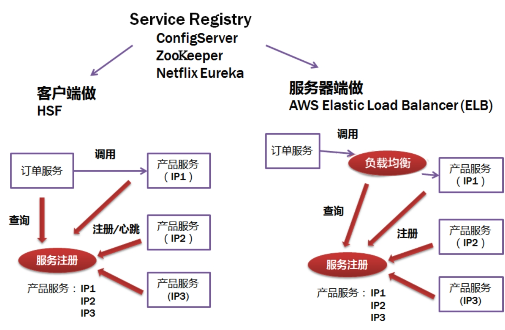
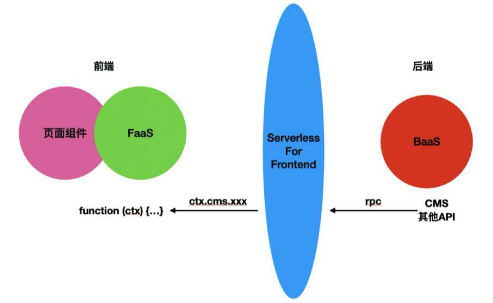

# 狼书（卷3）：Node.js高级技术

## 第1章 自己动手写npm模块

### 1.1 基础技能

- 环境变量
- zsh
- vim
- ack（与grep类似）
- autojump
- git
- dash

### 1.2 编写Node.js模块

Node.js提供了**child_process**模块可用于创建子进程，方法有3种，具体如下:

- child_process.exec：使用子进程执行命令，缓存子进程的输出，并将子进程的输出以回调函数参数的形式一次性返回
- child_process.spawn：使用指定的命令行参数创建新的子进程。当希望子进程向Node.js父进程返回大量数据时，比如进行图像处理、读取二进制数据等，最好使用spawn方法
- child_process.fork：spawn方法的特殊形式，fork用于在子进程中运行模块，例如，`fork("\./son.js")`相当于`spawn("node",["./son.js"])`。与spawn方法不同的是，fork方法会在父进程与子进程之间建立一个通信管道，**用于进程间通信**

### 1.3 npm技巧

查看模块依赖图的命令行工具：npm2dot

```bash
brew install graphviz
npm install -g npm2dot
```

### 1.4 实例讲解

### 1.5 编写脚手架

### 1.6 开源周边

- 异常处理
- 测试：mocha、AVA、Jest、Vitest等
- 工具模块：debug、日志等
- argv解析：Commander、Yargs
- 其他实用工具

持续集成（Continuous Integration, CI）主要负责3件事：从Git仓库拉取代码、编译、测试

CI服务：GitHub Actions（Vue.js使用）、Travis CI（Koa使用）、 Circle CI（Vue.js使用）等

### 1.7 推荐模块（PS：这些模块个别的有些老了）

- debug
- GitBook
- colors和chalk
- mkdirp
- shelljs
- moment
- lru-cache、js-lru
- semantic-release-cli
- xtend
- require-directory
- yargs

## 第2章 自己动手编写企业级Web开发框架

### 2.1 特色Web框架

- LoopBack
- Nest
- ThinkJS
- Egg.js
- Next.js
- Redwood
- strapi

### 2.2 自己动手写框架

## 第3章 构建具有Node.js特色的服务

### 3.1 服务概览

- Node.js核心作用：
  1. 页面渲染
  2. 提供API服务
     - 静态API模拟
     - API中间层
     - RPC服务
- 架构演变：MVC-->RPC（Remote procedure Call）-->SOA（Service-Oriented Architecture）-->微服务
- 对于一个复杂的大型业务系统，它的业务功能可以被拆分为多个相互独立的微服务，各个微服务之间是松耦合的，通过各种远程协议进行同步/异步通信，它们均可以被独立部署、扩/缩容、升/降级，进而达到快速交付的目的
- Gateway：客户端访问服务端的统一入口
- 服务之间通信：IPC
  - 同步调用：REST（Spring Boot）、RPC（Thrif、Dubbo、gRPC）
  - 异步调用：Kafka、Notify、MetaQ
- **服务发现**：ZooKeeper等技术

  > 当服务上线时，服务提供者会将自己的服务信息注册到ZooKeeper或类似框架中，并通过心跳维持长链接，实时更新链接信息。服务调用者通过ZooKeeper寻址，根据可定制算法，找到一个服务，还可以将服务信息缓存在本地以提高性能。当服务下线时，ZooKeeper会发通知给服务客户端

  
- **BFF**
- SFF托管，Serverless For Frontend，= FaaS + BaaS

  JAMStack是一种基于客户端JavaScript，可重用API和预构建Markup的现代Web开发架构

  

  JAMStack on Serverless（JAMS）的核心内容：

  - JavaScript：基于JavaScript创建动/静态Web应用
  - API：所有的数据行为通过可复用的HTTP接口（RESTful或GraphQL）完成
  - Markup：使用构建工具“prebuilt”前端应用，部署到Serverless环境，能够同时支持CSR和SSR
  - Serverless：利用Serverless基建优势提供自动扩缩容零运维的API和页面托管服务

### 3.2 使用Node.js优化页面渲染

- BigPipe
- SSR
- PWA
  - Service Workers
    - IndexedDB
  - 实现“添加到桌面”功能
    - manifest.json
    - Service Workers
    - HTTPS协议
  - Workbox：可以方便地为站点提供离线访问能力，无论其由何种方式构建，就算不考虑离线能力，它也能提升站点的访问速度，而且几乎不用考虑太多具体实现，做一些必要配置即可
  - AOT与WebAssembly
- 同构开发：用JavaScript开发应用并使其能够同时运行于客户端和服务器端
  - 阿里的Beidou

### 3.3 页面即服务

去哪儿的BigView

### 3.4 使用Node.js开发RPC服务

#### 3.4.1 RPC原理

- 基于HTTP
- 基于TCP

基本流程：

1. 服务调用方(Client)通过本地的**RPC代理**调用相应的接口
2. 本地代理将RPC的服务名、方法名和参数等信息转换成一个标准的**RPC Request对象**并交给**RPC框架**
3. RPC框架采用**RPC协议(RPC Protocol)**对RPC Request对象进行**序列化处理**，转换成**二进制**形式，然后通过TCP通道传递给服务提供方(Server)
4. 服务提供方接收到二进制数据后，将它**反序列化成RPC Request对象**
5. 服务提供方根据RPC Request对象中的信息**找到本地对应的方法，传入参数后执行该方法，得到结果并将结果封装成RPC Response对象交给RPC框架**
6. RPC框架通过RPC协议(RPC Protocol)对**RPC Response对象进行序列化处理**，转换成二进制形式，然后通过TCP通道传递给服务调用方
7. 服务调用方收到二进制数据后，将它**反序列化成RPC Response对象**，并且将结果通过本地代理返回业务代码

#### 3.4.2 通信层协议设计

RPC协议分为：

1. 通信层协议：一般和业务无关，它的职责是将业务数据打包后，安全、完整地传输给接收者，TB Remoting、HSF、Dubbo都属于通信层协议，**通常一旦确定就很少变更，所以必须具备很好的通用性与扩展性**
2. 应用层协议：用来约定业务数据和二进制数据的转换规则，常见的有Hessian、Protobuf和JSON，**更多关注的是编码的效率和跨语言等特性**

**etcd是一个高可用的键值存储系统，主要用于共享配置和服务发现**

### 3.5 使用Node.js开发独立的API层

#### 3.5.1 GraphQL

GraphQL查询命令是一个字符串，它被发送给一个**与数据模式无关的服务器**，然后服务器返回JSON数据。GraphQL是强类型的，避免了版本控制，同时提供了随着数据演进可轻松改进查询语句的能力

GraphQL特性：

1. 声明式：查询的格式由请求方（即客户端）而非响应方（即服务器端）决定，无须编写额外的接口来适配客户端请求
2. 可组合：可以自由组合GraphQL的查询以满足需求
3. 强类型：只有强类型的GraphQL查询才会被执行

#### 3.5.2 Micro框架

专注于服务，精简了很多Web框架的多余特性，只保留简单、快速、轻量、体积小、敏捷、直接、标准化等特性

#### 3.5.3 API网关

Kong由Mashape公司开源，是一款基于Nginx+Lua编写的高可用、易扩展的API网关项目。由于Kong是基于Nginx的，因此，我们可以水平扩展多个Kong服务器，通过前置的负载均衡配置将请求均匀地分发到各个服务器，以应对大批量的网络请求

## 第4章 服务器部署与性能调优

### 4.1 服务器部署

- SLB是对多台云服务器进行流量分发的负载均衡集群

- SLB通过Tengine实现，Tengine是由淘宝网发起的Web服务器项目，其在Nginx的基础上针对大访问量网站需求添加了很多高级功能和特性
- pm2
- ELK
- APM
- 性能相关的概念：
  - QPS：单个进程每秒请求服务成功返回的次数，或者服务器每秒处理的请求数
  - QPS（单台机器的QPS）=总请求数/（进程数×请求时间）
  - 每**天80%的访问量集中在20%的时间内，这20%的时间叫作峰值时间**
  - 峰值QPS=（单日总PV数的80%）/（每天秒数的20%）
  - 需要的机器数量=峰值QPS/单台机器的QPS
- 亿级流量真的很大吗？其实，亿级流量和亿级并发根本不是一回事。对于精细化的性能评估过程，需要结合业务架构评估出流量的分布，大致步骤如下：
  - 将业务目标转化为技术目标，能够评估出总流量
  - 精确拆分，通过总流量与流量分布数据，评估出各入口流量
  - 根据入口流量与用户行为，评估压力测试模型
  - 依照压力测试模型创建相应的数据
- 全链路压测

### 4.2 性能调优

#### 4.2.1 基础知识

- 基准测试
  - 工具：Benchmark.js
- 压力测试
  - 压力测试需要确定一个系统的瓶颈或不能接受的性能点，以获得系统能提供的最大服务级别
  - 压力测试有**两个目的**：获得性能数据，以便服务器进行估算；将压力测试的结果作为性能调优的依据
  - 工具：AutoCannon
- 内存与垃圾回收
  - 新生区：大多数对象被分配在这里。新生区是一个很小的区域，在这个区域中，垃圾回收频繁发生，与其他区域相独立
  - 老生指针区：该区域内包含很多对象，这些对象中可能存在指向其他对象的指针。大多数在新生区存活一段时间后的对象都会被挪到这里
  - 老生数据区：这里存放只包含原始数据的对象（这些对象没有指向其他对象的指针）。字符串、封箱的数字及未封箱的双精度数字数组等在新生区存活一段时间后会被移动到这里
  - 大对象区：这里存放“体积”超越其他区中对象的对象。每个对象都有自己的mmap产生的内存。垃圾回收器从不移动大对象
  - 代码区：该区域内存放代码对象，也就是包含JIT之后指令的对象。这是唯一拥有执行权限的内存区（不过如果代码对象因过大而被存放在大对象区，则该大对象所对应的内存区也是可执行的，但大对象区本身不是可执行的内存区）
  - 查看内存占用情况：`process.memoryUsage()`
- Core Dump
  - 在程序运行的过程中，如出现异常终止或崩溃，操作系统会将程序当时的内存状态记录下来，保存在一个文件中，**这种行为被称作Core Dump**
  - 参数在mac下如何开启core dump
  - lldb与llnode的使用
  
- Profile采样
  
  - `node --prof index.js`开启日志记录
  - 进行压测，比如使用LoadTest向服务施压：`loadtest http://127.0.0.1:6001 --rps 10`
  - `node --prof-process isolate-xxxxx.log > profile.txt`，处理生成的log文件
  - 分析生成的profile文件，具体要参见Node.js Profile文档
  
- 探针原理
  
  - > 探针插桩的概念最早是由J.C.Huang教授提出的，是指在保证被测程序原有逻辑完整性的基础上向程序中插入一些探针（也称为“探测仪”），探针会被执行并抛出程序运行的特征数据，通过对这些特征数据的分析，可以获得程序的控制流和数据流信息，进而得到逻辑覆盖等动态信息，实现测试目的

#### 4.2.2 立体分析

为了能够更好地进行性能调优，我们可以对问题的生命周期进行分析，这个过程称为立体分析。立体分析是十分必要的，大概的流程分为**事前跟踪、开启防护、事后分析**三步

- 事前跟踪
  - 对内存增长有疑问，可以事前开启GC日志：`node --trace_gc --trace_gc_verbose xxx.js`
- 开启防护
  - 使用`node-memwatch`进行监控
- 事后分析
  - 利用官方推荐的免费查看内存消耗的工具：`heapdump`，允许对v8堆内存抓取快照，用于事后在Chrome Profiles里进行分析

#### 4.2.3 深度性能调优

- 常用工具
  - v8-profiler：对v8堆内存抓取快照和对CPU进行分析
  - node-heapdump：对v8堆内存抓取快照
  - node-mtrace：分析堆栈使用情况
  - node-memwatch：监听垃圾回收情况
- 深入进行性能调优的工具
  - 0x
    - 先安装`perf`（XCode内置）再安装`0x (pnpm add -g 0x)`
    - 开启服务：`0x -o xxx.js`
    - 压测（这里使用autocannon）：`autocannon 127.0.0.1:3000/users`
    - Ctrl+C结束进程，0x会生成火焰图，特别当指定了`-o`参数后，会自动打开生成的火焰图
  - Easy-Monitor
  - Clinic
  - Alinode

### 4.3 分析Easy-Monitor

## 第5章 测试、开源与自学

### 5.1 测试入门

- Web应用开发者所需要关注的三种测试：单元测试、集成测试、端到端测试
- TDD（测试驱动开发）与BDD（行为驱动开发）

### 5.2 测试进阶

- 测试的核心：
  1. 最小化问题：有助于厘清思路
  2. 保证质量：大项目测试的价值越大
  3. 便于重构：自动化提交
- Cucumber：一个命令行工具，它可以让人们用近似自然的语言去描述需求和场景，进而驱动开发
- Spy、Stub、Mock：Sinon
  - Spy：监视函数被调用的情况
  - Stub：替换对象的函数行为
  - Mock：设定函数行为并验证，尤其用于验证多种指定行为
- 持续集成
