# 编程卓越之道（卷1）：深入理解计算机（第2版）

## 第1章 编写卓越代码须知

> 计算机组成是计算机体系结构的一个子集，涉及**底层数据类型、CPU内部结构、内存结构和访问、底层计算机操作、大容量存储结构、外围设备及计算机和外界的通信方式**

## 第2章 数字表示

许多算法操作的正确性和效率取决于数字的内部和外部表示形式

#### 2.2.2 底数（基数）

基数又叫作底数，小数点（注意，术语小数点仅适用于十进制数字）左边的每一位数字都要乘以基数的幂，而且指数按位递增

#### 2.4.2 位串

**半字节(Nibble)**是四位数据的集合，每个半字节刚好可以表示一个十六进制数字

**字节(Byte)**的长度是八位，许多CPU支持的最小可寻址数据条目就是一个字节

**字(Word)**的长度因CPU而异，可以是16位、32位或64位。本书采用80x86术语，一个字定义为16位的集合

**双字（Double Word或Dword）**就是两个字

大多数语言都支持64位浮点值，因此我们使用术语四字(Quad Word)来描述这些数据类型

### 2.5 有符号和无符号

二进制补码系统使用高位作为**符号位(Sign Bit)**。如果高位为0，则该数字为非负数，使用正常的二进制编码；如果高位为1，则该数字为**负数，使用二进制补码**

**可以按照如下二进制补码运算来求负**：

1. 将非负数按位取反；把0全部变成1，把1全部变成0
2. 将取反的结果加1（忽略溢出）

但这里需要**注意**，采用16位二进制补码的计数系统**无法表示**+32，768。通常，不能对二进制补码计数系统中的最小负值求负：

对-32,768(0x8000)求负：

1. 0b1000_0000_0000_0000，即-32,768，这是最小的16位负数
2. 0b0111_1111_1111_1111所有位取反(0x7FFF)
3. 0b1000_0000_0000_0000加1（0x8000，即-32，768）。对0x8000取反的结果为0x7FFF，加1后得到了0x8000！-(-32, 768)等于-32,768

### 2.6 二进制数的属性

- 二进制数的第0位为1，则该数为奇数；反之为偶数
- 二进制数的低n位都是0，则该数可能被$2^n$整除，比如低2位为0，能被$2^2$整除
- 将进制数左移1位的结果等于原二进制数乘以2
- 无符号二进制数右移1位相当于原二进制数除以2
- 两个n位二进制数的乘积最多需要$2*n$位来保存
- 两个n位二进制数的和或者差最多需要$n+1$位来保存

### 2.7 符号扩展、零扩展和收缩

8位的有符号数必须经过转换才能在涉及16位数的表达式中使用。这种转换叫作**符号扩展(SignExtension)**操作

**零扩展(ZeroExtension)**是将位数较少的无符号数转换为位数较多的无符号数。零扩展非常容易，只需用0填充位数较多的操作数的高位字节即可

将位数较少的整数赋值给位数较多的整数，需要的机器指令要比在两个位数相等的整数变量之间移动数据**更多（执行时间也更长）**

## 第3章 二进制算术运算和位运算

## 第4章 浮点表示形式

### 4.1 浮点运算简介

实数的数量是无限的，而浮点表示形式的位数却是有限的，能够表示的值的数量也是有限的。如果特定的浮点格式无法精确地表示某个实数值，就用能够精确表示的最接近该实数的近似值代替。

大多数浮点格式使用一部分位来表示尾数，使用余下的几位来表示阶码。**尾数(Mantissa)**通常是有限范围内（比如0～1）的一个基值。**阶码(Exponent)**则是一个乘数，将其应用到尾数上之后就可以得到超出尾数范围的值。尾数/阶码组合的最大优势是扩展了浮点格式可以表示的范围

- 规则1：求值的顺序会影响结果的准确性
- 规则2：将同符号的两个数相减或者将不同符号的两个数相加，得到的结果可能达不到该浮点格式能够表示的最高精度
- 规则3：连续进行加、减、乘、除运算时，应当首先进行乘法和除法运算
- 规则4：当进行多个数字乘除法运算时，先进行相同量级的乘除法运算
- 规则5：在进行两个浮点数是否相等的比较时，比较的始终是两个值的差是否小于某个很小的误差值

### 4.2 IEEE浮点格式

- 单精度浮点格式的尾数有24位，阶码8位，尾数的值在1.0~2.0（不包括2.0），尾数最高位始终为1，表示二进制小数左边的数字，剩余的23位尾数表示二进制小数右边的值，尾数只有23位（第24位始终为1），**因为单精度格式能表示的值就只有800万（$2^{23}$)个，精度只有23度**

  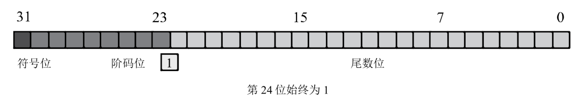

  **尾数格式采用的是1的补码，而不是2的补码。这意味着24位尾数的值只是一个无符号二进制数，值为正还是负由第31位的符号位确定**

  关于指数部分的偏移量：

  > 在单精度浮点数中，增码-127实际上是用来表示指数部分的真实值的偏移量。单精度浮点数采用32位表示，其中1位用于表示符号位，8位用于表示指数部分，23位用于表示尾数部分。
  >
  > 指数部分使用增码（excess）表示法，其中偏移量为127。这意味着，存储在指数部分的无符号整数值需要减去127，以获得真实的指数值。
  >
  > 例如，如果指数部分的无符号整数值为100，那么实际的指数值为100 - 127 = -27。
  >
  > 因此，增码-127用于在单精度浮点数中将无符号整数指数值转换为有符号整数指数值。**这种设计使得指数范围从-127到128，其中-127表示最小的指数值，128表示最大的指数值**

- 双精度格式的长度是单精度的两倍，由11位的增码-1023格式阶码、53位的尾数（包括隐含为1的高位）及一位符号位组成。动态范围大约是10±308，而精度达到了15～16+位十进制数字

  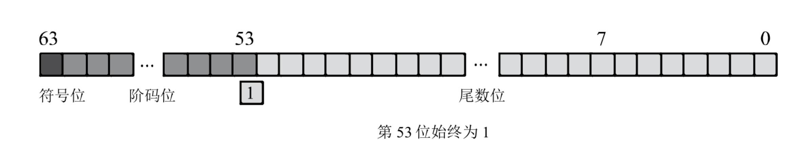

- 为了保持长串双精度浮点数计算的精度，英特尔公司还设计了**扩展精度格式**。扩展精度格式一共使用了80位，包括64位的尾数、15位的增码-16383格式阶码，还有一位符号位。尾数的高位并不始终隐含为1

  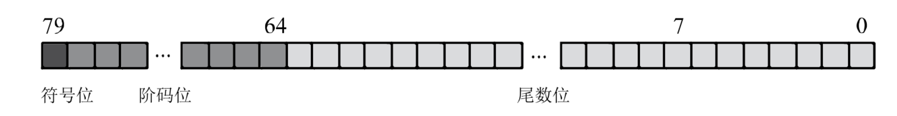

### 4.4 舍入

- 如果保护位表示的值小于尾数低位表示的值的一半，则四舍五入会将结果下舍入到小于该浮点值的最大值（忽略符号位）
- 如果保护位表示的值大于尾数低位表示的值的一半，则四舍五入会将尾数上舍入到大于该浮点值的最小值（忽略符号位）


### 4.5 特殊的浮点值

- 浮点数阶码位不会全部为0或全部为1。**全1或全0的阶码表示的就是特殊值**

- **阶码全部为1且尾数非零（隐含为1的高位不算在内）**，则由尾数的高位（隐含为1的高位也不算在内）确定该值代表的是**未明非数(QNaN, Quiet Not-a-Number)**还是**明确非数(SNaN, Signaling Not-a-Number)**

  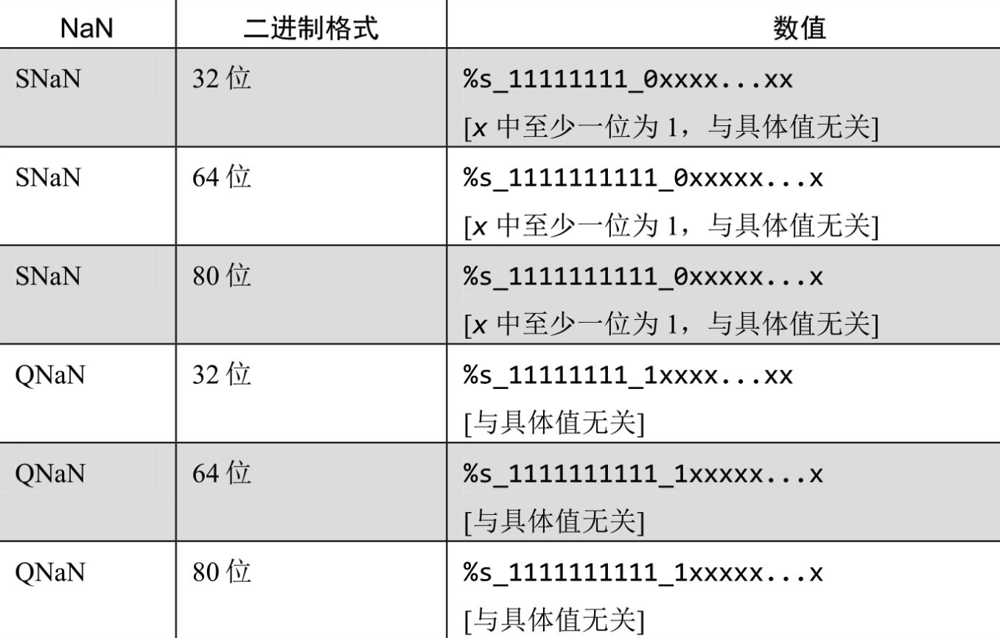

- **指数位全部为1并且尾数位全部为0**的浮点数表示的是另外两个特殊值：+**无穷**(+Infinity)和-无穷(-Infinity)（由浮点数的符号位决定）

- 最后两个特殊值-0或+0的**指数位全部为0**，由符号位确定浮点数表示的是-0还是+0

### 4.7 浮点运算

#### 4.7.2 浮点数的加减法

**IEEE浮点格式使用1的补码表示负数值**，取负非常简单，只需要把符号位取反即可

> 在这种编码中，最高位(最左边的位)被用作符号位。如果最高位为0,则表示该值为正数；如果最高位为1,则表示该值为负数。对于负数，其补码与原码相同，只是最高位取反(即从0变为1,或从1变为0)

## 第5章 字符表示形式

#### 5.1.1 ASCII字符集

ASCII字符集可以分为四组，每组32个字符。比如**空格符（ASCII编码为\$20）和数字（ASCII编码为\$30..\$39），大写的字母字符A～Z的ASCII编码为\$41～\$5A，小写字母字符使用\$61～\$7A的ASCII编码**。如果将大写字母和小写字母的编码转换为二进制，你就会发现大写字母和对应的小写字母的二进制表示只有一位不同：

> 只要将第5位取反，就可以快速地转换字母字符的大小写。例如，要将大写字母强制转换为小写字母，只需将第5位设置为1。反过来，可以通过将第5位设置为0将小写字母强制转换为大写字母
>
> 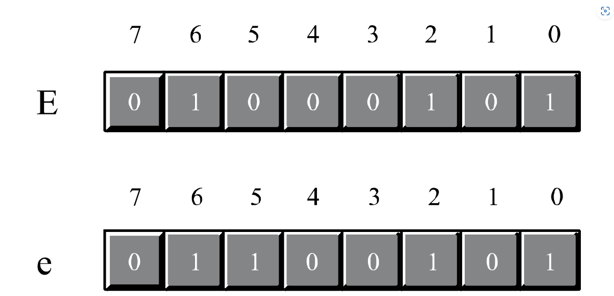


#### 5.1.4 Unicode字符集

**最早的Unicode标准使用一个16位的字来表示每个字符**。因此，Unicode最多可以支持65536个不同的字符编码

如果Unicode字符二进制表示形式的**高9位全部为0，则低7位就是标准ASCII编码。如果高9位中有部分位非零，则16位就是扩展字符编码（ASCII扩展）**

Unicode定义放弃了对定长字符表示形式的坚持，没有把每个Unicode字符的长度扩展到三个或四个字节，而是**采用了不固定的（多字节）Unicode字符的编码**。现在Unicode定义的码位有1112064个，远超当初为Unicode字符设计的两个字节的容量

**Unicode码位(Code Point)**就是Unicode编码和特定字符符号关联的整数值，Unicode码位约定使用十六进制值加上U+前缀来表示一个值。例如，U+0041是字母A的Unicode码位 [更多](https://en.wikipedia.org/wiki/Unicode#General_Category_property)

#### 5.1.6 Unicode编码平面

> 由于历史原因，Unicode中每65536个字符组成一个特殊的区块，这些区块被称为**多文种平面(Multilingual Plane)**。第一个多文种平面(U+000000～U+00FFFF)大致对应的是最早的16位Unicode定义，Unicode标准把这个平面称为**基本多文种平面(BMP, Basic Multilingual Plane)**。平面1(U+010000～U+01FFFF)、平面2(U+020000～U+02FFFF)和平面14(U+0E0000～U+0EFFFF)是**补充平面**。平面3～13被Unicode保留以用于**未来的扩展**，而**平面15和平面16则留给用户以用于自定义字符集**
>
> Unicode标准定义了U+000000～U+10FFFF的码位。注意，0x10FFFF为1114111，其中大部分用于Unicode字符集的1112064个码位，**剩下2048个保留为代用(Surrogate)码位，也就是Unicode扩展**
>
> Unicode中U+FFFF之后的码位使用的是特殊的多字（双字节）条目编码。**两种可能的扩展**的每一种都需要10位编码，总共需要20位。20位编码可以支持16个多文种平面，再算上BMP一共是17个多文种平面。16个多文种平面加上一个BMP一共需要21位编码，这也是为什么码位的范围会在U+000000～U+10FFFF
>
> **十六进制的码位值6位数字中的高个两位指定了码位所属的多文种平面**

#### 5.1.7 代用码位

**Unicode使用代用码位(U+D800～U+DFFF)对超过U+FFFF的值进行编码**，两个字（单元1/高位代用码位和单元2/低位代用码位）总是成对出现，单元1的值（高位为%110110）指定的是Unicode标量的高10位(b10～b19)，单元2的值（高位为%110111）指定的则是Unicode标量的低10位(b0～b9)

**b16～b19四位的值加上1就指定了Unicode平面1～16，b0～b19位则指定了平面内的Unicode标量值**

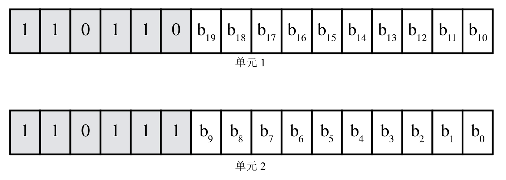

**只有BMP中才有代用码位**

#### 5.1.8 字形、字符和字素簇

在Unicode术语中，**字素簇**(Grapheme Cluster)才是人们通常所说的字符：由一个或多个Unicode码位组成的序列，将它们组合在一起形成一个语言元素（即一个字符）

#### 5.1.10 Unicode编码

这里主要关注一下utf8编码

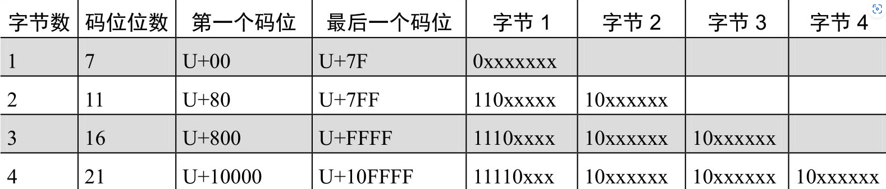

表中“xxx...”代表Unicode码位中的位。在多字节序列中，字节1的位(x)在码位中最高，字节2的位(x)次之（相对于字节1为低位），依此类推。例如，两个字节的序列%11011111、%10000001对应的Unicode标量为%0000_0111_1100_0001(U+07C1)（根据表5-3，标量从低到高依次是字节2的低位6位00_0001，字节1的低位5位111_11）

###  5.2 字符串

## 第6章 内存结构和访问

### 6.1 基本系统组件

#### 6.1.1 系统总线


大多数CPU都具有三种主要的总线：数据(Data)总线、地址(Address)总线和控制(Control)总线

处理器位数由处理器的**数据总线位数**和**最大通用整数寄存器的位数**两者中的**较小者决定**

系统在设计时会为每个内存单位和I/O设备分配一个**唯一的内存地址**。当软件想要访问特定的内存单位或I/O设备时，需要将对应的地址交给地址总线。设备内的电路会检查地址总线上的地址，如果地址匹配就传输数据。其他所有内存单位都会忽略地址总线上的这次请求

典型CPU的内存控制器能够连接的DRAM模块**数量有限**，因此，CPU可以连接的DRAM容量上限直接**由CPU内置的内存控制器决定，和外部地址总线位宽无关**

### 6.2 内存的物理结构

CPU将值0放在数据总线上，将地址125放在地址总线上，并让控制总线上的写入线路生效，这就相当于执行了Pascal语句Memory［125］:=0；其做的事如下图：

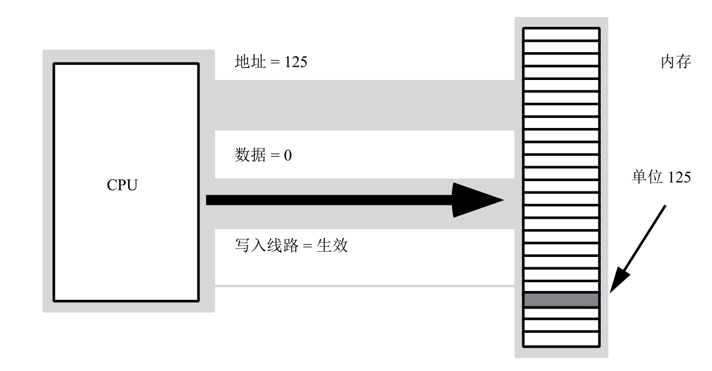

#### 6.2.1 8位数据总线

如古老的8088CPU，一次可以传输8位数据

术语按字节寻址内存阵列(Byte-Addressable Memory Array)的意思就是CPU可以寻址的内存最小单位是单个字节块

处理器如果想要访问一个4位的值也必须一次读取8位，再忽略掉多余的4位

#### 6.2.2 16位数据总线

如8086、80286和ARM系统处理器的变化的数据总线有16位，这些处理器的内存结构分成了两个组(Bank)：一个“偶数”组和一个“奇数”组

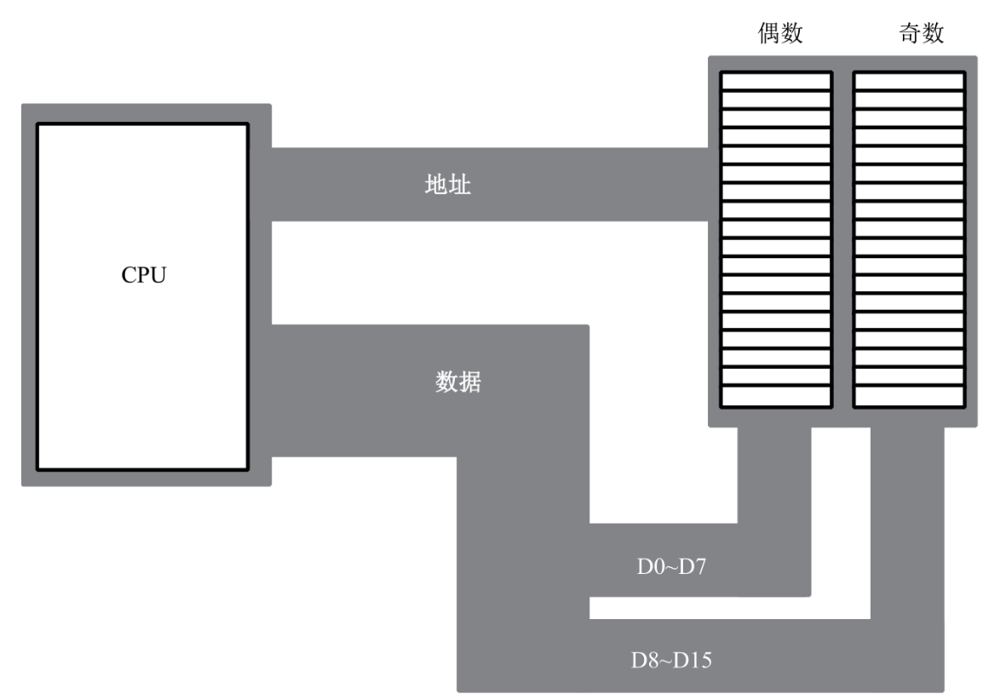

数据总线中的线路D8～D15（**高位字节**）连接的是内存的**奇数组**，线路D0～D7（**低位字节**）连接的是**偶数组**

16位80x86CPU的地址总线上出现的**一定是偶数地址**。偶数地址的字节总是出现在数据总线的D0～D7上，而奇数地址的字节总是出现在数据总线的D8～D15上。当访问以偶数地址开始的字时，CPU可以在一次内存操作中加载完整的16位数据块。当需要访问单个字节时，CPU会（通过字节生效控制线路）激活对应的内存组（偶数或奇数），并在地址对应的数据线路（D0～D7或D8～D15）上传输该字节

访问以奇数地址开始的字需要**两次内存操作**（和8位总线的8088/80188一样）。首先，CPU必须先读取地址125处的字节，再读取地址126处的字节。其次，CPU内部需要交换两个字节的位置，因为两个字节被载入CPU时都错误地出现在另一半数据总线上

**好在16位80x86CPU隐藏了这些细节**

#### 6.2.3 32位数据总线

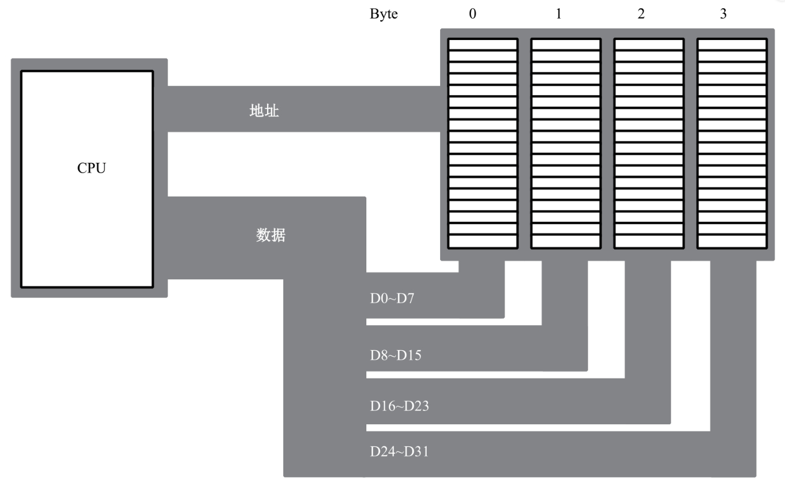

对于32位内存接口来说，**地址一定是4的倍数**。CPU通过不同的字节生效控制线路来从地址上的4个字节中选出软件想要访问的那一个。和16位处理器一样，CPU会按需自动对字节重新排序

只有双字值的地址可以被4整除时，32位CPU才能在一次内存操作中访问该双字。如果地址不能被4整除，则CPU可能需要两次内存操作才能访问一个双字。

### 6.3 大端序与小端序结构

小端序字节格式(Little-Endian Byte Organization)

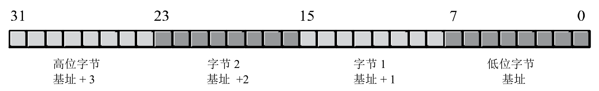

大端序字节格式(Big-Endian Byte Organization)

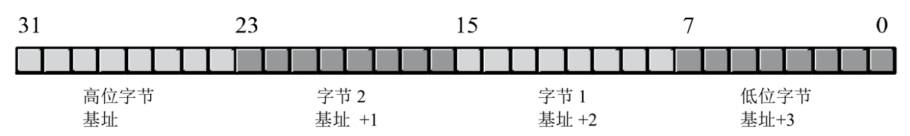

跨网络传输数据时规范格式通常是大端序格式。这是因为**TCP/IP和其他部分网络协议使用的是大端序格式**。而通用串行总线(USB)传输数据使用的规范格式是小端序格式

### 6.4 系统时钟

**系统时钟是控制总线上的一个电信号，周期性地在0和1之间震荡**。CPU内的所有活动都与这个时钟信号的边沿（上升沿或下降沿）同步

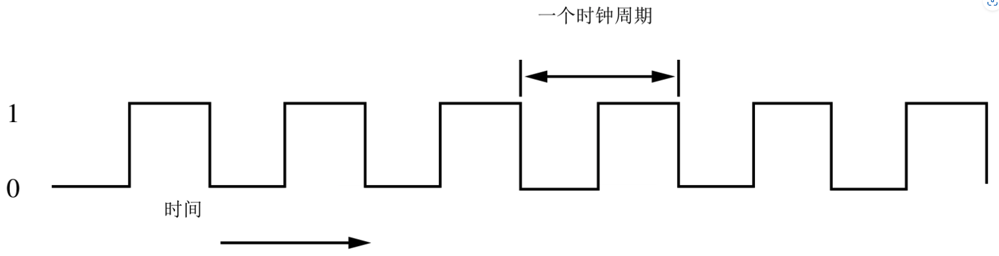

系统时钟在0和1之间切换的速率就是**系统时钟频率(System Clock Frequency)**，系统时钟从0切换到1再切换回到0所花费的时间就是**时钟周期(Clock Period/Clock Cycle)**

为了确保操作的同步，**大多数CPU会在下降沿（FallingEdge，时钟信号从1变为0时）或上升沿（RisingEdge，时钟信号从0变为1时）开始进行操作**

#### 6.4.1 内存访问和系统时钟

内存访问操作和系统时钟是同步的，也就是说，在每个时钟周期对内存的访问最多也就一次

现代CPU比内存设备快得多，因此围绕CPU构建的系统通常会使用第二个时钟，**总线时钟(Bus Clock)**。总线的频率是CPU频率的分数，例如，典型的处理器时钟频率为100 MHz～4 GHz，它们使用的总线时钟有1600 MHz、800 MHz、500MHz、400 MHz、133 MHz、100 MHz或66 MHz（CPU通常会支持几种不同的总线时钟频率，而具体范围取决于CPU）

### 6.5 CPU的内存访问模式

现代CPU支持的最常见的内存寻址模式(Memory Addressing Mode)有**直接(Direct)、间接(Indirect)和变址(Indexed)**

**直接内存寻址模式**将变量的内存地址编码作为访问变量的实际机器指令的一部分。通常，程序使用直接寻址模式访问**全局静态变量**

**间接寻址模式**通常使用寄存器来保存内存地址（有些CPU会使用内存单位来保存间接地址，但现代CPU中这种形式的间接寻址**已经很少见了**）

**变址寻址模式**是直接寻址和间接寻址两种模式的结合。具体来讲，就是使用这种寻址模式的机器指令对偏移量（直接地址）和寄存器进行编码，并将该编码作为指令编码的一部分。运行时CPU会计算这两个地址分量之和，**得到有效地址(Effective Address)**

## 第7章 复合数据类型与内存对象

复合数据类型由其他更简单的数据类型组成，指针、数组、记录、结构，还有元组和联合都是复合数据类型的例子

### 7.1 指针类型

**指针就是一种内存变量，其值为其他内存对象的地址**

#### 7.1.1 指针的实现

尽管大多数编程语言都使用内存地址来实现指针，但指针实际上是**对内存地址的抽象**。因此，编程语言可以使用任何机制来定义指针，只要这种机制可以将指针的值映射成内存中的对象地址

```assembly
mov( PointerVariable, ebx ); // 把指针变量加载到寄存器中
mov( [ebx], eax);						 // 使用寄存器间址模式来访问数据
```


#### 7.1.2 指针与动态内存分配 

指针一般被用来引用在堆（Heap，为动态存储分配保留的内存区域）上分配的匿名变量

在堆上分配的对象被称为匿名变量(Anonymous Variable)，因为这些对象是通过地址访问的，没有可以访问的变量名

#### 7.1.3 指针操作与指针运算

##### 指针加整型数

在高级编程语言中最常见的解决方案是，当将指针加上整型偏移量的时候，将偏移量乘以指针引用的对象的大小，也就是说，如果指针p指向的是内存中一个大小为16字节的对象，那么p+1指向的就是p的地址再加16字节

在数据访问必须对齐的计算机体系结构中，只要数据对象的大小是要求对齐的块大小的整数倍（如果需要的话，编译器还会加入填充字节保证数据对齐），这种机制就能避免前面提到的问题

*指针只有和整型数相加才有意义，指针和指针相加或指针和非整型数相加都没有意义*

##### 指针减整型数

指针减去整型数的结果引用的是紧挨在原指针地址之前的内存单位。但是，减法不满足交换律

*80x86汇编语言的偏移量是以字节为单位的*

##### 指针减指针

两个指针相减得到的是两个指针指向的数据对象之间间隔的数据对象数量

*只有在两个指针引用的数据结构相同时，指针相减才有意义*

##### 指针比较

比较指针是否相等可以判断指针引用的是不是内存中的同一个对象

### 7.2 数组

**数组的基址(Base Address)是数组第一个元素的地址**，占用的内存单位也处于**最低**位置

#### 7.2.1 数组声明

如果数组被声明为**自动变量**，则C/C++会用**对应内存单位中当前的值**来“初始化”数组元素。如果这些数组被声明为**静态对象**，则C/C++会将数组的**全部元素清0**

#### 7.2.2 内存中的数组表示形式

一个数组占用的字节数是**数组元素个数和每个元素所占字节数的乘积**。很多语言还会在数组末尾加上额外的几个填充字节，让数组的总长度**正好是4或8的整数倍**（在32位或64位机器上，编译器可能会在数组末尾添加字节来扩展数组长度，保证其长度正好是机器字的长度的整数倍）

#### 7.2.3 访问数组元素

$$
Element\_Address = Base\_Address + index \times Element\_Size
$$

#### 7.2.4 多维数组

首先要解决的问题是如何在一维的内存空间中存储多维的对象：以$$4\times4$$的数组为例，我们需要使用一个函数来算出元素在这块16个连续内存单位中的偏移量，它需要两个入参分别指定行和列，支持任意维度，且每个维度支持任意范围，大多数高级语言使用的函数都属于下面两类：**行序优先(Row-Major Ordering)**和**列序优先(Column-Major Ordering)**

##### 1. 行序优先

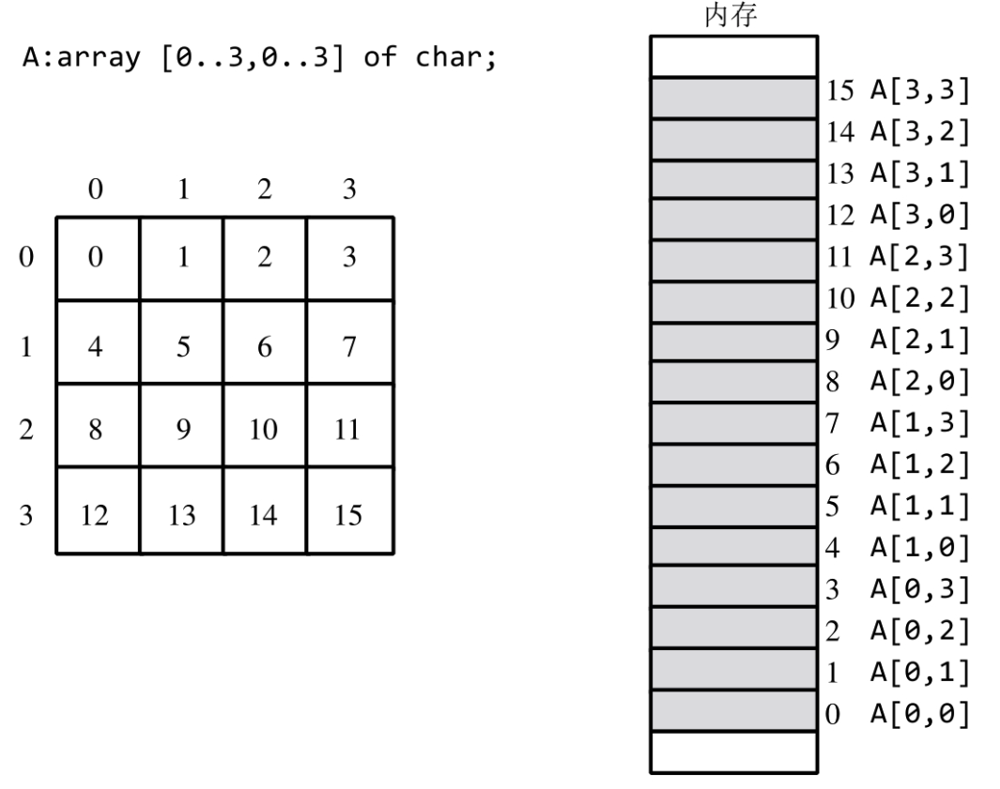

**大多数高级编程语言使用的都是行序优先的方法**

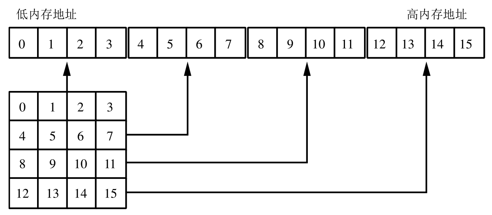

**多维数组下标转换偏移量函数：**
$$
Element\_Address = Base\_Address + (colindex \times row\_size + row\_index) \times Element\_Size
$$

##### 2.列序优先

##### 3. 声明多维数组

##### 4. 访问多维数组元素

##### 5. Swift数组实现

Swift实际支持的并不是多维数组而是**数组的数组**

### 7.3 记录/结构体

C++结构体实际上是一种特殊的类，其行为和C结构体不同，而且在内存中还可能包含C结构体中没有的额外数据（这就是C++结构的内存存储可能不太一样的原因，参考7.3.5节的内容）。C和C++结构体还有一些命名空间及其他的小区别

**可以使用extern “C”块让C++编译真正的Cstruct定义**

**记录字段在内存中的存储顺序和声明的顺序一样，**考虑到性能，实际上**大多数**编译器会将**记录字段的地址对齐到合适的内存边界**

以80x86为例，符合Intel ABI（Application Binary Interface，应用二进制接口）的编译器会把字节对象地址分配到记录中的任意偏移量上，而字对象的地址只会分配到偶数偏移量上，双字或者更大的对象地址则分配在双字边界上

除了**要把记录字段的地址和合理的偏移量对齐**，大多数编译器还要确保整个记录的**长度是2字节、8字节甚至16字节的整数倍**

但是，访问内存中未对齐的值会让程序运行慢下来

### 7.4 判别联合

记录与联合的区别：

1. 记录中的每个字段相对于记录基址的偏移量都是不同的，字段不会重叠。但是，**联合的字段偏移量全都是0**，所有字段重叠在一起
2. 记录的大小是所有字段大小之和（可能还要加上填充字节），而联合的大小就是最大字段的大小（可能还要加上末尾的填充字节）

### 7.5 类

> 在大多数编程语言中，类数据字段在内存中的布局也确实和记录与结构体类似。编译器会将类声明中的字段排列在连续的内存单位上。然而，类也具备一些纯记录和结构体没有的额外特性。**特别是成员函数（类中声明的函数）、继承和多态，这些特性极大地影响了编译器在内存中实现类对象的方式**

```assembly
type
	student2: class
		var 
			sName: char[65];
			Major: int16;
			SSN: char[12];
			Midterm1: int16;
			Midterm2: int16;
			Final: int16;
			Homework: int16;
			Projects: int16;
		method setName( source: string );
		method getName( dest: string );
		procedure create; // 类构造器
	endclass;
```


内存表示形式：


student2类数据开头有一个VMT指针字段。**VMT即虚拟方法表(Virtual Method Table)**，它是一个数组指针，数组的元素是类关联的方法（函数）指针，此处，VMT字段指向的方法表包含**两个32位指针**：一个指向setName()方法，另一个指向getName()方法。当虚拟方法setName()或getName()中任何一个被调用时，**程序并不会直接调用内存中的两个方法。程序会先从内存中的对象里获取VMT的地址，再使用这个指针获取特定方法的地址（setName()可能位于VMT的第一个下标处，而getName()位于第二个下标处），然后使用获取到的地址间接地调用对应的方法**

*如此处理是**为了实现类的继承与多态***

#### 7.5.1 继承

```assembly
type
	student3: class inherits( student2 ) // 类student3继承了类student2的所有数据字段和方法
		var
			extraTime: int16; // 定义了一个新的数据字段extraTime
		override method setName; // 定义了一个新方法setName()，取代了原来student2中的setName()方法
		override procedure create; // 定义了重写的create过程
	endclass;
```

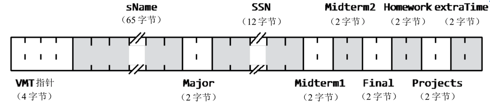

student2对象的VMT字段指向的是类student2的VMT（**内存中实际只有一张student2VMT，所有的student2对象包含的VMT指针都指向它**）

字段继承自基类的类有一个**重要的特性**，即**可以通过基类的指针来访问基类的字段，哪怕该指针指向的是其他类（从基类继承字段的类）的地址**

```assembly
type
	tBaseClass: class
		var
			i: uns32;
			j: uns32;
			r: real32;
		method mBase;
	endclass;
	
	tChildClassA: class inherit( tBaseClass )
		var
			c: char;
			b: boolean;
			w: word;
		method mA;
	endclass;
	
	tChildClassB: class inherit( tBaseClass )
		var
			d: dword;
			c: char;
			a: byte[3];
	endclass
```

**i、j和r字段在所有子类中的偏移量必须和在tBaseClass中的偏移量一样，继承机制才能正常工作**，即使寄存器EBX指向的对象类型是tChildClassA或tChildClassB，指令`mov ((type tBaseClass [ebx]).i, eax); `仍然可以正确地访问字段i

所有类（哪怕是没有关系的类）指向VMT的指针在其内存对象的偏移量都是一样的（偏移量通常为0）

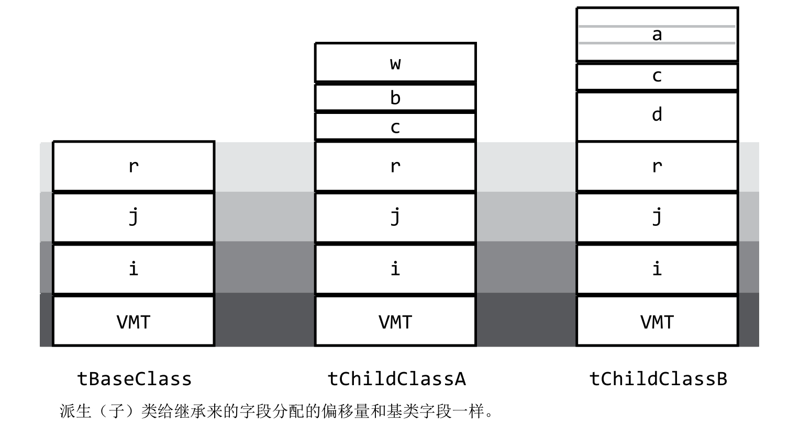

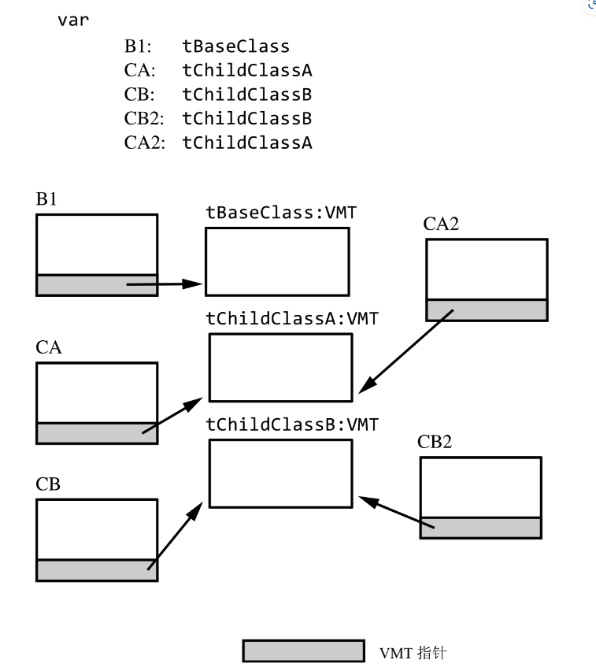

**子类从基类继承字段的同时，子类VMT也继承了基类VMT中的条目**

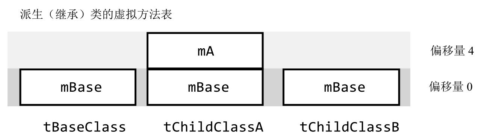

类tBaseClass的VMT只有一个条目：指向tBaseClass.mBase()方法的指针

类tChildClassA的VMT有两个条目：指向tBaseClass.mBase()和tChildClassA.mA()方法的指针

由于tChildClassB没有定义任何新方法或迭代器，所以它的VMT只有一个条目：指向tBaseClass.mBase()方法的指针。注意，**tChildClassB的VMT与tBaseClass的VMT内容是一样的，但HLA会生成两张不同的VMT**

#### 7.5.2 类构造函数

在调用任何VMT中的方法之前，都必须确保VMT在内存中是真实存在的（保存着类定义的方法的地址），而且**每个创建出来的类都必须初始化VMT**，对于高级语言，编译器在编译类定义的时候自动生成VMT，至于**对象本身的VMT指针字段的初始化，通常是由每个类的默认构造函数（对象初始化函数）负责完成的**

下面这两条语句会把（指定的类的）VMT地址复制到正在创建的对象的VMT指针字段(this._pVMT_)中：

```assembly
mov( &student2._VMT_, this._pVMT_);
mov( &student3._VMT_, this._pVMT_);
```


#### 7.5.3 多态

基于以上的设计，假设有一个`student2`类型的变量`John`，当调用`John.setName("John")`时，HLA的示例如下：

```assembly
mov( John, esi ); // 将John指针中保存的地址复制到ESI寄存器
mov( (type student2 [esi])._pVMT_, edi ); // 获取到_pVMT_字段保存的VMT的地址，加载到EDI寄存器
call( [edi+0 ); // VMT包含两个条目，其中setName方法的偏移量是0
```

根据上面的过程，假设有一个`student3`类型的变量`Jenny`，当调用`Jenny.setName("Jenny")`时，过程也是一样的，这就实现的多态（`setName`是基类中的方法）


#### 7.5.4 抽象方法和抽象基类

> 抽象基类(Abstract Base Class)的存在只是为了向其派生类提供一组公共字段。不要声明类型为抽象基类的变量，一定要使用它派生出来的某个类作为变量的类型。抽象基类只是创建其他类的模板而已

抽象基类至少要包含一个抽象方法，但并不要求全部方法都是抽象方法；在抽象基类中当然也可以声明一些标准方法（当然需要提供实现）

### 7.6 C++类

### 7.7 Java类

### 7.8 Swift类

### 7.9 协议与接口

协议或接口是通过VMT指针实现的，VMT中包含的是在协议或接口中声明的函数地址。在前面例子中，Swift类g的数据结构中有三个VMT指针：协议a一个、协议d一个、类g一个（包含指向local()函数地址的指针）。

### 7.10 泛型和模板

## 第8章 布尔逻辑与数字设计

### 8.1 布尔代数

#### 8.1.1 布尔运算符

- 与：A·B
- 或：A+B
- 非：A'

#### 8.1.2 布尔假设

德摩根定律： (A+B)'=A'·B' 及 (A·B)'=A'+B'

#### 8.1.3 布尔运算符优先级

圆括号 > 逻辑非 > 逻辑与 > 逻辑或

逻辑与和逻辑或运算符都满足**左结合律(Left Associative)**

### 8.2 布尔函数与真值表

如果输入变量的个数为n，则不同的布尔函数就有$ 2^{2^n} $（2的2的n次幂的幂）个，怎么得来的？参见原文下一节关于布尔函数编号的计算逻辑

### 8.3 函数编号

介绍函数编号是怎么计算来的，同时也解释了为什么输入n个变量，得到的布尔函数的个数为$2^{2^n}$个

### 8.4 布尔表达式的代数运算

### 8.5 规范形式

**极小项和(Sum of Minterms)**与**极大项积(Product of Maxterms)**两种规范系统

极小项(Minterm)是一个刚好包含了 n个字母的积，其中n就是输入变量的个数，通常n个变量有$2^n$个极小项，任意布尔函数的规范形式都可以从极小项和（逻辑与）得到

#### 8.5.1 极小项和规范形式与真值表

#### 8.5.2 使用代数方法得到极小项和的规范形式

#### 8.5.3 极大项积规范形式

极大项是所有带撇号及不带撇号的变量之和（逻辑或）

### 8.6 布尔函数简化

### 8.7 这和计算机有什么关系

任何程序都可以使用一系列的布尔方程来表示。也就是说，**任何软件实现的算法，都可以直接用硬件实现**。任何布尔函数都可以找到与之对应的一组电路。设计CPU和其他计算机电路的电气工程师们必须对这些知识非常熟悉。

#### 8.7.1 电路与布尔函数

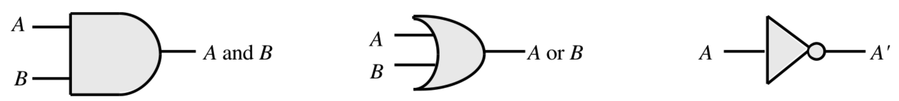

#### 8.7.2 组合电路 

#### 8.7.3 时序与时钟逻辑

## 第9章 CPU体系结构

### 9.1 CPU设计基础

- 可编程计算机系统

  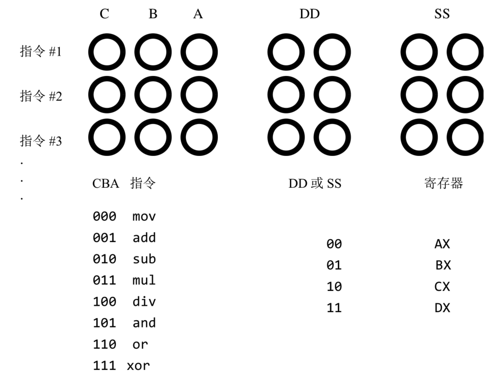

- 存储程序计算机

  将和机器指令等价的二进制数值保存在主存中，当CPU需要执行指令时，从内存中获取对应的二进制数值并加载到特殊的寄存器中解码出指令

  控制单元使用一个特殊的指令指针(Instruction Pointer)寄存器来保存指令的二进制数字编码的地址。指令的二进制数字编码也称为操作码(Operation Code/opcode)。控制单元获取内存中的指令操作码，放入指令解码寄存器中执行。当指令执行完毕，控制单元递增指令指针，继续获取内存中的下一条要执行的指令

### 9.2 指令的解码与执行：随机逻辑与微码

传统CPU控制单元获取到内存中的指令之后，有两种方法来执行指令：**随机逻辑（硬接线）**和**微码（仿真）**

- 随机逻辑（硬接线）：基于硬件逻辑设备来操作操作码数据，速度快，但电路设计难度复杂
- 微码（仿真）：基于微码的CPU包含一个小巧快速的执行单元，又称为**微引擎**，微引擎自身数据非常快，但它必须从微码ROM中获取微指令，因此，如果逻辑执行比内存读取要快，那么微引擎必须降速和微码ROM保持一致，这又会限制CPU的运行速度

### 9.3 指令执行详解

一般分为三个阶段：

1. 从内存中获取指令的操作码
2. 更新EIP（Extended Instruction Pointer，扩展指令指针）寄存器，使其指向紧随在操作码之后的字节的地址
3. 解码操作码得到指定的指令

#### 9.3.1 mov指令

#### 9.3.2 add指令

#### 9.3.3 jnz指令

#### 9.3.4 loop指令

### 9.4 RISC还是CISC：通过执行更多更快的指令来提高性能

指令更多但更简单的程序比指令更少但更复杂的程序执行得更快

指令的执行时间很大程度上取决于它的工作量。一条指令需要的内部操作越多，执行的时间就越长。除了通过减少内部操作的数量来改善执行时间，RISC还对内部操作进行优先级排序，让操作可以并发执行。这就是并行(Parallel)

### 9.5 提高处理速度的关键：并行

CPU必须先从内存中获取指令操作码，才能更新EIP寄存器，让它指向紧随在操作码之后的字节的地址。解码指令操作码之后才知道需要获取源寄存器的值。CPU必须先获取源寄存器的值才能将取到的值存入目标寄存器

> ESI寄存器的全称是"Extended Source Index"。在x86架构的CPU中，ESI通常被用作字符串和数组操作的源地址指针。同样，EDI寄存器的全称是"Extended Destination Index"，它经常被用作目标地址指针。

#### 9.5.1 功能单元

一个功能单元一次只能执行一个操作，两个使用同一功能单元的操作是不可能并行执行的

#### 9.5.2 预取队列

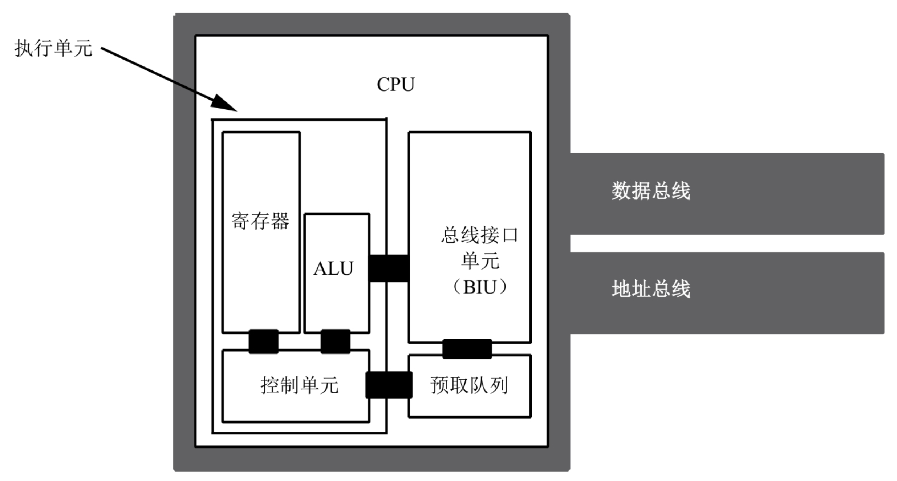

1. 利用空闲的总线周期，在总线空闲的时候，预取并保存下一条指令的操作码和操作数

   > 在没有被执行单元使用的时候，BIU可以从内存中获取额外一些字节值并保存到预取队列中，这些字节中就有机器指令。接下来，当CPU需要指令操作码或者操作数的时候，就可以从预取队列中获取下一个字节值。BIU一次可从内存中获取多个字节值，而且每个时钟周期CPU往往消费不完预取队列中的字节值，所以，CPU使用的指令一般都能从预取队列获取

2. 指令重叠

   下一条指令操作码的解码阶段和前一条指令的最后阶段也可以重叠，这是另一项提升

#### 9.5.3 影响预取队列性能的情况

跳转指令执行后可能需要几个时钟周期才能恢复预取队列的内容（少用）

在编写程序的时候，如果能够确定哪一个跳转条件最为常见，就要仔细地规划程序，当最常见的条件满足时应该继续执行下一条指令而不是跳转到另一个地址

指令长度（以字节为单位）也会影响预取队列的性能。指令越长，预取队列被CPU取空的速度就越快，就会导致CPU等待，因为CPU从预取队列移出指令的速度林比BIU向预取队列中复制数据的速度快

数据总线位宽越宽预取队列的性能越好

#### 9.5.4 同时执行多条指令的流水线

假设流水线有n个阶段，那么可以并行的指令数通常为n

1. 典型的流水线

2. 流水线停顿

   当遇到总线争用问题的时候，CPU认为指令在流水线上待得越久，它的优先级越高

   在流水线系统中，跳转越少越好

#### 9.5.5 指令缓存：提供多条内存访问通路

只要处理器的数据和指令使用独立的片上缓存，也可以具备很多哈佛体系结构的优势，且引入的问题还不多。高级CPU对内采用哈佛体系结构，对外采用冯·诺伊曼体系结构

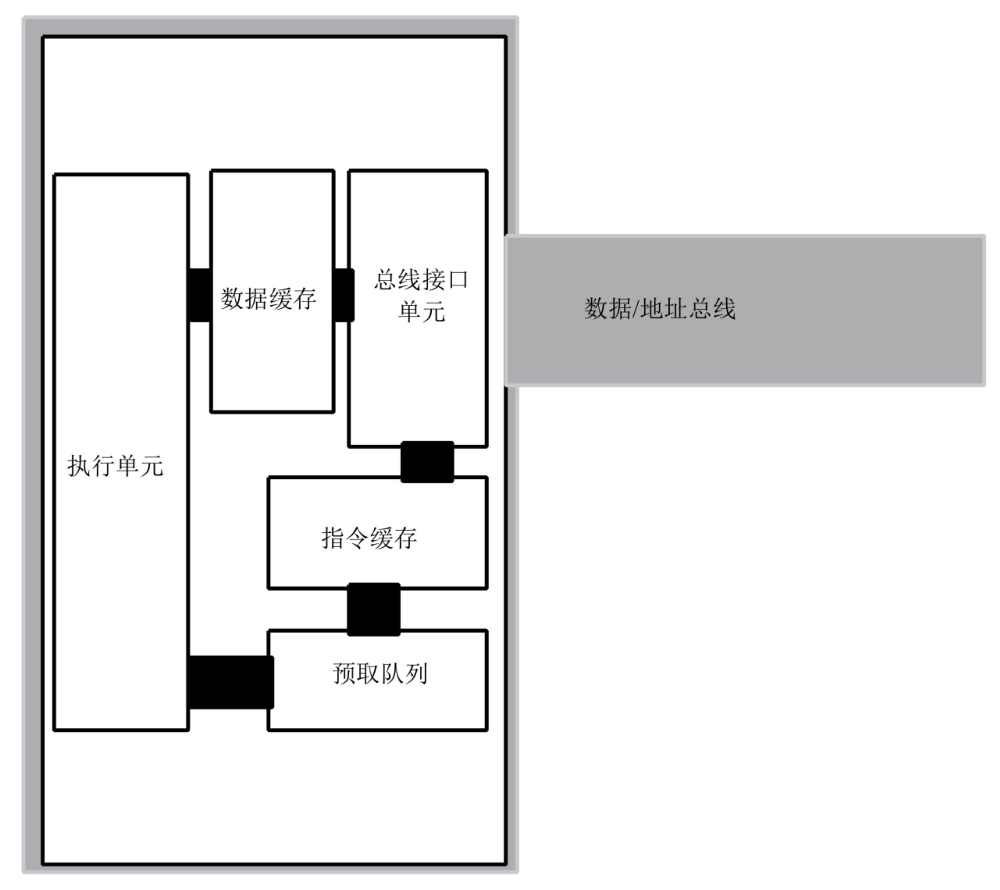

#### 9.5.6 流水线冒险

1. 控制冒险
2. 数据冒险

#### 9.5.7 超标量运算：并行执行指令

#### 9.5.8 乱序执行

#### 9.5.9 寄存器重命名

寄存器重命名用一种障眼法让CPU能够提供比实际数量更多的寄存器。程序不能直接访问这些额外的寄存器，但是CPU在某些情况下可以用它们来防止数据冒险

CPU有一种巧妙的先进机制，可以为每个通用寄存器都创建一组寄存器。也就是说，CPU提供的不是一个EAX寄存器，而是一组EAX寄存器，我们可以这样命名：EAX［0］、EAX［1］、EAX［2］，依此类推。同样，其他寄存器也可以使用寄存器组，比如EBX［0］～EBX［n］、ECX［0］～ECX［n］，等等。虽然指令集本身并不支持程序员选择使用寄存器组的某个寄存器，但是CPU可以自动选择其中一个寄存器，前提是这样做不会改变运算过程并且能够加速程序执行。这就是**寄存器重命名**

#### 9.5.10 甚长指令字体系结构

#### 9.5.11 并行处理

1. SISD-单指令流单数据流(SISD, Single Instruction, Single Data)模型
2. SIMD-单指令流多数据流(SIMD, Single Instruction, Muluiple Data)模型
3. MIMD-多指令流多数据流(MIMD, Multiple Instruction, Multiple Data)模型

#### 9.5.12 多处理

## 第10章 指令集体系结构

### 10.1 指令集设计的重要性

### 10.2 指令设计的基本目标

#### 10.2.1 操作码的长度选择

操作码的长度必须是8位的整数倍

使用数据压缩理论来设计指令——变长指令

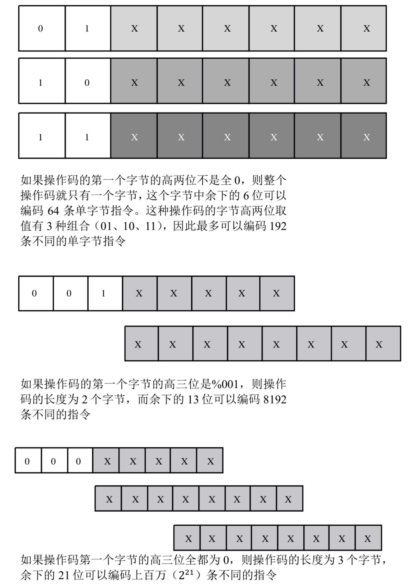

**变长指令的处理会复杂一些，影响CPU的整体性能，并且流水线很难解码多条指令，因为CPU很难判断预取队列中指令和指令之间的边界，所以大多流行的RISC体系结构都没有选择变长指令**

#### 10.2.2 规划未来

#### 10.2.3 选择指令

设计师可以留出一些指令暂时不实现，实际上也是留待以后实现。正确的做法不是一下子就把指令用完，而是要在设计时折中，创建出一套一致、完备的指令集

设计过程的初期应该把选择的范围集中在通用的指令上，这一点非常关键。最好的参考就是其他处理器的指令集

#### 10.2.4 分配指令操作码

1. 根据指令的共同特性进行分组
2. 对指令进行编码
   - 用一部分位来指定分组
   - 再用一部分位来确定是分组中的哪条具体的指令
   - 还要用一部分位来编码操作数的类型（寄存器、内存单位和常量）

### 10.3 假想处理器Y86


