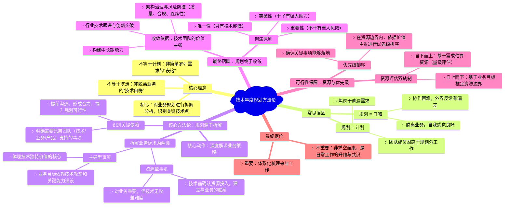

```mermaid
mindmap
  root)技术年度规划方法论(
    核心理念
      初心：对业务规划进行拆解分析，识别关键技术点
      不等于计划：非简单罗列需求的“表格”
      不等于瞎想：非脱离业务的“技术自嗨”
    常见误区
      规划 = 计划
        :· 焦虑于遗漏需求
        :· 团队成员困惑于规划外工作
      规划 = 自嗨
        :· 脱离业务，自我感觉良好
        :· 协作困难，外界反馈有偏差
    核心方法论：规划源于拆解
      核心动作：深度解读业务策略
      拆解业务诉求为两类
        资源型事项
          :· 对业务重要，但技术无攻坚难度
          :· 技术需确认资源投入，建立与业务的联系
        主导型事项
          :· 业务目标依赖技术攻坚和关键能力建设
          :· 体现技术独特价值的核心
      识别关键依赖
        :· 明确需要兄弟团队（技术/业务/产品）支持的事项
        :· 提前沟通，形成合力，提升规划可行性
    最终落脚：规划终于收敛
      收敛依据：技术团队的价值主张
        :· 构建中长期能力
        :· 行业技术跟进与创新突破
        :· 架构治理与风险防控（质量、合规、连续性）
      聚焦原则
        :· 唯一性（只有技术能做）
        :· 重要性（不干有重大风险）
        :· 突破性（干了有极大助力）
    可行性保障：资源与优先级
      资源评估双轨制
        :· 自下而上：基于需求估算资源（量级评估）
        :· 自上而下：基于业务目标框定资源边界
      优先级排序
        :· 在资源边界内，依据价值主张进行优先级排序
        :· 确保关键事项能够落地
    最终定位
      :· 重要：体系化梳理来年工作
      :· 不重要：非凭空而来，是日常工作的升维与共识
```

