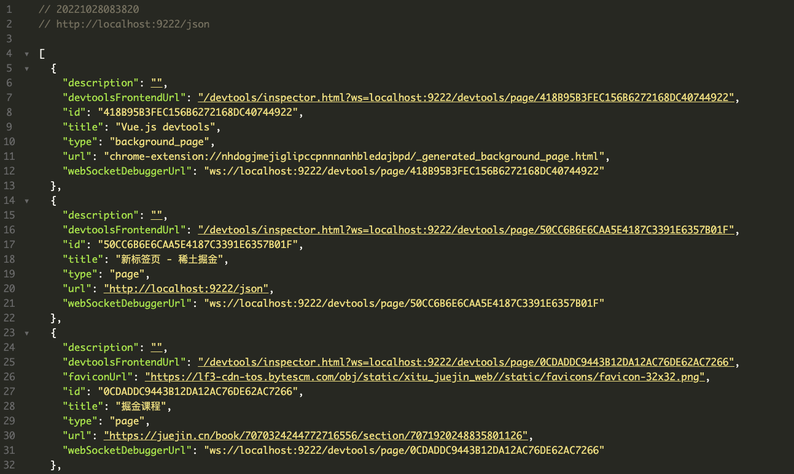
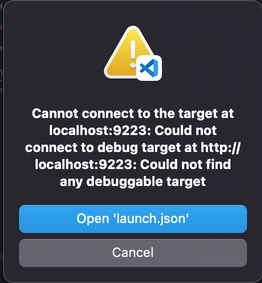
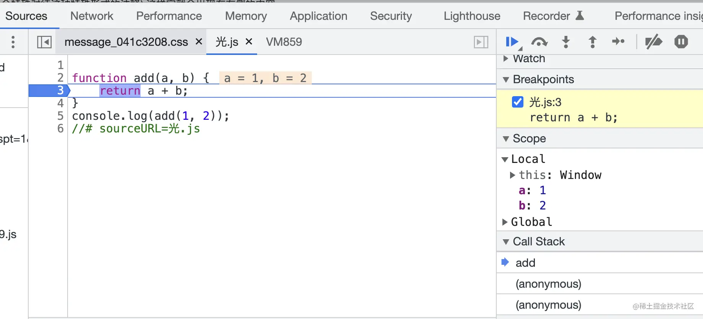
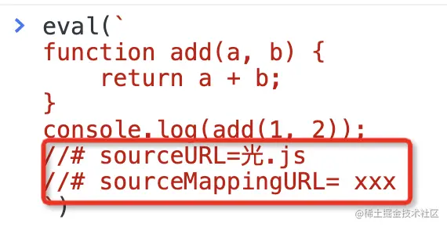
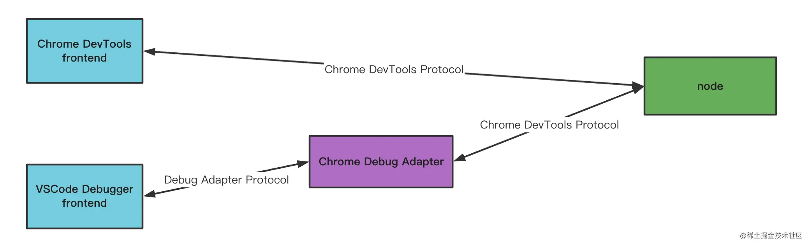

# 前端调试通关秘籍

## 零、前言


## 一、VSCode Chrome Debugger

1. `Attach to Chrome`的用法

   以`remote-debugging-port=9222`为参数启动Chrome

   ```bash
   /Applications/Google\ Chrome.app/Contents/MacOS/Google\ Chrome --remote-debugging-port=9222 --user-data-dir=自己创建的某个目录地址
   ```

   此时访问`localhost:9222/json`即可发现ws服务的地址了**（如果没指定user-data-dir要先关闭所有Chrome实例）**

   

   **关于参数user-data-dir的作用**

   该参数表示Chrome保存用户目录的地方，默认值为`~/Library/Application Support/Google/Chrome`,浏览记录、cookies、插件、书签、网站数据等等都保存在此处

   而启动时指定这个目录而不使用默认目录，是因为它只能被一个Chrome实例所访问，如果此时再启一个端口为9223的实例进行调试时，就会报如下错：

   

2. `Launch Chrome`的用法

   **launch配置中的userDataDir配置**

   作用如上述，可配置值及意义：

   - true：默认值，表示创建一个临时目录来保存用户数据
   - false：使用默认的user data dir启动chrome
   - 自定义路径：使用自定义路径来保存用户数据

   使用`false`的好处是之前在浏览器保存的用户数据比如登录状态都得到了保留，特别是如`Vue DevTools`等插件也是保存了默认用户目录中的，如果选择了`true`则需要重新安装插件

   **在调试的同时使用Chrome**

   安装Chrome的Canary版本，在`launch`方式的`runtimeExecutable`中配置值"canary"，则可以在使用同一个用户数据目录的情况下，调用使用Canary版本，正常使用普通版本，更多关于`runtimeExecutable`的值可以在vscode中查看说明

   **runtimeArgs指定Chome打开时的默认行为**

   - --auto-open-devtools-for-tabs：默认打开Chrome DevTools
   - --incognito：以无痕模式启动Chrome
   - --user-data-dir：上面已介绍，选项`userDataDir`其实就是通过指定该参数实现的

   **sourceMapPathOverrides**

   

   用于对源码路径再进行一次映射

## 二、sourcemap

> sourcemap是关联编译后的代码和源码的，通过一个个行列号的映射

一个sourcemap的例子

```json
{
  version : 3,
  file: "out.js",
  sourceRoot : "",
  sources: ["foo.js", "bar.js"],
  names: ["a", "b"],
  mappings: "AAgBC,SAAQ,CAAEA;AAAEA",
  sourcesContent: ['const a = 1; console.log(a)', 'const b = 2; console.log(b)']
}
```

各属性字段的意义：

- version：sourcemap的版本号，用来规约版本对应的各属性字段
- file：文件名
- sourceRoot：源码根目录
- sources：源码文件，即用于打包生成file的原始文件列表
- names：打包前的原变量名称
- sourcesContent：打包前的源码内容，也是数组，与sources对应
- mappings：**位置映射**

**关于mappings：**

mappings通过`;`与`,`分隔，一个`;`就代表一行，每一行中通过`,`分隔多个位置的映射，而对于如`AAgBC`这样的长度为5的字符串（称为**VLQ编码**），每一位字符的意义如下：

- 转换后代码的第几列
- 转换前的哪个源码文件（保存在sources属性中，通过下标索引）
- 转换前的源码的第几行
- 转换前的源码的第几列
- 转换前的源码的哪个变量名（保存在names属性中，通过下标索引）

PS：如果对于VLQ感兴趣可以参见阮一峰的[Javascript Source Map详解](https://www.ruanyifeng.com/blog/2013/01/javascript_source_map.html)，配置这个[工具](https://www.murzwin.com/base64vlq.html)，别外关于`AAgBC`的例子补充一下解析结果（摘自掘金，关于base64的码位表可以参见上面提到的阮一峰的文章）

>AAgBC 
>// 先将每一位按 base64 编码还原为 6 位二进制字符串
>=> 000000 000000 100000 000001 000010 
>
>// 然后进行分组，最高位的含义是是否连续，如果是 1 则连续，所以要和后面的放到一组
>=> (000000) (000000) (100000 000001) (000010)
>
>
>// 分完组之后，最高位就可以移除了，由于 VLQ 只能表示 -15 ~ 15 之间的数，所以有的数值是切割之后来表示的，所以我们要先还原它，去除最高位倒序拼接即可
>=> (00000) (00000) (0000100000) (00010)
>
>
>// 之后将最低位的符号位去除，虽然 VLQ 可以表示正负，但代码中没有负行负列这么一说，通常都是 0，所以直接去掉就行了
>=> (0000) (0000) (000010000) (0001)
>
> 
>// 最后还原为十进制数
>=> 0 0 16 1
>
>因此，结合最开始的例子，AAgBC 的映射关系就是：
>out.js 的【第 0 行（因为 AAgBC 在第一个分号之前），第 0 列】=> foo.js 的【第 16 行，第 1 列】

sourcemap的生成


构建过程生成的AST中会保留源码的位置，可以通过[astexplorer.net](https://astexplorer.net/#/gist/19042bfa06784d0e1b2dcb2ecd3559d5/50898c658d8129dbe520cc515af169331082036b)来查看AST，可以通过[source-map](https://www.npmjs.com/package/source-map)这个库来创建和解析sourcemap

**webpack中关于sourcemap的配置**：

webpack中`devtool`的配置值可以使用这个正则来校验：**^(inline-|hidden-|eval-)?(nosources-)?(cheap-(module-)?)?source-map$**，也间接表示了该属性的可选值：

- inline：将生成的sourcemap内容直接内联到打包好的文件中
- hidden：生成的sourcemap，但不与打包好的文件进行关联
- eval：浏览器devtool支持通过sourceUrl来把eval的内容单独生成文件，还可以进一步通过sourceMappingUrl来映射回源码，webpack利用这个特性来简化sourcemap的处理，可以直接从模块开始映射，不用从bundle级别
- nosource：生成的sourcemap不包含sourceContent内容，减小sourcemap文件的大小
- cheap：只映射到源码的某一行，不精确到列，用于提升sourcemap的生成速度
- module：sourcemap生成时会关联每一步loader生成的sourcemap，可以映射回最初的源码
- source-map：生成sourcemap文件

**关于eval打断点的方式：**

浏览器支持了这样一种特性，只要在 eval 代码的最后加上 //# sourceURL=xxx，那就会以 xxx 为名字把这段代码加到 sources 里，就可以打断点了




此外，还可以进一步指定sourceMappingUrl来映射到源码：



**vue-cli创建的项目，默认情况下断点不生效，是因为默认使用了`eval-cheap-module-source-map`的devtool配置，导致文件映射不正确（文件路径后带了`?hash`），将devtool改为`source-map`就可以了**

## 三、VSCode Snippets使用

**语法：**

- 指定光标位置：$x
- 多光标编辑：$x $x
- 指定 placeholder 文本：${x:placeholder}
- 指定多选值：${x|aaa,bbb|}
- 取变量：$VariableName
- 对变量做转换：${VariableName/正则/替换的文本/}

**工具**

[snippet generator](https://snippet-generator.app/)

## 四、调试Vue源码

需要git clone vue的源码仓库，在使用`pnpm run build`时添加环境变量`SOURCE_MAP=true`，这样构建出来的代码就是带sourcemap的，接着将对应package下的dist目录中构建好的代码与sourcemap拷贝到待调试项目的node_moduels下的对应目录即可，不过这里还要处理一个sourcemap与源码的映射关系，不然无法编辑源码

一种方式是配置`sourceMapOverrides`，参考前一节，另一种就是修改vue仓库中的build脚本，让生成的sourcemap直接就是正确的路径：

```javascript
// 修改rollup.config.js里关于sourcemap配置的地方，添加如下配置：
output.sourcemapPathTransform = (relativeSourcePath, sourcemapPath) => {
  const newSourcePath = path.join(path.dirname(sourcemapPath), relativeSourcePath);
  return newSourcePath;
}
```

再进行build后替换，就可以定位到源码（.ts文件），如果想直接跳转打开源码文件，需要将vue源码项目与待调试的工程添加到同一个workspace中

## 五、调试Node.js代码

对于一份node.js的代码比如index.js，可以使用如下方式开启调试服务：

```bash
# --inspect是以调试模式启动，--inspect-brk则在启用调试模式的同时在首行断住，端口号可以省略
node --inspect-brk=9229 ./index.js
```

此时会打印出一个ws的地址，接下来就可以使用客户端进行连接调试了，比如Chrome或VS Code

### 1. Chrome

打开`chrome://inspect/#devices`即可看到`Remote Target`中有我们刚才启动的调试服务，如果没有可以勾选上`Discover network targets`，并且配置一下IP地址和端口，比如一般node.js的ws调试服务地址为：`127.0.0.1:9229`

### 2. VS Code

在`launch.json`中使用模板`Node.js: Attach`来创建一个调试配置，将端口改为node.js ws调试服务的端口即可，当然也可以使用`Node.js: Launch Program`来直接启动要调试的脚本（**个人一般都是使用这种方式**）



#### 2.1. npm script

在`launch.json`添加配置预设项时选择`Node.js: Launch via npm`，通过指定`runtimeArgs`即可调试npm script

## 六、VS Code配置详解

### 6.1 Node.js Attach模式

如前所述，此模式为对于现有的一个已启动调试模式的node.js应用（`node --inspect-brk ./xxxx.js`）进行连接并调试，原理正是通过websocket形式暴露的Chrome Debug Protocol协议进行通信

**restart配置**

既然是都过ws调试服务，就会存在超时、失败之类的，此时需要进行重连，重连的间隔和次数可以如下配置：

```json
"restart": {
	"delay": 1000,
  "maxAttempts": 3
}
```

上述配置表示，1s后重试，最多重试3次

**attach by process id**

通过`lsof -i:xxx`命令可以根据调试服务监听的端口拿到调试服务的进程id，然后就可以使用此模式来进行调试了

### 6.2 Node.js Launch模式

**runtimeExecutable配置**

会从`PATH`环境变量中查找对应名字的`runtime`并启动，默认为`node`，也可配置为`npm`来调试`npm script`，或者如`ts-node`来调试ts代码（需要先安装）

**skipFiles**

其默认值为`<node_internal>/**`，即跳过node内部的文件，只关心我们所写的代码，如果去掉，则可在`CALL STACK`中查看node模块加载相关的代码

**autoAttachChildProcesses**

默认值为`true`，用于当你编写的`node`代码涉及子进程时，能命中子进程代码中的断点，调试模式启动时，主进程会有调试端口，子进程也会有调试端口，而这个配置项为`true`时就会自动连接上子进程的ws调试服务的端口

**env与envFile**

用来指定环境变量的，可以通过`env`配置项直接指定，也可以通过`envFile`配置项指定一个`.env`文件，并在其中添加相关的环境变量

**resolveSourceMapLocations**

用来定义vscode会去哪找代码的`sourcemap`，需要注意的是，它的默认值为：

```json
"resolveSourceMapLocations": [
	"${workspaceFolder}/**",
  "!**/node_modules/**,
]
```

注意第二条，这会导致vscode默认不查找`node_modules`下的`sourcemap`，比如当调试`babel`的源码时，在下载下来的`babel`依赖包里是有`sourcemap`的，但因为上述配置`vscode`会默认忽略查找此处，所以需要去掉

