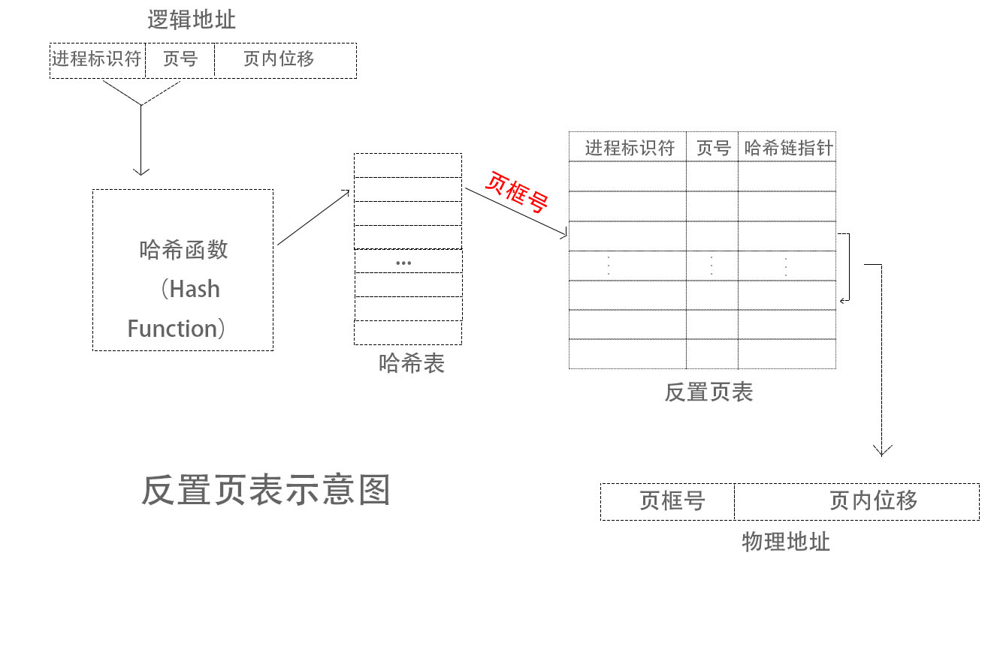
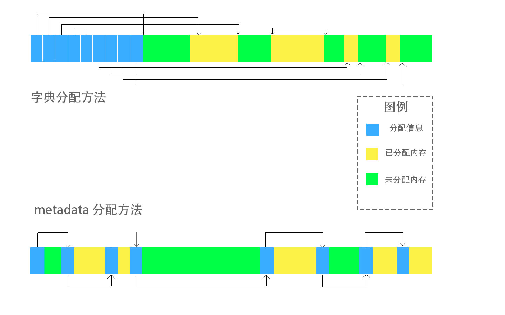
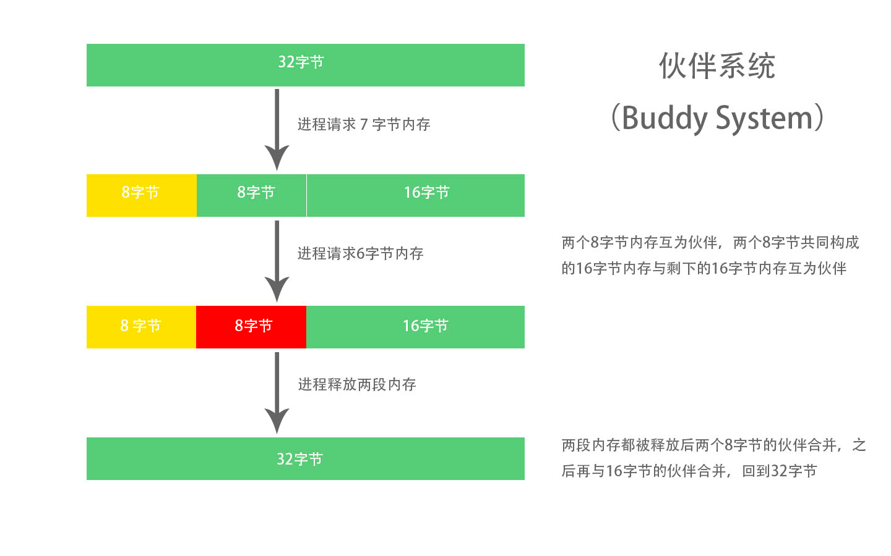
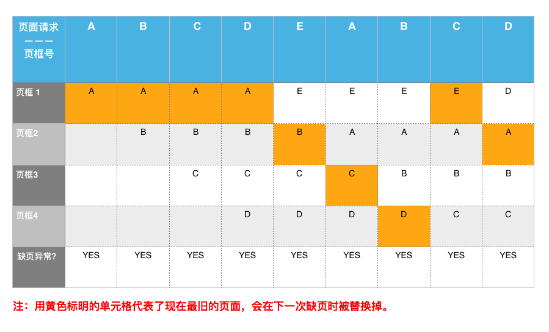
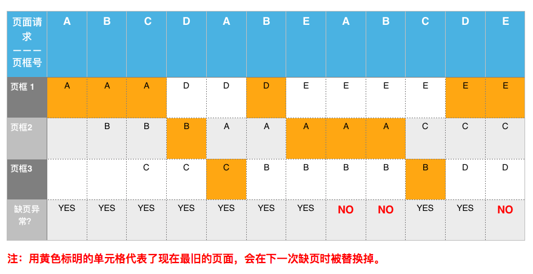

# 操作系统相关学习

## 引言

略

## 一、C语言复习

略

## 二、进程

### 2.1 进程、地址空间与线程

进程在系统中的实现方式要达到两个目的：

1. 进程的结构必须能够囊括一个进程的运行状态，在由于中断、异常或系统调度进入内核态时我们应该能够将进程的运行状态放到内存的某一位置，使我们可以在某一时间点根据进程的优先级接着这次的进度再次运行该进程。
2. 由于进程在用户一侧对内存进行了抽象，我们需要在系统一侧包含从抽象内存向实际内存和外存（磁盘等存储设备）的映射，以便通过抽象内存的地址获取物理地址和中存储的数据

为了实现以上两个目的，我们将在进程中存储处理器状态寄存器、指令计数器、栈指针、通用寄存器等代表了进程目前运行状态的值。

**并行与并发的区别：**

并行：在物理时间上同时运行

并发：多个进程在处理器上并发运行


由于现代计算机中往往有多个核或多个处理器，我们的程序可以达到并行，因为同一个进程可能同时包含有多个不同的运行状态。为了更好的区分进程在一个处理器上的运行状态和进程本身的运行状态，我们引入**线程**的概念。每个线程有一个线程控制块，用来存储我们上述提到的处理器状态寄存器、指令计数器、栈指针、通用寄存器等数值，但同一个进程中的所有线程都共享同一个地址空间

一个用户进程所看到的内存空间是抽象的，区别于实际的物理内存，因此为了支持进程从抽象内存获取物理内存中存储的信息，我们需要在进程中包含从抽象内存向物理内存的映射，即该系统所用的地址转换方法所需要的信息，常见的地址转换方法包括分页存储、分段存储等。

用于描述进程的数据结构就是**进程控制块**，它作为进程存在的唯一标识，其中包含了优先级、基地址、可用地址范围等用户进程不应该有权限修改的信息，因为它存储在内核空间中

### 2.2 进程状态与用户态和内核态之间的切换

进程的三态模型：

- 运行态（running）
- 就绪态（ready）
- 等待态（wait）

**处于就绪态的进程不会因为遇到任何事件而无法进入等待态；处理于等待态的进程在事件发生后考虑到优先级的问题，必须先回到就绪态而不能直接运行**

进程的五态模型：引入了新建态（new）和终止态（exit）

- 新建态：进程被创建时尚未加入就绪队列的状态
- 终止态：进程已经结束，但尚未被系统撤销的状态


### 2.3 子进程与父进程

- fork：通过unistd.h中的`pid_t fork()`函数可以创建子进程，返回值为进程标识符pid，此标识符可用来区分父进程与子进程，在父进程中返回的进程标识符id是新创建的子进程的进程标识符，而在子进程中返回的进程标识符为0，可以利用if语句判断进程标识符是否为0，从而使子进程与父进程执行不同的信不信。

- exit：通过stdlib.h中的`void exit(int status)`，可以在由fork创建的子进程中主动结束这个程序。而参数status会作为子进程的结束状态被提供给wait()方法的第一个参数
- wait：sys/wait.h中包含`pid_t wait(int* stat_loc)`，其参数stat_loc可以被用来存储等待的进程的结束状态值的指针。wait方法会使父进程进入等待态，直到父进程的所有子进程中的**一个**成功退出并返回结束状态值，父进程才可以进入就绪态。

```c
#include <stdio.h>
#include <unistd.h>
#include <stdlib.h>
#include <sys/wait.h>

int main() {
    printf("%s\n", "我是鸣人！");
    /*YOUR CODE HERE*/
    int pid = fork();
    if (pid != 0) {
        int status;
        int result = wait(&status);
        if (result == -1 || status != 0) {
            printf("%s\n", "可恶，又失败了，再来一次！");
            return -1;
        } else {
            printf("%s\n", "我负责性质变化！");
        }
    } else {
        int second_pid = fork();
        if (second_pid != 0) {
            int new_status;
            int new_result = wait(&new_status);
            if (new_result == -1 || new_status != 0) {
                exit(-1);
            } else {
                printf("%s\n", "我负责形态变化！");
            	exit(0);
            } 
        } else {
            printf("%s\n", "我负责产生查克拉！");
            exit(0);
        }
    }
    return 0;
}
```

### 2.4 exec

exec组包含以下六个函数：

```c
int execl(const char* path, const char* arg, ...);
int execlp(const char* file, const char* arg, ...);
int execle(const char* path, const char* arg, ..., char* const envp[]);
int execv(const char* path, char* const argv[]);
int execvp(const char* file, char* const argv[]);
int execvpe(const char* file, char* const argv[], char* const envp[]);
```

以execve为例，此函数将在**现在运行的**进程中以argv中存储的字符串为参数运行由filename指向的可执行程序，并将envp中存储的“变量=数值”作为环境变量代入这个程序，根据传统，argv中的第一个参数必须与filename一致，真正的参数第二个开始。execve会以filename的程序覆盖现在进程中正在运行的程序，因此所有在execve函数之后的行都只会在execve失败之后被执行。

这6个函数可以表示为“exec + l/v + p/e/pe”，所以这六个函数主要有两处不同，第一处不同（l/v）在参数中表现为“execl”类函数将所有参数作为一整个字符串代入，而“execv”类函数将参数分别放入一个字符串的数组，将数组作为参数代入函数运行。第二处不同（p/e/pe）表现为包含p（代表path）的函数可以模仿计算机shell中的功能，在“file”中不含“/”时应用环境变量PATH中的目录来寻找可执行文件，而包含e（代表environment）的函数可以像execve一样将“变量=数值”对作为环境变量代入程序。

## 三、内存管理与地址转换

### 3.1 内存管理的基本思想

每个进程有自己的**地址空间**，包括这个进程可以使用的全部地址和其中存储的所有数据；为了防止不同进程修改彼此的地址空间，操作系统需要将进程的逻辑地址转换为物理内存中的实际地址，这一过程可以由不同方法实现

操作系统为了达到让多个程序相互不覆盖地放入物理内存，多种连续内存管理方法与非连续内存管理方法逐渐被发明和使用，在介绍这些实现方法之前，还必须了解**碎片**的概念和评价一个内存管理方法的标准

碎片分为**外部碎片**与**内部碎片**，前者指的是因为长度过短而无法被使用的未分配内存；后者指的是已分配内存中因为分配长度过长而没有被进程有效利用的内存

评价实现地址转换和内存分配方法的标准：

1. 是否会造成大量碎片的出现
2. 实际实现的过程是否过于复杂、占用过多的内存
3. 既能够达到保护进程不被其它恶意进程读取内容、保护进程不能修改自己的代码、方便进程在运行过程中获取更多内存或与其它进程共享一部分内存，同时又不需要过多的内存空间存储地址转换需要的信息或过长的时间实现地址转换或内存分配，并且不产生内部和外部碎片

### 3.2 连续内存管理

连续内存管理会将同一个进程的地址空间映射到一段连续的物理内存上

#### 3.2.1 固定分区存储管理

- 早期被用来实现连续内存管理的方法是**固定分区存储管理**

  将内存空间分为数目固定的分区，其中每个分区的大小都与其它分区不同，一个分区只对应一个进程，处于不同分区中的进程并发执行。此种方法需要一种记录未被使用的分区的方法，即内存分配表，它记录了内存中所有被划分的分区的大小及使用情况

- 进程就绪队列不为空，且出现一个新的可用分区时，选择下一个进程的方法：

  - 让每一个进入系统的进程排在可容纳该进程的最小区分队列中，该分区空闲时选择第一个进程运行；
  - 所有进程排在同一个队列中，分区空闲时进入队列，寻找第一个分区可以容纳的进程或分区长度所能容纳的最大进程进入该分区。

- 此两种方法存在的问题
  
  - 前者，如果大部分进程所需要内存都处于同一个大小区间内，会出现进程长时间等待的问题
  - 后者，如果选择第一个可容纳的进程，如果进程所需要内存空间很小，则会产生较大的内部碎片，如果选择后分区长度所能容纳的最大进程，则又可能会出现第一种方法存在的问题

- 固定分区存储管理存在的问题
  - 一个进程所需要的内存大小大于最大分区的大小，则系统必须合并分区，复杂度高
  - 如果事先知道最大作业的大小而将一个分区设为该大小，则该分区运行其它进程时可能产生较大的内部碎片
  - 进程运行时如果发现需要更多的内存，固定分区方式很难给这个进程分配新的分区
  - 固定分区方式限制了分区的数量，可能会造成进程拥堵

#### 3.2.2 可变分区存储管理

这种管理方式按不同进程所需的内存大小划分分区，并将所有未分配的分区放在一个链表中。在一个进程结束、被系统撤消后，它所占用的分区被标记为未分配，加入未分配分区链表；如果毗邻的分区也未分配，则它们被合并为一个更大的分区加入链表。在一个新的进程进入系统时，系统将沿链表寻找可以容纳该进程的未分配分区，将进程需要的大小分配给该进程，将该分区中剩余的内存作为一个新的未分配分区加入链表

  

#### 3.2.3 基地址与限长

连续内存管理方法中，每个进程在获取一段连续内存后将内存的**基地址（Base）**与**限长（Bound）**存入进程控制块中，在进程读写内存时，就能通过基地址和限长来检查进程是否企图使用超出其分配范围外的内存

### 3.3 可变分区存储管理的实现

针对分区分配的五种算法

#### 3.3.1 最先适应（first fit)

顺序查找未分配分区链表，选择第一个满足长度要求的分区。采用这种算法时，未分配区表中的空闲区往往按照地址从低到高排列，这样高地址部分的内存尽量不被分割，可以留给内存需求大的进程。尽管这种算法使低地址空间的使用率远高于高地址空间并在低地址空间产生了许多小的未分配分区，在实际的系统中，这种算法由于其快速、便于实现的特点被广泛应用

#### 3.3.2 下次适应（next fit）

这种算法会保留一个搜索指针，每次总是从上次未分配分区的扫描结束处开始扫描，直到的到第一个能满足长度要求的空闲分区。这种算法相比第一种对存储空间的利用率较均衡，不会使碎片化的空闲区集中在低地址部分

#### 3.3.3 最优适应（best fit）

这种算法在每一个新进程进入系统时都扫描整个未分配分区链表，寻找最小可满足该进程内存需求的未分配分区。使用这种算法时往往把分区按大小升序排列，方便找到符合要求的最小分区。这种算法的问题是每次分配分区后，该分区中大于进程所需内存大小的部分可能很小，因此会在未分配分区链表中加入很多很小的分区，不能被任何进程使用，而导致外部碎片的产生

#### 3.3.4 最坏适应（worst fit）

与上一种相反，这种算法总是将最大的未分配分区分割给作业使用，这样分配的分区中剩下的分区总不会过小。使用这种算法时，我们总是将未分配分区按大小降序排列，使找到最长分区非常快速

#### 3.3.5 快速适应（quick fit）

这种算法给一些常用的分区长度设立了单独的链表（如：2kb、4kb、8k的分区可能分别对应一个单独的链表）。我们把大小接近这些分区的分区也放在这些分区的链表中（如：5kb分区可以放在4kb的链表中）。这样，在一个新进程进入系统时，我们可以将可以容纳该进程的最小长度的链表的第一个分区分给它。这种算法非常快速，但在归还分区和合并未分配分区时非常复杂

### 3.4 内存不足的解决方法

连续内存的存储面临一个比较大的问题，难以获得足够大小的连续内存用于分配给一个进程：

1. 总量大于但需要进行分区合并才能获取足够的连续内存空间
2. 系统中未分配内存问题小于进程需要的内存，此时需要进行置换，将一部分处于内存中的东西移到外存中

#### 3.4.1 移动技术

对于第一个问题，通过读出已分配内存中的全部数据并写回内存中的另一个位置，使未分配分区集中到一个位置进行合并来满足需求

问题：

- 正在读写的分区不能移动
- 移动过程中不能读写分区，延长所有进程的响应时间

#### 3.4.2 覆盖技术与对的技术

##### 覆盖技术

覆盖技术要求程序开发者将自己的程序分为几个“覆盖段”，每个覆盖段中含有多个相对独立的程序部分，称为“覆盖”，处于同一个覆盖段中的覆盖相互没有依赖关系，所以不需要同时处于内存中。我们以每个覆盖段中最大的覆盖的大小来规定该覆盖段的大小；在每个覆盖段中，所有覆盖按一定的顺序进入内存，这样系统在给这个进程分配内存时，就只需要分配大小等于该进程所有覆盖段大小之和的内存，节省了很多空间

问题：

程序设计的难度大，需要将程序分为互不依赖的模块，并设计不同模块进入内存的顺序，这种技术只在早期的计算机中被使用

##### 对换技术

对换技术的概念非常简单，即将内存中的一部分移出内存，然后将总量小于等于被移出部分大小的数据从外存移到内存中

问题：

哪一部分内存该被移出——处于等待态的进程；如果没有进程处于等待态该如何？这就引出了非连续存储管理的意义

### 3.5 分段内存管理

分段内存管理会将进程的逻辑地址分为两部分：段号与段内位移

每一个进入操作系统的进程都会拥有自己的段表，表中的每一行都对应着段号等于行号的段的段长与基址，以及一些用于限制这一段的操作权限的保护位（如是否可读、可写）。这样就可以通过段号获取逻辑地址所对应的段的基址，然后将段长与位移作比较，如果位移未超过段长则将位移与基址相加，得到实际的物地址。由于系统对于段号和段内位移的尾数做了限制，如果在32位操作系统中段号由i位组成，则用户进程在设计分段时不能设计超出2^i个段，每段的长度不能超过2^(32-i)字节

每次进程在对内存进行操作时，都必须用段号作为行号进入该进程的段表，获取基址和段长；如果段号大于该进程的最大段号，或进程对这一地址的操作不被该段允许，或逻辑地址中的段内位移大于段长，则硬件会触发异常，这就是你在写C语言时可能会见到的段错误（Segmentation fault）


#### 优点

不同进程间可以共享一段逻辑上相对独立的内存，比如两个运行同一程序的进程可以共享代码分段，两个公用一个库的进程可以共享只包含这个库的段。

#### 缺点

每段大小不固定，因此可能面临内存中存在很多外部碎片，需要移动已有进程才能运行新进程的局面，为了解决这一问题，我们可能希望每一段都有相同的大小，或可以被切分为大小相同的更小单位来存储，这就引出**分页存储管理（Paging）**

### 3.6 分页存储管理

一个系统中所有页大小是固定、相等的，页大小一般为2的整数次幂字节。为了区分进程地址空间与物理内存，我们将物理内存中同样大小的内存单位称为页框；你可以把地址空间的页想象成照片，而物理内存就像是一个相册，中间有很多大小相同的相框，而相框中包含什么照片就取决于现在是哪个进程在用这本相册

每个进程有自己的页表，长度由进程所需页的数量决定，我们可以在页表的第b行查看页号为b的页在物理内存中对应的页框号、读写权限位、是否实际存在于内存中的有效位、页是否被修改过的**页面重写标志位（后续会讲到）**等，将页框号与位移合成该逻辑地址对应的物理地址

为了分配页给不同的进程，系统将需要一个内存物理块表，用来记录页框状态，即哪些页框未被分配，已分配的页框属于哪些进程等等；在新进程进入系统后，将在内存物理块表中寻找未被分配的页框给这个进程使用


#### 优点

进程所占内存大小是页大小的整数倍，不会像分段处理那样出现外部碎片

每个进程都需通过页表获得物理地址，用户进程自然不能接触其它进程未与之共享的物理地址

共享变得简单了许多，只需要将不同进程的两个页指向同一个页框

#### 缺点

页表本身需要很大的空间，可能会占去很多内存空间，后续介绍的多级页表、反置页面表和分段与分页结合的存储管理都是为了解决这个问题

### 3.7 分段VS分页

#### 相同点

分段与分页都会将一个进程的地址空间分为几个小段，将这些小段分别存储在连续的一段内存中，但同一个进程的不同段可能存储在不连续的内存中

#### 不同点

分页完全根据一个固定的大小将内存分为大小相等的段，与内存中所存储的内容无关，而分段存储管理是根据内存的逻辑结构将内存分为几个部分。一种常见的分段方法是将进程内存分为代码、数据、栈和堆四部分，然后将这几部分分别存放在几段可能互不连续的内存中；而在分页的存储模式中，栈可能会分布在几个物内存中不连续的页中。另一点不同是，在分页存储管理中，页的划分是用户进程不可见的；而在分段存储管理中，段的划分是用户进程可见的，可以根据自己的需求和逻辑地址结构的限制来自行划分

分段与分布也可以结合起来使用，后续章节会提及

### 3.8 虚拟存储，多级页表与反置页表

分页存储管理会导致页表占用较大的内存空间，而在现代计算机系统的发展中，人们意识到一个进程可能并不随时需要其全部的程序和数据来运行，因此可以进一步扩大进程的地址空间，将地址空间的一部分存储在磁盘上，只将运行用到的部分放到物理内存中，这种想法允许一个进程拥有与物理内存大小相同甚至大于物理内存大小的地址空间，因此虚拟存储器诞生了。在将虚拟存储中的逻辑地址转换为物理内存的实际地址时，我们需要的页表大小与虚拟存储中的总页数成正比，也就是说页表会占用更多的物理内存，为了节约空间的开销，引入了两种新的将页号转换为页框号的方法

#### 说明

在国内很多教材中，虚拟地址，即虚拟存储器所用的地址，与逻辑地址，即进程地址空间中的地址，是两个不同的概念，这种区分主要来源于x86架构对于分段存储的实现。在x86构架中，逻辑地址使用的是“段：段内位移”的形式，与我们常见的0xFFFFFFFF这种形式的地址不同。后一种地址与地址空间中每一个位置一一对应，如一根线一样，被称为线性地址。虚拟地址都是针对进程的虚拟地址空间的线性地址，与x86架构中的逻辑地址有明显不同；处理器使用的是逻辑地址，但我们也可以通过一定的方式由逻辑地址获得虚拟地址。此处不同的架构不是我们关注的重点，因为将以“逻辑地址”来表示进程地址空间的线性地址，而不把逻辑地址当作“段：段内位移”的形式

#### 3.8.1 多级页表

多级页表的思想是将原页号分为两个部分，用第一部分将原来的大页表分为几个小页表，称为页表页，将每个页表页分别存在内存的一个位置，然后将这些位置与我们用来区分页表页的页号的第一部分一一对应，形成一个页目录表，在转换地址时先通过页号的第一部分在页表页目录中找到一个页表页，然后用页号的第二部分在页表页中找到页框号；我们将页号的第一部分称为页目录位移，页号的第二部分称为页表页位移

如何决定页目录位移包含多少位？假设在一个32位系统中，每个页面为2^iKB（即占了i+10位），那么内存中总共有2^(22-i)个页（32-i-10=22-i），页表中每行为2^jB，即所有页表项占用的内存2^(22-i+j)，即需要22-i+j位表示每一项的地址，对于32位系统，每个页表页可以包含2^(10+i-j)项（即32-(22+i-j)），则需要2^(22-i-10-i+j)即2^12-2i+j个页表页，因此，我们需要12-2i+j位来表示页目录位移，10+i-j位表示页表页位移，10+i位表示页内位移，总共占32位

多级页表的优势在于，不需要将所有的页表页留在内存中——只需要那些近期使用过或正在使用的页表页留在内存中，而这可以帮我们节约大量内存。但多级页表也存在问题——即使一个页和它对应的页表页都存在于内存，也需要三次访问内存：

1. 访问页目录找到页表页的起始地址
2. 通过页表页起始地址+页表页位移找到页框号
3. 通过页框号+页内位移访问实际数据

此外，如果发现某一页不在内存中，还要花费更多的时间将页从磁盘中复制到内存中


#### 3.8.2 反置页表

其特点是将所有进程都包含在**一张表中**，将逻辑地址中的页号与该进程的进程标识符结合起来作为哈希函数的输入，哈希函数映射到一个反置表项上。一个反置表项包括进程标识符、页号和哈希链指针；哈希指针是一个指向反置页表中的其它项的指针，它被用来解决哈希函数中不同进程的不同逻辑页指向同一个反置项的问题。如果反置页表项中的进程标识符和页号与逻辑地址中的进程标签号和页号相同，这说明物内存中的这一页框确实对应着逻辑地址空间中的这一页，我们可以直接将页框号与页内位移组合获得物理地址。反之，就必须沿哈希指针寻找符合该逻辑地址的进程标识符和页号的项，如果找不到，那说明该页不在物理内存中，此时系统触发缺页异常，将页从磁盘中复制到内存中

反置页表相对于多级页表，对于在物理内存中的页，可能只需访问一次内存；同时它的大小是与物理内存中的页数量成正比，因为所占的内存远小于普通页表。

但它存在的问题是，表中包含的只有在物理内存中的页，对于不在物理内存中的页，进程仍需建立普通页表存储，而且反置页表相对其它方式需要更复杂的硬件结构来实现



### 3.9 应用可变分区存储管理实现malloc

#### 3.9.1 sbrk系统调用

```c
void* sbrk(intptr_t increment);
```

sbrk系统调用可以被用来调整一个程序的数据段的终止地址，即program break。它在现有的基础上将program break提高increment字节，调用成功返回**调整前**的program break位置，失败则返回(void*)-1

#### 3.9.2 实现malloc的三种算法

- 在堆内存的开头存放一个字典，将每块分配的内存的信息作为一个数据项放到字典中，每个数据项记录内存的位置、大小等信息

```c
struct dictionary_entry{
  void* address;
  size_t size;
  /*if this block is free, then is_free is 1 otherwise it's 0*/
  int is_free;
}
struct dictionary_entry dictionary[NUM_OF_ENTRIES];
```

这种方式存在一个问题，我们如果知道该在字典中存放多少个数据项，比如我们在字典里存放了n项数据，然后从字典之后的内存开始分配给进程，当我们发现需要更多数据项时，我们是否需要将所有已分配的项的内存向后移动？这就引出第二种结构，即将每段包含了信息的数据结构存放在其对应的被分配内存的前面



- metadata分配方法，如上图所示

解决了字典方法所面临的数据项数量未知的问题，但也存在问题——它和我们前面提到的可变分区存储管理本质上是一样的，都面临着外部碎片的问题，于是又引出新的分配方法——**伙伴系统**

- 伙伴系统分配方法

伙伴系统的基本思想是，将进程请求的堆内存大小变为大于等于数据块的最小的2的整数次幂（如：用户请求7字节的堆内存，则将7约为2^3=8字节），然后在堆内存中寻找该大小的数据块，如果没有该大小的内存，则将一个大小为该数据块二倍的数据块分为两半，互为对方的“伙伴”，其中一半用来返回给用户。为了记录每个数据块是否空闲，我们给每一个大小等的数据块都建立一个**位映像（bitmap）**，用来表示每块数据是否已经被应用；每次分配新数据时，我们在对应的数组中寻找空闲的数据块



## 四、地址转换与页面替换

### 4.1 存储管理部件与翻译快表

处理器运行时使用的是逻辑地址，所以当需要从内存中读取或写入某一数据时，需要先将逻辑地址转换为物理地址，而**存储管理部件（Memory Management Unit，MMU）**正是实现这一功能

MMU中含有一个硬件页表基址寄存器，其中存放了现在正在运行的进程的页表基址，当进程需要读写一个地址时，MMU都将其逻辑地址分解为页号与页内位移，然后用硬件页表基址寄存器中的页表基址找到页表中的正确的项，获得其物理页框号。同时MMU也负责在进程使用一个页时查看保护权限位、检查进程无越权操作，并改变页表中该页对应的特征位（修改位、有效位、引用位等）

**如何解决每次读写需要访问两次内存的问题？**

在第一次使用一个页时不可避免需要从页表中找到它对应的页框号，需要访问两次内存，但如果通过某种形式记住这个页框号，则后续再使用该页时就可直接使用了，那页框号记录在哪呢？如果记录在内存则依旧要访问两次内存，这里就引入一个比内存更快的硬件——**翻译快表（Translation Lookaside Buffer，TLB）**

TLB**独立于内存**，读写速度远快于内存，但造价也更高，因为一般只用来存放几十个页表项。每次进程需要使用一个页时，先查看页号对应的页框号是否在TLB中，如无则将页号及其对应的页框号、特征位存入翻译快表，下次再使用该页时则可以直接在TLB中找到页框号获取物理地址

每次使用一个页时需要更新翻译快表中对应的特征位，如写入页后必须更新**修改位（dirty bit）为1**

由于不允许一个进程通过TLB获取另一个进程的信息，因为需要以某种形式区分不同进程在TLB中的项，一般有两种方法：

- 在每一个TLB项中添加对应进程的**进程标识符（PID）**
- 在每一次上下文切换时将TLB清空或全部设为无效，强制下一个进程进入页表来获取页框号

TLB本质上就是一种特殊的**高速缓冲存储器（cache）**，为了减少访问页表产生的延迟，则必须提高TLB的命中率，接下来就要提到影响命中率和命中时间的因素以及提高TLB命中率、缩短其命中时间的方法

### 4.2 失效与地址映像

先考虑TLB在哪些情况下无法命中一个页（无法命中的情况称为失效），在不考虑多处理器的情况下，主要分为以下三种：

- 第一次使用某个页，其不可能在TLB中，这种失效称为**强制失效（compulsory miss）**
- 如果曾经将某个页放入TLB，但一段时间后，这个页的位置已经被其它页占用了，这种失效称为**冲突失效（conflict miss）**
- 如果在使用一个页时，该页不在TLB中，并且TLB已满，这种失效称为**容量失效（capacity miss）**

区分容量失效和冲突失效：如果面临的失效通过增加TLB容量就可以解决，则是前者，否则是后者

以下两种情况先**不做讨论**：

- 减少强制失效：可以根据用户连续使用内存的假设（称作**空间局部性，spatial locality**）在使用一个页时将其后面的一个或几个页也读取进来（这种技术称为**预取，prefetching**），但读取本身所占的时间也会带来延迟，读取太多反而易造成容量失效
- 减少容量失效：解决这个问题只有扩大容量，但这就要求提高计算机的制作成本

冲突失效的数量主要取决于TLB如何通过页号决定页在TLB中的位置，即所使用的地址映像方法，与高速缓冲存储器类似，TLB也可以从以下三种方式中选择一种：

- 直接映像（direct-map）
- 组关联映射（set associative）
- 全关联映射（fully associative）

#### 4.2.1 直接映像

可以根据TLB的容量，取页号中固定的几位与TLB的中的项一一对应。比如快表容量为64（=2^6），假设后6位是`010010`，则可将其放入TLB的第18项，如果这一项已被使用，则将原页移出，放入新页，这个失效的旧页面临的就是**冲突失效**

#### 4.2.2 组关联映射

为了解决直接映像的冲突失效问题，我们希望一个区域可以容纳多个被映射到这个区域的页面而不导致失效，这就是组关联映射背后中的思想。在组关联中，TLB被分为几个含有相同数量页的组，当一个页面被映射到一个位置时，它可以进入这几个组中任何一个组的对应位置，这就减少了冲突失效出现的概率。

以上面提到的可以容纳64项的TLB为例，如果分为4组，那么64/4=16（=2^4），我们就只需要比较页号的后4位来给页面选择一个位置；如果这4组中任何一组中的这一位置是空闲的，就可以把页放入那个位置

#### 4.2.3 全关联映射

将组关联的优势发挥到极致，将所有TLB中的项都看作并列的组（比如TLB中有64项，那么它就有64个只含一项的组），当一个页进入TLB时，就可以进行任何一个空闲的项，这就是全关联映射

全关联映射虽然大大提高了命中率，但也延长了一次命中需要的时间，因为此时要从TLB中获取一个页的页框号，必须同时将它与全组的对应位置存放的页作对比，这一过程将会花费更长的时间

#### 4.2.4 方案的选择

由于TLB的一次失效意味着要去内存中的页表获取页表项，一次失效带的时间代价远大于提高关联性导致的命中时间的延长，因此一般的TLB仍然采用全关联映射

当然，为了既享受关联型TLB带来的高命中率，又不牺牲命中时间，TLB也可以由两层使用不同的映射方法的快表构成。第一层快表容量小、使用直接映射、速度较快、但命中率较低；一旦第一层不能命中，就进入全关联型的第二层快表，这一层虽然命中时间长，但命中率高

#### 4.2.5 关于“抖动”

全关联映射中，还有一个因素会影响命中率，就中当TLB已满时如何选择旧的页进行替换的机制，因为在全关联型中，每个页都是相互等价的，如果替换机制不够好，很可能出现一个页面刚刚被替换出去，又马上需要调入的情况，这种情况的持续被称为**“抖动”**，会大大拖慢运行的速度

一个较为合理的替换机制是选择自上一次使用后过去的时间最长的页面，这是基于一个假设：用户在使用内存时短时间内会使用一段连续的区间的内存，因此一段时间不被使用的内存短时间内应该也不会被使用。这种方法被称为**最近最少使用方法（Least Recently Used，LRU）**

另一种替换机制是随机选择一个页替换；这种方法听起来不靠谱，但实际随着快表大小的增大，随机替换机制的命中率会逐渐逼近最近最少使用的命中率，而其实现难度又小于后者，因为在实际应用中往往被广泛使用

### 4.3 请求分页虚存管理

当一个进程所需的页比物理内存大时，我们就只将运行所需要的页保留在内存中，将其它页保留在读写速度较慢的外存中，因此当我们发现一个页不在内存中时，我们就触发了**缺页异常（Page Fault Exception）**原本负责地址转换的**存储管理部件（MMU）**会将控制权交给内核，而内核会使进程进入等待态，选择一个空闲的页框或将一个内存中的页移出至外存，将所缺页从外存复制到该空闲页框中。这一过程被称为**分页虚存管理**，即只在需要页时将页从外存调入内存

请求分页机制与翻译快表机制本质都是利用高速缓存，所以都需要解决一个问题：怎样才能最大限度地利用存储在高速缓存中的数据提升运行速度，因为需要有一个能够降低缺页异常比率的算法，这种替换算法根据替换范围分为两大类：全局替换算法与局部替换算法，前者从物理内存的**全部页中**选取一个页进行替换，后者只从**需要调入页的进程**本身的页中选取一个替换

- FIFO（先进先出算法）
- LRU（最近最少使用算法）
- Random（随机算法）
- OPT（最佳页面替换算法）

#### 4.3.1 最佳页面替换算法

最佳页面替换算法要求系统在需要从外存调入一个新页面时选择内存中未来最长的一段时间内不会被用到的页面来替换，此算法显然是不能够实现的，因为无法完全预知未来，之所以提及此算法，是因为这个算法可以被证明是最好的页面替换算法，接下来提及的算法都要与这个最佳算法作比较来衡量其优劣程度

#### 4.3.2 FIFO

FIFO，即先进先出算法，易于实现，它按照页面进入内存的时间顺序，每次将最老的页面调出内存。但这种调用方式只适合那些不重复调用同一个页面的进程，而对于先调入代码页这种常用页面后不断重复使用该页面的进程来说，FIFO是灾难性的，如下图这种调用顺序，每次都会触发缺页异常：



为了避免上述问题，我们可以使用改良版的FIFO算法，叫做**第二次机会算法**：按照页面进入内存的顺序，把它们放在一个链表中，每个页面有一个“引用位（use bit）”，代表其是否被使用过，引用位一开始为0，在读写时被设为1，每次准备将链表开头的结点对应的页面调出内存时，先查看它的引用位，如果其值为0，那它不仅是最先进入内在，而且已经很久没被使用过，可以进行替换；否则，我们就清零它的引用位，然后将它放到队尾，作为一个新的调入页面得到第二次机会

FIFO的另一个缺点：增大内存并不一定能够降低其缺页异常的比率，比如下面内存大小为3和4时的缺页次数对比：




为了避免FIFO的缺点，我们可以使用Random算法来替换页面。Random算法作为对OPT的近似显然不是一个很好的选择，因为它只有很小的可能性产生跟OPT一样的结果，但它也有一个明显的优点，那就是它成为最坏的页面调试方法的可能性也同样小。与之相比，FIFO和我们接下来要实现的LRU都可以在某些特殊的调用序列下成为最坏的方法。
