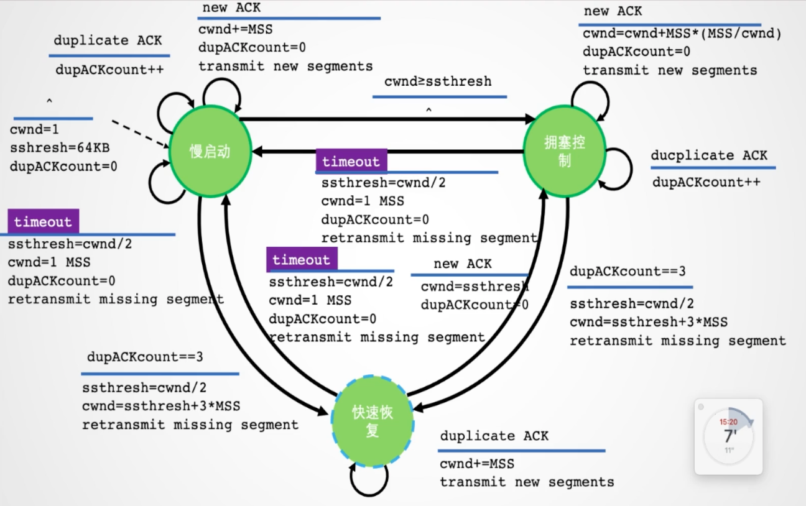
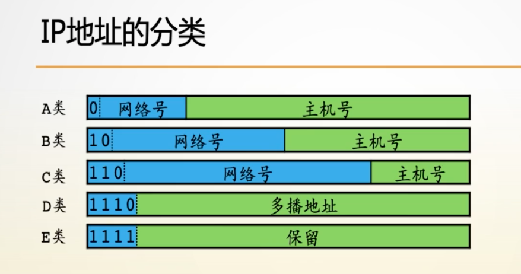
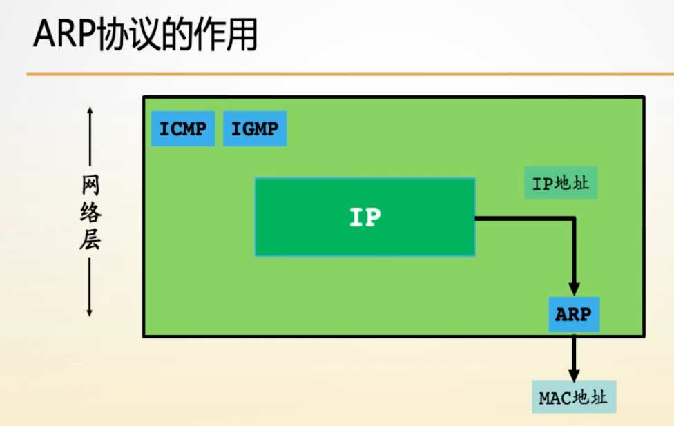
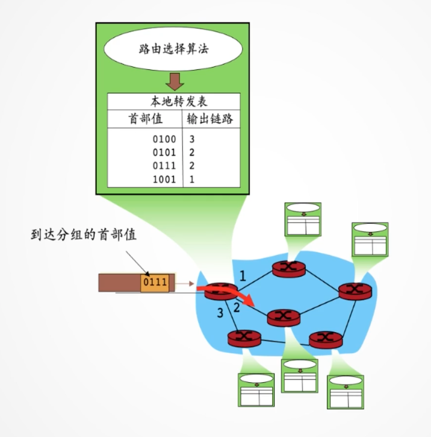
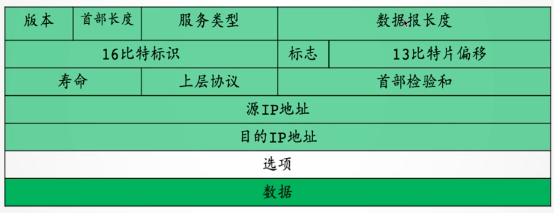
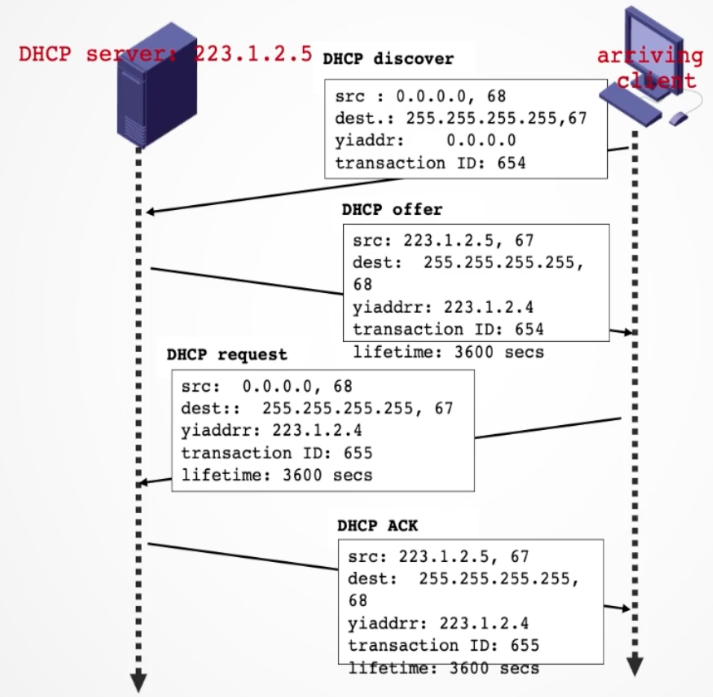
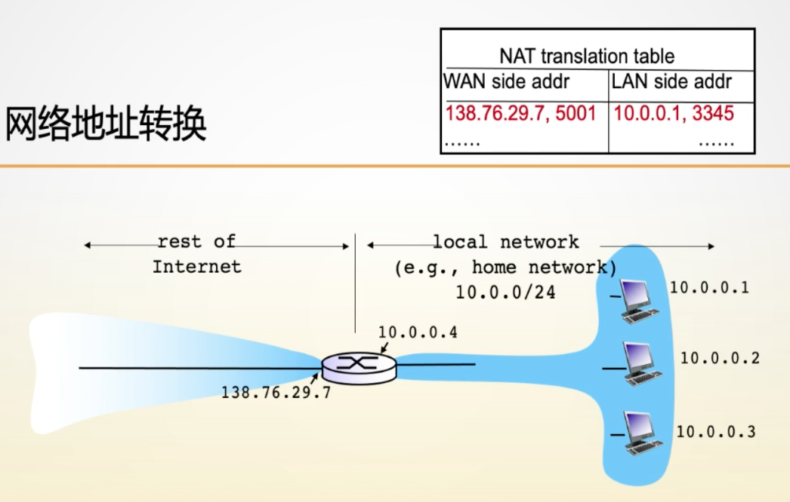
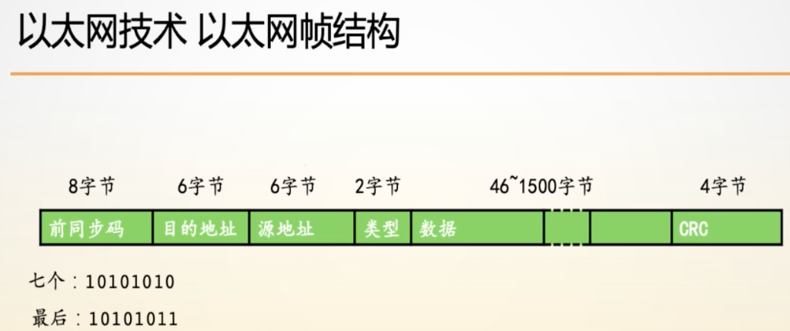

# 操作系统课程笔记

## 第一课 getopt

### 1.1 getopt

```bash
# 查看man手册
man -f getopt
man 3 getopt
```

这里我们要查看是作为函数调用的`getopt`，所以使用`man 3 getopt`

```c
// argc-参数个数
int getopt(int argc, char * const argv[], const char *optstring);
```

**提示**

在使用如`getopt`时如果不记得它的说明，可以在当前光标停留在此函数上时，按shift+k，进入man手册，如果说像`getopt`这种说明内容在man手册的第三章，可以先按数字3，再按shift+k

```c
#include <stdio.h>
#include <stdlib.h>
#include <unistd.h>
#include <string.h>

int main(int argc, char **argv) {
    int opt, age;
    char name[20] = {0};
  	// "n:"表示n之后必须有参数
    while ((opt = getopt(argc, argv, "n:a:")) != -1) {
        switch (opt) {
            case 'n':
                strcpy(name, optarg);
                break;
            case 'a':
                age = atoi(optarg);
                break;
            default:
                printf("Usage : %s -n name -a age!\n", argv[0]);
                exit(1);
        }
    }
    printf("%s is %d years old!\n", name, age);


    return 0;
}
```

**问题记录**

- C语言中extern的作用，getopt的man手册中使用到extern来声明optarg，所以代码中可以直接使用到这个变量吗？

```c
/*************************************************************************
	> File Name: 1.c
	> Author:
	> Mail:
	> Created Time: Sat 03 Jul 2021 09:46:40 PM CST
 ************************************************************************/

#include <stdio.h>
#include "1.h"
int main () {
    age = 18;
    printf("ycyu is %d years old!\n", age);
    return 0;
}
/*************************************************************************
	> File Name: 1.h
	> Author:
	> Mail:
	> Created Time: Sat 03 Jul 2021 09:47:30 PM CST
 ************************************************************************/

#ifndef _1_H
#define _1_H
extern int age;
#endif
/*************************************************************************
	> File Name: 2.c
	> Author:
	> Mail:
	> Created Time: Sat 03 Jul 2021 09:48:34 PM CST
 ************************************************************************/

#include <stdio.h>
int age = 120;
```

- atoi的使用？

- 能读man手册关于getopt的介绍？

- exit的使用？

### 1.2 fprintf

```c
int printf(FILE *stream, const char *format, ...);
```

查看当前进程号（pid）:

```bash
echo $$
```

假设上一步打印出的进程号是315319，再去查看该进程的文件描述符有哪些

```bash
cd /proc/315319/fd
ls -al
```

可以查看到存在文件描述符，其中0表示标准输入，1表示标准输出，2表示错误输出，这里以2为例

```bash
ls -al 2
```

可以看到`2 -> /dev/pts/2`，/dev表示设备，/pts代表虚拟终端，/2表示第2个，再通过`w`命令可以查看当前是谁在使用这个命令终端

```bash
w
 22:02:06 up 95 days, 21:35,  1 user,  load average: 0.00, 0.03, 0.00
USER     TTY      FROM             LOGIN@   IDLE   JCPU   PCPU WHAT
ycyu     pts/2    36.5.180.248     20:42    0.00s 12.00s  0.00s w
```

综上可知，错误输出流最终也是在2号虚拟终端上展示，所以当前用户ycyu才可以看到错误打印

### 1.3 fopen

```c
FILE *fopen(const char *pathname, const char *mode);
```

**注意**

FILE在这里并不是宏定义，而是一个结构体，虽然早期它是用宏定义来实现的

### 1.4 fread

```c
// 表示从stream中读取nmemb项数据，每项为size大小，写到ptr指向的位置，返回读取的项的数量
size_t fread(void *ptr, size_t size, size_t nmemb, FILE *stream);
```

```c
#include <stdio.h>
#include <unistd.h>
#include <stdlib.h>
#include <string.h>
int main() {
    FILE *fp, *fp_o;
    if ((fp = fopen("./ls.log", "r")) == NULL) {
        perror("fopen");
        exit(1);
    }
    if ((fp_o = fopen("./ls2.log", "w")) == NULL) {
        perror("fopen");
        exit(1);
    }

    while (1) {
        char buff[10] = {0};
        size_t rsize = fread(buff, 1, sizeof(buff), fp);
        if (rsize <= 0) {
            printf("File Finished!\n");
            break;
        }
        printf("%s", buff);
        fwrite(buff, 1, strlen(buff), fp_o);
    }

    fclose(fp);
    fclose(fp_o);

    return 0;
}
```

## 第二课 open

### 2.1 open

```bash
man 2 open
```

```c
// 返回值是文件描述符
int open(const char *pathname, int flags);
// 多态？
int open(const char *pathname, int flags, mode_t mode);
// 这里的fd就是文件描述符，返回值表示成功与否，0表示成功 -1表示失败
int close(int fd);
```

#### 模拟cp的操作

```c
#include <stdio.h>
#include <unistd.h>
#include <stdlib.h>
#include <sys/types.h>
#include <sys/stat.h>
#include <fcntl.h>

int main(int argc, char **argv) {
    if (argc < 3) {
        fprintf(stderr, "Usage : %s source dest\n", argv[0]);
        exit(1);
    }
    int s, d;
    if ((s = open(argv[1], O_RDONLY)) < 0) {
        perror("open");
        exit(1);
    }
  	// 这里要注意，flags为O_WRONLY | O_CREAT，mode为S_IRWXU | S_IRGRP | S_IROTH
    if ((d = open(argv[2], O_WRONLY | O_CREAT  , S_IRWXU | S_IRGRP | S_IROTH)) < 0) {
        perror(argv[2]);
        exit(1);
    }
    while (1) {
        // 这里目前是字符串的形式
        char buff[10] = {0};
        ssize_t rsize = read(s, buff, sizeof(buff));
        if (rsize <= 0) {
            break;
        }
        // 这里注意不要使用strlen(buff)，因为strlen遇到'\0'则停止
        write(d, buff, rsize);
    }
    close(d);
    close(s);
    return 0;
}
```

### 2.2 opendir

```c
DIR *opendir(const char *name);
DIR *fdopendir(int fd);
```

返回一个目录流

#### 模拟ls

```c
// common/head.h
/*************************************************************************
	> File Name: head.h
	> Author:
	> Mail:
	> Created Time: Sun 04 Jul 2021 05:36:19 PM CST
 ************************************************************************/

#ifndef _HEAD_H
#define _HEAD_H
#include <stdio.h>
#include <unistd.h>
#include <stdlib.h>
#include <sys/stat.h>
#include <sys/types.h>
#include <dirent.h>
#include <string.h>
#endif

/*************************************************************************
	> File Name: 1.ls.c
	> Author:
	> Mail:
	> Created Time: Sun 04 Jul 2021 05:23:30 PM CST
 ************************************************************************/
#include "head.h"

int main(int argc, char **argv) {
    char path[512] = {0};
    if (argc == 1) {
        strcpy(path, ".");
    } else {
        strcpy(path, argv[1]);
    }

    DIR* dirp;
    if ((dirp = opendir(path)) == NULL) {
        perror(path);
        exit(1);
    }
    struct dirent *dir;
    while(1) {
        if ((dir = readdir(dirp)) == NULL) {
            break;
        }
        printf("%s ", dir->d_name);
    }
    closedir(dirp);
    return 0;
}
```

**这里注意，在编译时需要使用-I参数指定把head.h包括进行**

```bash
gcc 1.ls.c -Icommon/
```

## 第三课 open

### 3.1 作业：严格模拟ls -a -l

### [流程图地址](https://www.processon.com/diagraming/60e19a1b7d9c082853247c4c)

```c
// 代码框架
/*************************************************************************
	> File Name: 2.ls.c
	> Author:
	> Mail:
	> Created Time: Sun 04 Jul 2021 07:43:34 PM CST
 ************************************************************************/

// head.h的位置与上节课中一致
#include "head.h"

void do_ls(const char *name) {
    DIR *dirp;
    struct dirent *dir;
    if ((dirp = opendir(name)) == NULL) {
        printf(" %s", name);
        return;
    }
    printf("%s:\n", name);
    while (1) {
        if ((dir = readdir(dirp)) == NULL) {
            return;
        }
        printf(" %s", dir->d_name);
    }
    printf("\n");
    return;
}

int main(int argc, char **argv) {
    int opt, a_flag = 0, l_flag = 0, nargs;
    while ((opt = getopt(argc, argv, "al")) != -1) {
        switch(opt) {
            case 'l':
                l_flag = 1;
                break;
            case 'a':
                a_flag = 1;
                break;
            defalut:
                fprintf(stderr, "Usage : %s [al] args\n", argv[0]);
                exit(1);
        }
    }
    nargs = argc - optind;
    for (int i = 0; i < nargs; i++) {
        //printf("args[%d] = %s\n", i, argv[i + optind])
        do_ls(argv[i + optind]);

    }

    return 0;
}
```

```c
/*************************************************************************
> File Name: ls.c
> Author:
> Mail:
> Created Time: Tue 06 Jul 2021 08:29:09 AM CST
************************************************************************/

#include <stdio.h>
#include <unistd.h>
#include <stdlib.h>
#include <sys/types.h>
#include <sys/stat.h>
#include <dirent.h>
#include <string.h>
#include <errno.h>
#include <time.h>
#include <pwd.h>
#include <grp.h>

char get_ft(mode_t st_mode) {
    //printf("file type : %o\n", st_mode & S_IFMT);
    switch (st_mode & S_IFMT) {
        case S_IFSOCK: return 's';
        case S_IFLNK: return 'l';
        case S_IFREG: return '-';
        case S_IFBLK: return 'b';
        case S_IFDIR: return 'd';
        case S_IFCHR: return 'c';
        case S_IFIFO: return 'p';
        default: return '?';
    }
}

void get_fp(mode_t st_mode, char *s) {
    //printf("permission : %o\n", st_mode);
    char pstr[9] = {"rwxrwxrwx"};
    int pbits[9] = {S_IRUSR, S_IWUSR, S_IXUSR, S_IRGRP, S_IWGRP, S_IXGRP, S_IROTH, S_IWOTH, S_IXOTH};

    for (int i = 0; i < 9; i++) {
        //printf("st_mode(%o) & pbits[%d](%o) = %d\n", st_mode, i, pbits[i], st_mode & pbits[i]);
        if ((st_mode & pbits[i]) > 0) {
            s[i] = pstr[i];
        } else {
            s[i] = '-';
        }
    };

    s[9] = '\0';
}

void fmt_size(long size, char *s) {
    char unit = '\0';
    float hsize;
    if (size < 1000) {
        hsize = size;
    } else if (size < 1000000) {
        hsize = size / 1024.0;
        unit = 'K';
    } else if (size < 1000000000) {
        hsize = size / 1024.0 / 1024.0;
        unit = 'M';
    }
    sprintf(s, hsize >= 10 || unit == '\0' ? "%.0f%c" : "%.1f%c", hsize, unit);
}

void get_fn(mode_t mode, const char * path, char * s, size_t size) {
    if ((mode & S_IFMT) != S_IFLNK) {
        strcpy(s, path);
    } else {
        ssize_t nbytes, bufsize = size + 1;
        char *buf = (char *)malloc(bufsize * sizeof(char));
        if (buf == NULL) {
            perror("malloc in get_fn");
            return;
        }
        if ((nbytes = readlink(path, buf, bufsize)) == -1) {
            perror("readlink in get_fn");
            return;
        }
        sprintf(s, "%s -> %.*s", path, (int)nbytes, buf);
        free(buf);
    }
}

void get_uname(uid_t uid, char *s) {
    struct passwd *pwd = getpwuid(uid);
    strcpy(s, pwd->pw_name);
}

void get_gname(gid_t gid, char *s) {
    struct group *grp = getgrgid(gid);
    strcpy(s, grp->gr_name);
}

int filter(const struct dirent *ent) {
    if (ent->d_name[0] == '.') {
        return 0;
    }
    return 1;
}

void do_ls(const char *path, int a_flag, int l_flag) {
    //printf("arg = %s, a_flag = %d, l_flag = %d\n", path, a_flag, l_flag);
    DIR *dirp;
    struct dirent **namelist;
    struct stat sb;
    //if ((dirp = opendir(path)) == NULL) {
    //    fprintf(stderr, "ls: cannot access '%s': %s\n", path, strerror(errno));
    //    return;
    //}
    int n = scandir(path, &namelist, a_flag == 0 ? filter : NULL, alphasort);
    if (n == -1) {
        //perror("scandir");
        fprintf(stderr, "ls: cannot access '%s': %s\n", path, strerror(errno));
        return;
    }
    char *output[n];
    long total = 0;
    for (int i = 0; i < n; i++) {
        if (l_flag == 0) {
            printf("%s  ", namelist[i]->d_name);
        } else {
            char fullpath[512];
            strcpy(fullpath, path);
            strcat(fullpath, namelist[i]->d_name);
            //printf("fullpath = %s\n", fullpath);
            output[i] = (char *)malloc(512 * sizeof(char));
            if (lstat(fullpath, &sb) == -1) {
                perror("lstat");
                return;
            }
            total += sb.st_blocks;

            char filetype = get_ft(sb.st_mode);

            char permission[10] = {"\0"};
            get_fp(sb.st_mode, permission);
            char username[100] = {"\0"};
            get_uname(sb.st_uid, username);
            char groupname[100] = {"\0"};
            get_gname(sb.st_gid, groupname);
            char filesize[10] = {"\0"};
            fmt_size(sb.st_size, filesize);
            struct tm *lt = localtime(&sb.st_mtime);
            char timestr[100] = {"\0"};
            strftime(timestr, sizeof(timestr),"%b%_3d %H:%M",lt);
            char filename[100] = {"\0"};
            get_fn(sb.st_mode, namelist[i]->d_name, filename, sb.st_size);
            sprintf(output[i], "%c%s %ld %s %s %4s %s %s\n", filetype, permission, sb.st_nlink, username, groupname, filesize, timestr, filename);
        }
        free(namelist[i]);
    }
    if (l_flag == 1) {
        char totalstr[10] = {"\0"};
        fmt_size(total * 512, totalstr);
        printf("total %s\n", totalstr);
        for (int i = 0; i < n; i++) {
            printf("%s", output[i]);
            free(output[i]);
        }
    }
    printf("\n");
    free(namelist);

    return;
}

int main(int argc, char **argv) {
    int opt, a_flag = 0, l_flag = 0, nargs = 0;
    while ((opt = getopt(argc, argv, "al")) != -1) {
        switch(opt) {
            case 'a':
            a_flag = 1;
            break;
            case 'l':
            l_flag = 1;
            break;
            default:
            fprintf(stderr, "Usage : %s [al] args.\n", argv[0]);
            exit(1);
        }
    }
    nargs = argc - optind;
    if (nargs == 0) {
        do_ls("./", a_flag, l_flag);
    } else {
        for (int i = 0; i < nargs; i++) {
            //printf("args[%d]=%s\n", i, argv[optind + i]);
            do_ls(argv[optind + i], a_flag, l_flag);
        }
    }

    return 0;
}
```


### 3.2 gets

```bash
man gets
man fgets
```

```c
char *gets(char *s);
char *fgets(char *s, int size, FILE *stream);
```

### 3.3 阻塞I/O与非阻塞I/O

在open函数的man手册中提到过一个flag：O_NONBLOCK，即以非阻塞模式打开

普通文件与块设备文件会无视这个flag

```c
int fcntl(int fd, int cmd, ... /*arg*/);
```

非阻塞I/O代码演示

```c
/*************************************************************************
	> File Name: 1.nonblock.c
	> Author:
	> Mail:
	> Created Time: Sun 04 Jul 2021 08:29:57 PM CST
 ************************************************************************/

#include "head.h"

int main(int argc, char **argv) {
    int opt, flags = 0, age = 18;
    while ((opt = getopt(argc, argv, "n")) != -1) {
        switch (opt) {
            case 'n':
                flags = 1;
                break;
            default:
                fprintf(stderr, "Usage : %s [n]\n", argv[0]);
                exit(1);
        }
    }
    if (flags) {
        if (make_nonblock(0) < 0) {
            perror("make_nonblock");
            exit(1);
        }
    }
    printf("Before 5 sec!\n");
    sleep(5);
    printf("After 5 sec!\n");
    int ret = scanf("%d", &age);
    perror("scanf");
    printf("ret = %d\n", ret);
    printf("ycyu is %d years old!\n", age);
    make_block(0);
    scanf("%d", &age);
    printf("ycyu is %d years old!\n", age);

    return 0;
}
/*************************************************************************
	> File Name: common.c
	> Author:
	> Mail:
	> Created Time: Sun 04 Jul 2021 08:21:10 PM CST
 ************************************************************************/

#include "head.h"

int make_nonblock(int fd) {
    int flags = fcntl(fd, F_GETFL);
    if (flags < 0) return -1;
    flags |= O_NONBLOCK;
    return fcntl(fd, F_SETFL, flags);
}
int make_block(int fd) {
    int flags = fcntl(fd, F_GETFL);
    if (flags < 0) return -1;
    flags &= ~O_NONBLOCK;
    return fcntl(fd, F_SETFL, flags);
}
```

### 3.4 进程

#### 3.4.1常用考点

- 进程、程序、线程、协程的区别
- 进程空间
- 进程调度
  - 调度算法
  - 三态模型、五态模型
- 进程间通信（IPC）
- 并发与并行

#### 3.4.2 什么是进程

- 是程序在内存中的映像
- 是资源分配的最小单位
- 是运行的程序

#### 3.4.3 进程包含什么

#### 3.4.4 如何进行多进程编程

##### fork()方法

```c
pid_t fork(void);
```

复制当前调度fork方法的进程，复制出来的进程叫作子进程，它们各自运行在各自的内存空间中，在调用fork那一刻，他们的内存中的内容是相同的

fork调用成功后，在父进程中得到的是子进程的pid，在子进程中得到的是0 。 如果分配失败，在父进程中得到的pid为-1

#### 缓冲I/O

```c
/*************************************************************************
	> File Name: 1.fork.c
	> Author:
	> Mail:
	> Created Time: Sun 04 Jul 2021 09:11:42 PM CST
 ************************************************************************/

#include "head.h"

int main() {
    pid_t pid;
  	// 注意这句，在结尾不添加"\n"时，代码执行时，会打印两次，这里的原因就是缓冲I/O，也就是说这里printf之后，内容是在内存中，并不是立刻打印，所以当fork之后再打印时，就会打印两次，而添加"\n"之后只打印一次，是因为标准系统中是以行缓冲去缓冲
    printf("Before fork()");
    if ((pid = fork()) < 0) {
        perror("fork()");
        exit(1);
    }
    if (pid == 0) {
        printf("In Child!\n");
        exit(0);
    } else {
        printf("In Parent!\n");
    }
		// 另一个注意的就是父子进程的执行顺序不确定

    return 0;
}
```

#### 创建10个子进程，并且子进程知道自己是第几个

```c
/*************************************************************************
	> File Name: 2.fork_for_10.c
	> Author:
	> Mail:
	> Created Time: Sun 04 Jul 2021 09:29:10 PM CST
 ************************************************************************/

#include "head.h"

int main() {
    pid_t pid;
    int count = 0;
    for (int i = 0; i < 10; i++) {
        count++;
        if ((pid = fork()) < 0) {
            perror("fork");
            exit(1);
        }
        if (pid == 0) {
            printf("I'm no.%d child\n", count);
            exit(1);
        }
    }

    return 0;
}
```


#### 3.4.5 进程的产生

## 第四课 ls

### 4.1 程序、进程、线程

#### 程序

程序是编译过的，可执行的二进制代码，保存在存储介质中

#### 进程

进程是指正在运行的程序，进程包括二进制镜像，加载到内存中，这会涉及很多其他方面：

- 虚拟内存实例
- 内核资源如打开的文件
- 安全上下文如关联的用户
- 一个或多个线程

#### 线程

线程是进程内的活动单元，是系统调用的最小单位，是轻量级的进程

每个线程包含自己的虚拟存储器，包括栈、进程状态如寄存器、指令指针

在单线程的进程中，进程即线程

#### 进程ID-PID

默认16位，其最大值是32768（/proc/sys/kernel/pid_max）；

系统中的第一个进程为systemd，或者init，进程ID为1，故称为1号进程；

0号进程是存在的，当没有其他进程运行时，内核运行的进程pid为0，成为空闲进程

PID的分配：

- 进程ID从1开始递增分配，这里与fd不同，fd为最小未被使用的号
- 到最大值后重新开始由最小的未使用的ID开始分配
- 这样做的目的是什么？
  - 系统通过PID来判断进程是否存活，如果使用最小未分配时，容易误叛

#### 进程体系

除init进程外，任何一个进程都有自己的父进程，父进程的PID存储在ppid中；

每个进程都属于某个用户和某个组，用以实现访问控制，子进程会继承父进程的用户和组；

每个进程都是某个进程组的一部分，进程组表示的是该进程和其他进程的关系，与用户与组不同，在用户层面，进程组和作业是紧密相关的

与之相关的函数：

- getpid
- getppid

#### 退出进程

- exit
  - 可使用宏定义EXIT_SUCCESS和EXIT_FAILURE
  - 调用exit时将执行以下步骤
    - 1. 执行ataxia()、on_exit()注册的事件，注册的函数是逆序调用的，重复注册或触发重复调用，atexit没有入参，on_exit支持传参
      2. 关闭文件流
      3. 删除打开的临时文件tmpfile
      4. 调用_exit()函数
         1. 释放内存
         2. 关闭打开的文件
         3. 关闭信号量

#### 等待进程退出

- wait函数
- waitpid函数

#### 僵尸进程与孤儿进程

- 僵尸进程
  - 子进程退出，父进程不调用wait或waitpid等待地其退出
  - 父进程也没有退出，这样子进程将变成僵尸进程
  - 僵尸进程继续占用系统资源，对系统具有一定的危害

- 孤儿进程
  - 当父进程先于子进程退出，子进程继续运行时变为孤儿进程
  - 孤儿进程将被系统（1号进程）收养，对整个系统运行无害
  - 事实上，根据孤儿进程的特点，我们可以实现守护进程

#### 守护进程的实现

- 调用fork()，子进程为待定的守护进程
- 在父进程调用exit()
- 在子进程中调用setsid()，使守护进程有一个新的进程组和会话
- 调用chdir()，改变上下文目录，不然目录会被一直占用着
- 关闭所有文件描述符，特别是继承来的
- 打开文件描述符0、1、2并重定向到/dev/zero

#### 高级进程管理

- 进程调度器
  - 内核子系统
  - 决定哪个进程来运行
- 进程状态
  - 阻塞
    - 正在睡眠，等待IO，等待信息继续执行下一步
  - 就绪
    - 进程获得所需的资源，可以进行下一步执行
  - 运行

#### 进程调度

- 单进程单处理器的调度
- 多进程单处理器的调度-->多任务
- 协同式与抢占式
  - 协同式自发结束：让出yielding

#### 时间片轮转

- 时间片太短：花费太多时间进行调度，无法使用时间局部性提升性能
- 时间片太长：降低了并发运行，用户等待时间过长
- IO约束型进程与处理器约束型进程
  - 多数时间处于阻塞状态等待资源的进程是IO约束弄进程
  - 一直消耗完所有时间片的进程为处理器约束型进程
  - IO约束型需要更短的时间片
  - CPU约束型需要更长的时间片

#### 抢占式调度

- 传统的Unix会给所有就绪的进程分配时间片
- 当进程消耗完自己的时间片，就会被挂起，开始运行下一个进程
- 如果系统中没有就绪进程，则内核为已经执行完的进程重新分配时间片
- 所有进程最后都有机会运行，即使有更高优先级的进程

#### 完全公平调度器CFS

- Linux2.6后引入
- CFS最初给N个进程每个分配1/N的处理器
- CFS通过优先级（nice value）权衡每个进程的比例，调整分配
- 默认的优先级是0，权值为1
- 优先级值越小，权值越高，分配更多

- 目标延时：两次调度之间的时间间隔，即响应时间
- 最小粒度
- 每个进程都获得处理资源的公平份额

#### 处理器亲和力

- 调度器必须尽量充分利用系统的处理器，负载均衡
- 调度器还应尽量把一个再次执行的进程放在原先的处理器上执行
- 进程在处理器上迁移：
  - 进程不再能使用缓存数据
  - 原处理器中的缓存信息必须标记为无效
  - 进程在处理器中迁移最大的损失就是来自缓存效应，此为时间局部性
- **软亲和力**表明一个进程会被一直调度在同一个处理器上的可能性
- 事实上，Linux底层就是这样做的，进程总会被调度在它之前运行的处理器上，除非处理器的负载极度不平衡时，才考虑在处理器间迁移
- 当用户程序极度依赖缓存时，可能需要将进程和处理器进行绑定，在整个调度过程中，就不会发生在处理器之间的迁移
- 把进程与处理器绑定的操作，称为处理器**硬亲和力**

#### 关于exec——进程的变身

```c
// l:参数以List形式传
int execl(const char* path, const char* arg, ...);
// p:file从环境亦是PATH中查找
int execlp(const char* file, const char* arg, ...);
// e:表示从环境变量中查找
int execle(const char* path, const char* arg, ..., char* const envp[]);
// v:表示vector
int execv(const char* path, char* const argv[]);
int execvp(const char* file, char* const argv[]);
int execvpe(const char* file, char* const argv[], char* const envp[]);
```

```bash
man 3 exec
```

exec会使用一个新的进程镜像来替换当前的进程镜像

### 作业

1. 实现以下功能
   - filename = do.c，可执行程序do
   - 运行'do a.c | a.cpp '
   - 如果文件存在，则使用vim打开文件
   - 如果文件不存在，则新建该文件，用vim打开
   - 当在vim中保存并退出的时候， 编译该程序
   - 如果是.c文件，使用gcc，如果是.cpp则使用g++
   - 如果编译成功，则直接执行该程序
   - 如果失败，则直接退出
2. 实现从数字1到数字n的累加
   - filename = sum.c
   - sum -i 5 -n 10000，表示使用5个进程，计算从1加到10000的和
   - 每个进程参与计算
   - 不能对业务进行拆分
   - 每个进程都去抢着加
   - 不能使用任何睡眠策略
   - 不能规定进程的执行顺序
   - 需要使用文件，可以参考flock

## 第五课 non_block

- 上次多进程实现打开vim编辑并编译do.c

```c
/*************************************************************************
	> File Name: do.c
	> Author:
	> Mail:
	> Created Time: Thu 08 Jul 2021 07:13:15 PM CST
 ************************************************************************/

#include <stdio.h>
#include <sys/types.h>
#include <sys/stat.h>
#include <sys/wait.h>
#include <fcntl.h>
#include <unistd.h>
#include <stdlib.h>
#include <string.h>

int main(int argc, char **argv) {
    if (argc < 2) {
        fprintf(stderr, "Usage : %s a.c or %s a.cpp\n", argv[0], argv[0]);
        exit(1);
    }
    int status = 0;
    pid_t exec_pid = fork();
    if (exec_pid  == 0) {
        pid_t gc_pid = fork();
        if (gc_pid == 0) {
            pid_t vim_pid = fork();
            if (vim_pid == 0) {
                int fd = open(argv[1], O_CREAT | O_RDWR, 0744);
                if (fd == -1) {
                    perror("open");
                    exit(1);
                }
                execlp("vim", "vim", argv[1], NULL);
            } else {
                int vimstatus;
                int vim_result = wait(&vimstatus);
                printf("vim_result = %d, vimstatus = %d\n", vim_result, vimstatus);
                if (vim_result == -1 || vimstatus == 1) {
                    exit(1);
                } else {
                    char *ext = strrchr(argv[1], 46);
                    char *cmd = (strcmp(ext,".c") == 0 ? "gcc" : "g++");
                    execlp(cmd, cmd, argv[1], "-o", "test.out", NULL);
                }
            }
        } else {
            int gcstatus;
            int gc_result = wait(&gcstatus);
            if (gc_result == -1 || gcstatus == 1) {
                exit(1);
            } else {
                execl("./test.out", "", NULL);
                exit(0);
            }
        }
    } else {
        int execstatus;
        wait(&execstatus);
    }

    return 0;
}
```


- 上次多进程累加的作业解析

### 1. 文件锁版本

```c
/*************************************************************************
	> File Name: sum_add.c
	> Author:
	> Mail:
	> Created Time: Wed 07 Jul 2021 10:58:14 PM CST
 ************************************************************************/

#include "head.h"

typedef struct data {
    int now;
    int sum;
} mdata;

int set_num(mdata *num) {
    int fd;
    if ((fd = open("./.data", O_CREAT | O_WRONLY, 0644)) < 0) {
        perror("open");
    }
    int wsize = write(fd, (void *)num, sizeof(mdata));
    close(fd);
    return wsize;
}

int get_num(mdata *num) {
    int fd;
    if ((fd = open("./.data", O_RDONLY, 0644)) < 0) {
        perror("open");
    }
    int rsize = read(fd, (void *)num, sizeof(mdata));
    close(fd);
    return rsize;
}

void do_sum(int ind, int max) {
    mdata tmp;
    int fd_lock = open("./.lock", O_RDONLY);
    while (1) {
        flock(fd_lock, LOCK_EX);
        if (get_num(&tmp) < 0) {
            perror("get_num");
            exit(1);
        }
        if (tmp.now > max) {
            break;
        }
        tmp.sum += tmp.now;
        tmp.now++;
        printf("The %dth now = %d, sum = %d\n", ind, tmp.now, tmp.sum);
        set_num(&tmp);
        flock(fd_lock, LOCK_UN);
    }
    close(fd_lock);
    //printf("sum = %d\n", tmp.sum);
}


int main(int argc, char **argv) {
    int opt, ins = 1, max = 100;
    mdata num;
    num.now = 0;
    num.sum = 0;
    if (set_num(&num) < 0) {
        perror("set_num");
    }

    while ((opt = getopt(argc, argv, "i:n:")) != -1) {
        switch (opt) {
            case 'i':
                ins = atoi(optarg);
                break;
            case 'n':
                max = atoi(optarg);
                break;
            default:
                fprintf(stderr, "Usage : %s -i ins -n max\n", argv[0]);
                exit(1);
        }
    }

    pid_t pid, x = 0;
    for (int i = 1; i <= ins; i++) {
        if ((pid = fork()) < 0) {
            perror("fork");
            exit(1);
        }
        if (pid == 0) {
            x = i;
            break;
        }
    }

    if (pid == 0) {
        do_sum(x, max);
        //printf("In Child!\n");
    } else {
        for (int i = 0; i < ins; i++) {
            wait(NULL);
        }
        get_num(&num);
        printf("sum = %d\n", num.sum);
    }

    return 0;
}
```

### 2. 共享内存版本（未加锁）

```c
/*************************************************************************
	> File Name: sum_add.c
	> Author:
	> Mail:
	> Created Time: Wed 07 Jul 2021 10:58:14 PM CST
 ************************************************************************/

#include "head.h"

typedef struct data {
    int now;
    int sum;
} mdata;

void do_sum(int ind, int max, mdata *num) {
    while (1) {
        if (num->now == max) {
            break;
        }
        num->sum += ++num->now;
        printf("<%d> %d %d\n", ind, num->now, num->sum);
    }
}


int main(int argc, char **argv) {
    int opt, ins = 1, max = 100;
    while ((opt = getopt(argc, argv, "i:n:")) != -1) {
        switch (opt) {
            case 'i':
                ins = atoi(optarg);
                break;
            case 'n':
                max = atoi(optarg);
                break;
            default:
                fprintf(stderr, "Usage : %s -i ins -n max\n", argv[0]);
                exit(1);
        }
    }
    int shmid;
    key_t key = ftok(".", 2021);
    if ((shmid = shmget(key, sizeof(mdata), IPC_CREAT | 0600)) < 0) {
        perror("shmget");
        exit(1);
    }
    mdata *share_memory = (mdata *)shmat(shmid, NULL, SHM_RND);
    if (share_memory == NULL) {
        perror("shmat");
        exit(1);
    }
    share_memory->now = 0;
    share_memory->sum = 0;
    pid_t pid, x = 0;
    for (int i = 1; i <= ins; i++) {
        if ((pid = fork()) < 0) {
            perror("fork");
            exit(1);
        }
        if (pid == 0) {
            x = i;
            break;
        }
    }

    if (pid == 0) {
        do_sum(x, max, share_memory);
        //printf("In Child!\n");
    } else {
        for (int i = 0; i < ins; i++) {
            wait(NULL);
        }
        printf("sum = %d\n", share_memory->sum);
    }

    return 0;
}
```

```bash
man shmget
man ftok
man shmat
# 共享内存锁
man pthread_mutex
```

### 作业

思考共享内存方式的加锁操作

## 第六课 process

```bash
# 初始化线程互斥锁
man pthread_mutex_init
# 查看IPC信息
ipcs
# 删除指定shmid的共享内存段
ipcrm -m 3
# 编译时注意添加“-lpthread”
gcc 2.sum_add.c -Icommon/ -lpthread
```

```c
// 高精度sleep，单位是微秒，可以通过这种来查看并发情况下的debug
usleep(10000)
```

上一节课的共享内存完整功能版本

```c
/*************************************************************************
	> File Name: sum_add.c
	> Author:
	> Mail:
	> Created Time: Wed 07 Jul 2021 10:58:14 PM CST
 ************************************************************************/

#include "head.h"

typedef struct data {
    pthread_mutex_t mutex;
    int now;
    int sum;
} mdata;

void do_sum(int ind, int max, mdata *num) {
    while (1) {
      	// 加锁
        pthread_mutex_lock(&num->mutex);
        if (num->now >= max) {
            break;
        }
        num->sum += ++num->now;
        printf("<%d> %d %d\n", ind, num->now, num->sum);
      	// 释放锁
        pthread_mutex_unlock(&num->mutex);
      	// 睡眠以便其它进程拿到锁，这样打屏更容易看到是多个进程在同时操作
        usleep(2000);
    }

    pthread_mutex_unlock(&num->mutex);
}


int main(int argc, char **argv) {
    int opt, ins = 1, max = 100;
    while ((opt = getopt(argc, argv, "i:n:")) != -1) {
        switch (opt) {
            case 'i':
                ins = atoi(optarg);
                break;
            case 'n':
                max = atoi(optarg);
                break;
            default:
                fprintf(stderr, "Usage : %s -i ins -n max\n", argv[0]);
                exit(1);
        }
    }
    int shmid;
    key_t key = ftok(".", 2021);
    if ((shmid = shmget(key, sizeof(mdata), IPC_CREAT | 0600)) < 0) {
        perror("shmget");
        exit(1);
    }
    mdata *share_memory = (mdata *)shmat(shmid, NULL, SHM_RND);
    if (share_memory == NULL) {
        perror("shmat");
        exit(1);
    }
    share_memory->now = 0;
    share_memory->sum = 0;
  
    pthread_mutexattr_t attr;
    pthread_mutexattr_init(&attr);

    pthread_mutexattr_setpshared(&attr, PTHREAD_PROCESS_SHARED);
    pthread_mutex_init(&share_memory->mutex, &attr);

    pid_t pid, x = 0;
    for (int i = 1; i <= ins; i++) {
        if ((pid = fork()) < 0) {
            perror("fork");
            exit(1);
        }
        if (pid == 0) {
            x = i;
            break;
        }
    }

    if (pid == 0) {
        do_sum(x, max, share_memory);
      	// 子进程运行完之后dettach
      	shmdt(share_memory);
    } else {
      	// 标记当所有子进程dettach之后，释放当前共享内存空间
        shmctl(shmid, IPC_RMID, NULL);
        for (int i = 0; i < ins; i++) {
            wait(NULL);
        }
        printf("sum = %d\n", share_memory->sum);
    }

    return 0;
}
```

### 条件变量

```bash
# 条件变量初始化
man pthread_cond_init
```

### 作业

write.c与read.c，两个程序，协同工作，write负责记录用户输入的数据，read用来输出数据

- 提示
  - 亲缘与非亲缘进程之间到底有什么区别？
  - 在两个完全不想干的进程中，如何实现共享内存
  - 谁来初始化这一块内存
  - 是不是每一个进程都需要初始化共享内存

## 第七课 pthread

上节课的作业

```c
/*************************************************************************
	> File Name: cond.c
	> Author:
	> Mail:
	> Created Time: Sun 11 Jul 2021 08:10:00 PM CST
 ************************************************************************/

#include "head.h"
#include "cond.h"

void init_res(struct Msg *msg) {
    msg->flag = 1;
    pthread_mutexattr_t attr;
    pthread_mutexattr_init(&attr);
    pthread_mutexattr_setpshared(&attr, 1);
    pthread_mutex_init(&msg->mutex, &attr);

    pthread_condattr_t c_attr;
    pthread_condattr_init(&c_attr);
    pthread_condattr_setpshared(&c_attr, 1);
    pthread_cond_init(&msg->cond, &c_attr);
}
/*************************************************************************
	> File Name: read.c
	> Author:
	> Mail:
	> Created Time: Sun 11 Jul 2021 07:51:56 PM CST
 ************************************************************************/

#include "head.h"
#include "cond.h"

struct Msg *share_memory;

int main() {
    int shmid;
    key_t key = ftok(".", 2021);
    if ((shmid = shmget(key, sizeof(struct Msg), IPC_CREAT | 0600)) < 0) {
        perror("shmget");
        exit(1);
    }
    share_memory = (struct Msg *)shmat(shmid, NULL, SHM_RND);
    if (share_memory->flag == 1) {
        printf("Alread Inited\n");
    } else {
        init_res(share_memory);
    }

    while (1) {
        pthread_mutex_lock(&share_memory->mutex);
        pthread_cond_wait(&share_memory->cond, &share_memory->mutex);
        printf("<%s> : %s\n", share_memory->name, share_memory->msg);
        memset(share_memory->msg, 0, sizeof(share_memory->msg));
        pthread_mutex_unlock(&share_memory->mutex);
    }


    return 0;
}
/*************************************************************************
	> File Name: write.c
	> Author:
	> Mail:
	> Created Time: Sun 11 Jul 2021 08:23:57 PM CST
 ************************************************************************/

#include "head.h"
#include "cond.h"

struct Msg *share_memory;

int main(int argc, char **argv) {
    int shmid, opt;
    char name[20];
    while ((opt = getopt(argc, argv, "n:")) != -1) {
        switch (opt) {
            case 'n':
                strcpy(name, optarg);
                break;
            default:
                fprintf(stderr, "Usage : %s -n name!\n", argv[0]);
                exit(1);
        }
    }
    key_t key = ftok(".", 2021);
    if ((shmid = shmget(key, sizeof(struct Msg), IPC_CREAT | 0600)) < 0) {
        perror("shmget");
        exit(1);
    }
    share_memory = (struct Msg *)shmat(shmid, NULL, SHM_RND);
    if (share_memory->flag == 1) {
        printf("Alread Inited\n");
    } else {
        init_res(share_memory);
    }

    char buff[1024] = {0};
    while (1) {
        printf("Please input:\n");
        scanf("%[^\n]s", buff);
        getchar();
        pthread_mutex_lock(&share_memory->mutex);
        if (!strlen(buff)) {
            pthread_mutex_unlock(&share_memory->mutex);
            continue;
        }
        strcpy(share_memory->msg, buff);
        strcpy(share_memory->name, name);
        pthread_cond_signal(&share_memory->cond);
        pthread_mutex_unlock(&share_memory->mutex);
    }


    return 0;
}
/*************************************************************************
	> File Name: cond.h
	> Author:
	> Mail:
	> Created Time: Sun 11 Jul 2021 07:49:33 PM CST
 ************************************************************************/

#ifndef _COND_H
#define _COND_H
struct Msg {
    int flag;
    char name[20];
    char msg[1024];
    pthread_mutex_t mutex;
    pthread_cond_t cond;
};

void init_res(struct Msg *msg);
#endif
```

### 关于管道

```
man pipe
man popen
```

### 作业

1. 实现popen(const char *cmd, const char *mode)和close(FILE *fp);
   - popen
     - 使用pipe打开管道
     - fork创建子进程
     - exec在子进程中实现`/bin/sh -c "cmd"`
     - dup()来复制标准IO流到管道
     - fp转换fd，使用fileno
     - fd转换fp，使用fdopen
   - pclose
     - 使用 wait4等待子进程关闭
     - 子进程与popen的返回值绑定，或者叫有关联
     - 考保存pid与fd的关系

## 第八课 select

### 上节课的作业，实现popen与pclose

```c
/*************************************************************************
	> File Name: 1.test.c
	> Author:
	> Mail:
	> Created Time: Mon 12 Jul 2021 07:05:00 PM CST
 ************************************************************************/

#include "head.h"
#include "m_popen.h"

int main() {
    FILE *fp;
    char buff[1024] = {0};
    if ((fp = m_popen("cat ./1.test.c.a", "r")) == NULL) {
    //if ((fp = m_popen("cat", "w")) == NULL) {
        perror("m_open");
        exit(1);
    }

    while (fgets(buff, sizeof(buff), fp) != NULL) {
        printf("%s", buff);
        bzero(buff, sizeof(buff));
    }

    //sprintf(buff, "ycyu is 18 years old!\n");
    //fwrite(buff, 1, 1024, fp);
    int status = m_pclose(fp);
    printf("status = %d\n", status);
    return 0;
}
/*************************************************************************
	> File Name: m_popen.h
	> Author:
	> Mail:
	> Created Time: Mon 12 Jul 2021 06:20:54 PM CST
 ************************************************************************/

#ifndef _M_POPEN_H
#define _M_POPEN_H
FILE *m_popen(const char *cmd, const char *type);
int m_pclose(FILE *fp);
#endif
/*************************************************************************
	> File Name: m_popen.c
	> Author:
	> Mail:
	> Created Time: Mon 12 Jul 2021 06:22:13 PM CST
 ************************************************************************/

#include "head.h"
#include "m_popen.h"

pid_t childpid[512];

FILE *m_popen(const char *cmd, const char *type) {
    FILE *fp;
    int pfd[2];
    pid_t pid;

    if ((type[0] != 'r' && type[0] != 'w') || type[1] != '\0') {
        errno = EINVAL;
        return NULL;
    }

    if (pipe(pfd) < 0) {
        return NULL;
    }

    if ((pid = fork()) < 0) {
        return NULL;
    }

    if (pid == 0) {
        printf("My pid = %d\n", getpid());
        if (type[0] == 'r') {
            close(pfd[0]);
            if (pfd[1] != STDOUT_FILENO) {
                dup2(pfd[1], STDOUT_FILENO);
                close(pfd[1]);
            }
        } else {
            close(pfd[1]);
            if (pfd[0] != STDIN_FILENO) {
                dup2(pfd[0], STDIN_FILENO);
                close(pfd[0]);
            }
        }
        printf("exec %s\n", cmd);
        execl("/bin/sh", "sh", "-c", cmd, NULL);
    }
    if (type[0] == 'r') {
        close(pfd[1]);
        if ((fp = fdopen(pfd[0], type)) == NULL) {
            return NULL;
        }
    } else {
        close(pfd[0]);
        if ((fp = fdopen(pfd[1], type)) == NULL) {
            return NULL;
        }
    }

    childpid[fileno(fp)] = pid;
    return fp;
}

int m_pclose(FILE *fp) {
    pid_t pid;
    int wstatus;
    pid = childpid[fileno(fp)];
    if (pid == 0) {
        errno = EINVAL;
        return -1;
    }
    printf("Waiting for pid : %d\n", pid);
    wait4(pid, &wstatus, WUNTRACED, NULL);
    fflush(fp);
    close(fileno(fp));
    return wstatus;
}
```

### 哲学家进餐问题

### 信号量

```bash
man semget
man semop
```

### P操作与V操作

```bash
man semctl
pkill a.out
```

## 第九课 signal

### 回顾

- IPC通信的四种方式：共享内存（shm）、条件变量（cond）、管道（pipe）、信号量（sem）

### 线程

#### 1. 什么是线程

- 线程是操作系统调度器可调度的最小执行单元
- 现代操作系统实现了两种对用户空间的基础虚拟抽象：虚拟内存和虚拟处理器
- 进程感觉自己独占了内存，而线程感觉自己独占了处理器
- 一个进程至少包含一个线程，一个进程的多个线程共享内存空间
- 生个线程都独立调度，调度和切换的代价低于进程

### 2. 线程的优点

- 编程抽象模块化
- 增加程序的并发性
- 提高响应能力
- I/O阻塞可行
- 上下文切换代价小
- 内存保存，线程之间共享内存，切换无需置换内存

### 3. 线程的缺点

- 复杂，编码难度大，调度成本高
- 容易出现竞争死锁问题

### 4. 线程模式

- 每个连接对应一个线程
  - 一个线程对应着一个连接或请求，直到处理结束，这样线程就可以处理另一个新的请求了
  - 在此模式下，将线程换成进程，就是老版本的unix服务器了，Apache的标准fork模式就是这种模式
- 事件驱动的线程模式
  - 将上个模式中的负荷（比如等待操作）剥离出来，搭配异步I/O或者I/O复用来管理服务器中的数据流
  - 在此模式下，将处理请求转换为一系列的异步I/O和与期关联的回调函数
  - 这些回调函数可通过I/O多路程复用的方式来等待，完成该操作的进程称为event_loop

### 5. 线程的竞争

- 同一个进程的线程共享内存空间，独立调度，并发执行时“重叠执行”，以不可预期的顺序执行，如果多个线程访问同一个资源，就产生了竞争，程序由于不确定哪个线程先执行而带来的行为不一致；
- 竞争的条件：两个或更多的线程对共享资源的非同步访问；
- 共享资源可以是系统硬件、内核资源以及内存中的数据（data race）；
- 竞争发生的窗口，也就是需要同步的代码区称为临界区

### 6. 线程的同步

- 解决线程竞争的办法主要是线程同步，也就是让原先不确定的访问顺序，变得确定；
- 也就是要在临界区这个窗口内，要保证执行同步访问操作，确保对临界区的访问是互斥的；
- 最常见的实现就是在临界区前加互斥锁，在临界区后释放互斥锁，这样当一个线程占有锁的时候，其他线程就会被阻塞，直到锁被释放才可以获得锁，继续执行

### 7. 创建线程

```c
#include <pthread.h>
int pthread_create(pthread_t *thread, const pthread_attr_t *attr, void *(*start_routine)(void *), void *arg);
// Compile and link with -pthread
// 参数thread：如果线程创建成功，将会把线程的Id保存到thread指向的空间
// 参数attr：用于改变新创建线程的默认线程属性，一般默认NULL就可以；
// 参数start_routine：线程执行函数，形式应类似为-void * start_thread(void *arg)：
//   参数为void指针
//   返回值也void指针
// 参数arg：arg为传递给第三个参数，也就是线程执行函数的参数，需要要注意的是，如果传递多个参数，应该用结构体封装
```

```c
// 简单的例子
/*************************************************************************
	> File Name: pthread.c
	> Author:
	> Mail:
	> Created Time: Sat 17 Jul 2021 08:27:07 PM CST
 ************************************************************************/

#include "head.h"
#define MAX 10

void *print(void *arg) {
    printf("In child thread!\n");
}

int main() {
    for (int i = 0; i < 10; i++) {
        pthread_t tid[MAX];
        int result;
        result = pthread_create(&tid[i], NULL, print, NULL);
        printf("create thread %d! result: %d\n", i, result);
    }
		// 这里如果不阻塞一下，可能没东西输出，因为主进程已经退出了
    sleep(1);
    return 0;
}
```

### 7. 线程ID

- 线程Id与进程Id相似，但有一个本质的区别：进程Id是由内核分配的，而线程Id是由线程库分配的
- 获取自己的线程Id：pthread_t pthread_self(void)
- 判断两个线程是否相同：int pthread_equal(pthread_t t1, pthread_t t2);
- 因为POSIX不要求pthread_t是一个算数类型，所以不能保证可以使用“==”判断线程Id是否相同

### 8. 线程终止

- 线程会在下面的情况下退出，这与进程类似
  - 线程在启动时返回，该线程就结束
  - 如果线程调用了`void pthread_exit(void *retval)`，线程就会终止
  - 如果线程被另一个线程通过`int pthread_cancel(pthread_t thread)`函数取消，也会终止
- 在以下场景中，所有线程都会被杀死，进程被杀死
  - 进程从主函数中返回
  - 进程通过exit()函数终结

### 9. 线程的加入和分离

- 由于线程创建和销毁很容易，必须对线程进行同步的机制，避免被其他线程终止，对应的线程即`wait()`，也就是join线程；
- 线程join：支持一个线程阻塞，等待另一个线程终止，`int pthread_join(pthread_t thread, void **retval)`
- 线程detach：默认情况下，线程都是可以join的，detach可以让其不join，`int pthread_detach(pthread_t thread)`

```c
/*************************************************************************
	> File Name: pthread.c
	> Author:
	> Mail:
	> Created Time: Sat 17 Jul 2021 08:27:07 PM CST
 ************************************************************************/

#include "head.h"
#define MAX 10


void *print(void *arg) {
    printf("In child thread!\n");
}

int main() {
    pthread_t tid[MAX];
    for (int i = 0; i < 10; i++) {
        int result;
        result = pthread_create(&tid[i], NULL, print, NULL);
        printf("create thread %d! result: %d\n", i, result);
    }
  	// join之后，主线程就会等它结束，来给子线程“收尸”
    for (int i = 0; i < MAX; i++) {
        pthread_join(tid[i], NULL);
    }
  
    return 0;
}
```

```c
// 参数传递的示例
/*************************************************************************
	> File Name: pthread.c
	> Author:
	> Mail:
	> Created Time: Sat 17 Jul 2021 08:27:07 PM CST
 ************************************************************************/

#include "head.h"
#define MAX 10

void *print(void *arg) {
    usleep(2000);
    printf("In child thread %d!\n", *(int *)arg);
}

int main() {
    pthread_t tid[MAX];
  	// 注意这里的变化，如果只用一个变量
    int num[MAX];
    for (int i = 0; i < 10; i++) {
        int result;
        num[i] = i;
        result = pthread_create(&tid[i], NULL, print, &num[i]);
        printf("create thread %d! result: %d\n", i, result);
    }
    for (int i = 0; i < MAX; i++) {
        pthread_join(tid[i], NULL);
    }
  
    return 0;
}
```

```c
// 多参数传递
/*************************************************************************
	> File Name: pthread.c
	> Author:
	> Mail:
	> Created Time: Sat 17 Jul 2021 08:27:07 PM CST
 ************************************************************************/

#include "head.h"
#define MAX 10
struct Arg {
    char name[20];
    int age;
};

void *print(void *arg) {
    struct Arg *in_arg = (struct Arg *)arg;
    usleep(2000);
    printf("In child thread %d! name : %s\n", in_arg->age, in_arg->name);
}

int main() {
    pthread_t tid[MAX];
    struct Arg arg[MAX];
    for (int i = 0; i < MAX; i++) {
        int result;
        arg[i].age = i;
        strcpy(arg[i].name, "ycyu");
        result = pthread_create(&tid[i], NULL, print, &arg[i]);
        printf("create thread %d! result: %d\n", i, result);
    }
    for (int i = 0; i < MAX; i++) {
        pthread_join(tid[i], NULL);
    }

    return 0;
}
```

### 10. I/O多路程复用

```bash
man select
```

```c
/*************************************************************************
	> File Name: 1.select.c
	> Author:
	> Mail:
	> Created Time: Sun 18 Jul 2021 02:33:15 PM CST
 ************************************************************************/

#include <stdio.h>
#include <stdlib.h>
#include <sys/time.h>
#include <sys/types.h>
#include <unistd.h>

int main(void) {
    fd_set rfds;
    struct timeval tv;
    int retval;

    /* Watch stdin (fd 0) to see when it has input. */

    FD_ZERO(&rfds);
    FD_SET(0, &rfds);

    /* Wait up to five seconds. */

    tv.tv_sec = 5;
    tv.tv_usec = 0;

    retval = select(1, &rfds, NULL, NULL, &tv);
    /* Don't rely on the value of tv now! */

    if (retval == -1)
        perror("select()");
    else if (retval)
        printf("Data is available now.\n");
        /* FD_ISSET(0, &rfds) will be true. */
    else
        printf("No data within five seconds.\n");

    exit(EXIT_SUCCESS);
}
```

### 11. 信号

在bash下使用`kill -l`可以查看所有的信号集（也可以使用`bash -c "kill -l"`在不切换当前shell下来查看），kill本质上是给进程发信号，这点可以通过man来查看

另一个需要关注的就是signal函数，用于设置对于某个信号的处理操作

```c
/*************************************************************************
	> File Name: 1.signal.c
	> Author:
	> Mail:
	> Created Time: Sun 18 Jul 2021 04:01:21 PM CST
 ************************************************************************/

#include "head.h"

void print(int signum) {
    printf("CTRL + C pressed!\n");
    exit(0);
}

int main() {
    signal(SIGINT, print);
    sleep(20);
    return 0;
}
```

## 第十课 thread_pool

### 线程池

```c
/*************************************************************************
	> File Name: thread_pool.h
	> Author:
	> Mail:
	> Created Time: Sun 18 Jul 2021 04:49:59 PM CST
 ************************************************************************/

#ifndef _THREAD_POOL_H
#define _THREAD_POOL_H
struct task_queue {
    int head, tail, size, total;
    void **data;
    pthread_cond_t cond;
    pthread_mutex_t mutex;
};

void task_queue_init(struct task_queue *taskQueue, int size);
char *task_queue_pop(struct task_queue *taskQueue);
void task_queue_push(struct task_queue *taskQueue, char *str);

void *thread_run(void *arg);
#endif
/*************************************************************************
	> File Name: thread_pool.c
	> Author:
	> Mail:
	> Created Time: Sun 18 Jul 2021 04:50:04 PM CST
 ************************************************************************/

#include "head.h"
#include "thread_pool.h"

void task_queue_init(struct task_queue *taskQueue, int size) {
    taskQueue->size = size;
    taskQueue->head = taskQueue-> tail = taskQueue->total = 0;

    taskQueue->data = calloc(size, sizeof(void *));

    pthread_mutex_init(&taskQueue->mutex, NULL);
    pthread_cond_init(&taskQueue->cond, NULL);

    return;
}

char *task_queue_pop(struct task_queue *taskQueue) {
    pthread_mutex_lock(&taskQueue->mutex);
    while (taskQueue->total == 0) {
        pthread_cond_wait(&taskQueue->cond, &taskQueue->mutex);
    }
    char *str = taskQueue->data[taskQueue->head];
    taskQueue->total--;
    taskQueue->head++;
    if (taskQueue->head == taskQueue->size) {
        taskQueue->head = 0;
    }
    pthread_mutex_unlock(&taskQueue->mutex);
    return str;
}

void task_queue_push(struct task_queue *taskQueue, char *str) {
    pthread_mutex_lock(&taskQueue->mutex);
    if (taskQueue->total == taskQueue->size) {
        pthread_mutex_unlock(&taskQueue->mutex);
        return ;
    }
    taskQueue->data[taskQueue->tail] = str;
    taskQueue->total++;
    if (++taskQueue->tail == taskQueue->size) {
        taskQueue->tail = 0;
    }
    pthread_cond_signal(&taskQueue->cond);
    pthread_mutex_unlock(&taskQueue->mutex);
}

void *thread_run(void *arg) {
    pthread_detach(pthread_self());
    struct task_queue *taskQueue = (struct task_queue *)arg;
    while (1) {
        char *str = task_queue_pop(taskQueue);
        printf("<%ld> str : %s\n", pthread_self(), str);
    }
}
/*************************************************************************
	> File Name: 1.test.c
	> Author:
	> Mail:
	> Created Time: Sun 18 Jul 2021 06:27:24 PM CST
 ************************************************************************/

#include "head.h"
#include "thread_pool.h"

#define THREADMAX 5
#define TASKMAX 10

int main() {
    FILE *fp;
    pthread_t tid[THREADMAX];
    char buff[TASKMAX][100];
    struct task_queue *taskQueue = (struct task_queue *)malloc(sizeof(struct task_queue));
    task_queue_init(taskQueue, TASKMAX);

    for (int i = 0; i < THREADMAX; i++) {
        pthread_create(&tid[i], NULL, thread_run, (void *)taskQueue);
    }

    int sub = 0;
    while (1) {
        if ((fp = fopen("./thread_pool.c", "r")) == NULL) {
            perror("fopen");
            exit(1);
        }

        while (fgets(buff[sub], 100, fp) != NULL) {
            task_queue_push(taskQueue, buff[sub]);
            if (++sub == TASKMAX) {
                sub = 0;
            }

            while (taskQueue->total == taskQueue->size) {
                usleep(100000);
            }
        }
        fclose(fp);
    }

    sleep(200);
    return 0;
}
```

## 第十一课 socket

```bash
netstat -alnt
lsof -i:65000
```

### 作业

## 第十二课 

网络基础知识

## 第十三课

### 基于UDP实现可靠传输

## 第十四课

### 一、TCP协议

- TCP报文——20个字节的报文头部
  - 2字节源端口号+2字节的目的端口号
  - 4字节的序号+4字节确认号
  - 2字节的标记位：4bit首部+6bit保留位+URG+ACK+PSH+RST+SYN+FIN
  - 2字节的接收窗口——用于流量控制
  - 2字节的因特网检验和+2字节紧急数据指针
  
- 往返时间估算——RTT
  - SampleRTT——采样往返回时间，单个报文的时间
  - EstimatedRTT——预估往返时间
    - 等于（1-å）* EstimatedRTT + å * SampleRTT    å=0.125
  - DevRTT——误差
    - 等于（1-ß）* DevRTT + ß * ｜SampleRTT - EstimatedRTT｜	ß=0.25
  - TimeoutInterval = EstimatedRTT + 4 * DevRTT
  
- 流量控制
  - rwnd（接口窗口）= RcvBuffer（接受端缓冲区）- [LastByteRcvd - LastByteRead]（缓存中的数据）
  - LastByteSend - LastByteAcked <= rwnd（上次发送的-上次接受的=传输中的数据）
  
- 拥塞控制方法
  - 端到端拥塞控制
    - TCP拥塞窗口：cwnd = LastByteSent - LastByteAcked <= min{cwnd, rwnd}
    - 发送速率 ：约等于cwnd / RTT B/s
  - 网络辅助的拥塞控制——ATM ABR拥塞控制
  
- TCP拥塞控制的指导思想

  - 一个丢失的报文段意味着拥塞，丢包就䚱减少发送端的发送速率；
  - 一个确认的报文段表示网络正在向接收方交付报文段，因此，当收到对之前报文段的ACK后，应该增加发送方速率；
  - 带宽探测；

- 拥塞控制之慢启动

  - TCP连接建立之初，cwnd被设置为1MSS（最大报文段），每收到一个确认，将cwnd增加一个MSS。
  - 在慢启动过程中，刚开始速度慢，但是会以指数级增长
  - 结束慢启动：
    - timeout（丢包）：重新开始慢启动，慢启动阈值被设置为cwnd/2
    - cwnd>=ssthresh（阈值）：进入拥塞避免模式
    - 3个冗余ACK（第一个包丢了，后续收到三个冗余的ACK，则要快速重传丢掉的那个包）：快速重传，进入快速恢复模式
  
- 拥塞避免
  
  - 在拥塞避免状态下，cwnd每一个RTT增加一个MSS，线性增长
  - 结束：
    - timeout：重新开始慢启动，慢启动阈值被设置为cwnd/2
    - 3个冗余ACK：快速重传，进入快速回复
  
- 快速恢复

  - 对收到的每一个冗余AKC，cwnd增加一个MSS
  - 结束：
    - 收到new ACK，cwnd=ssthresh，并进入拥塞避免
    - timeout：重新开始慢启动，慢启动阈值被设置为cwnd/2



### 二、IP协议

- IP地址分类



- ARP协议——将ip地址换算成mac地址



- 路由转发
  - 当一个分组到达路由器的一条输入链路时，路由器必须将期移动到合适的输出链路，这个移动的过程称为转发
  - 每台路由器都有一个转发表，路由器通过检查到达分组的首部字段的值来转发分组
- 路由选择
  - 当分组从发送方流向接受方时，网络层必须决定这些分组所采用的路由或路径。计算这些路径的算法被称为路由选择算法



- IP数据报——头部也是20字节



- 链路层报文长度最大是1500字节

- ARP协议：IP-->MAC
- DHCP协议：MAC-->IP



## 第十五课

### 网络层

#### 1.网络地址转换



#### 2.ICMP协议——Ping操作

- ICMP协议被主机和路由器用来彼此沟通网络层的信息
  - 差错报告
  - ICMP位于IP之上，报文由IP分组承担
  - 13种类型表示网络的状态

#### 3.网络自治系统内的路由选择：RIP、OSPF

#### 4.网络自治系统间的路由选择：BGP

### 数据链路层

#### 1. 链接层提供的服务

- 成帧
- 链路接入
- 可靠交付（一般不做）
- 差错检测和纠正（bit级的错误，奇偶校验）

#### 2. 信道划分协议 CDMA——海蒂·拉玛（wifi之母）

#### 3. 随机接入协议 时隙ALOHA

#### 4. 载波侦听多路访问 CSMA/CD

#### 5. 轮流协议

- 轮询协议
- 令牌传递协议

#### 6. 以太网技术

- 以太网帧结构



- MTU（最大传输单元）1500字节

#### 7. 交换机表

## 第十六课

### 文件传输

```c
// debug
/*************************************************************************
	> File Name: color.h
	> Author:
	> Mail:
	> Created Time: Mon 26 Jul 2021 06:40:31 PM CST
 ************************************************************************/

#ifndef _COLOR_H
#define _COLOR_H
#define NONE  "\e[0m"           //清除颜色，即之后的打印为正常输出，之前的不受影响
#define BLACK  "\e[0;30m"  //深黑
#define L_BLACK  "\e[1;30m" //亮黑，偏灰褐
#define RED   "\e[0;31m" //深红，暗红
#define L_RED  "\e[1;31m" //鲜红
#define GREEN  "\e[0;32m" //深绿，暗绿
#define L_GREEN   "\e[1;32m" //鲜绿
#define BROWN "\e[0;33m" //深黄，暗黄
#define YELLOW "\e[1;33m" //鲜黄
#define BLUE "\e[0;34m" //深蓝，暗蓝
#define L_BLUE "\e[1;34m" //亮蓝，偏白灰
#define PINK "\e[0;35m" //深粉，暗粉，偏暗紫
#define L_PINK "\e[1;35m" //亮粉，偏白灰
#define CYAN "\e[0;36m" //暗青色
#define L_CYAN "\e[1;36m" //鲜亮青色
#define GRAY "\e[0;37m" //灰色
#define WHITE "\e[1;37m" //白色，字体粗一点，比正常大，比bold小
#define BOLD "\e[1m" //白色，粗体
#define UNDERLINE "\e[4m" //下划线，白色，正常大小
#define BLINK "\e[5m" //闪烁，白色，正常大小
#define REVERSE "\e[7m" //反转，即字体背景为白色，字体为黑色
#define HIDE "\e[8m" //隐藏
#define CLEAR "\e[2J" //清除
#define CLRLINE "\r\e[K" //清除行
#endif

/*************************************************************************
	> File Name: common.h
	> Author:
	> Mail:
	> Created Time: Sun 18 Jul 2021 11:09:52 PM CST
 ************************************************************************/

#ifndef _COMMON_H
#define _COMMON_H
int make_nonblock(int fd);
int make_block(int fd);
int socket_create(int port);
int socket_connect(const char *ip, int port);

#ifdef _D
#define DBG(fmt, arg...) printf(fmt, ##arg)
#else
#define DBG(fmt, arg...)
#endif

#endif

// 关于使用
DBG(GREEN"<Accept>"NONE" : %s:%d connected!\n", inet_ntoa(client.sin_addr), ntohs(client.sin_port));
```


## 第十七课

### 通过长短链接实现文件传输

```bash
man accept
man inet_ntoa #网络地址32位，转字符串
man ntohs # 
```

```c
/*************************************************************************
	> File Name: 1.server.c
	> Author:
	> Mail:
	> Created Time: Wed 28 Jul 2021 06:18:41 PM CST
 ************************************************************************/

#include "head.h"
#include "datatype.h"

int data_listener;

int recv_file(int sockfd, char *name, char *dir);

int main(int argc, char **argv) {
    if (argc != 2) {
        fprintf(stderr, "Usage : %s port!\n", argv[0]);
        exit(1);
    }
    DBG(YELLOW"<Debug>"NONE" : server_listen is OK!\n");
    int sockfd, server_listen;
    char data_dir[512] = {0};
    sprintf(data_dir, "%s", "./data/");

    if ((server_listen = socket_create(atoi(argv[1]))) < 0) {
        perror("socket_create");
        exit(1);
    }

    if ((data_listener = socket_create(8888)) < 0) {
        perror("socket_create");
        exit(1);
    }

    while (1) {
        struct request req;
        struct response res;
        struct sockaddr_in client;

        bzero(&req, sizeof(req));
        bzero(&res, sizeof(res));
        socklen_t len = sizeof(client);
        DBG(YELLOW"<Debug>"NONE" : server is listening!\n");
        if ((sockfd = accept(server_listen, (struct sockaddr *)&client, &len)) < 0) {
            perror("accpet");
            exit(1);
        }
        pid_t pid;
        if ((pid = fork()) < 0) {
            perror("fork");
            exit(1);
        }
        if (pid > 0) {
            close(sockfd);
            continue;
        }
        close(server_listen);
        DBG(GREEN"<Accept>"NONE" : %s:%d connected!\n", inet_ntoa(client.sin_addr), ntohs(client.sin_port));
        while (1) {
            DBG(L_GREEN"<Con>"NONE" : Wait for request!\n");
            int rsize = recv(sockfd, (void *)&req, sizeof(req), 0);
            if (rsize <= 0) {
                perror("recv");
                DBG(RED"<Debug>"NONE" : %s:%d is out of connection!\n", inet_ntoa(client.sin_addr), ntohs(client.sin_port));
                close(sockfd);
                break;
            }
            if (rsize != sizeof(req)) {
                DBG(RED"<Error>"NONE" : error happends!\n");
                continue;
            }

            printf("receive flag : %d\n", req.flag);
            switch (req.flag) {
                case 1:
                    recv_file(sockfd, req.name, data_dir);
                    break;
            }
        }

    }


    return 0;
}

int recv_file(int sockfd, char *name, char *dir) {
    struct response res;
    int new_listener, confd;
    res.flag = 1;
    send(sockfd, (void *)&res, sizeof(res), 0);
    if ((confd = accept(data_listener, NULL, NULL)) < 0) {
        return -1;
    }

    DBG(YELLOW"<Debug>"NONE" : Before revc!\n");
    if (recv_file_from_socket(confd, name, dir) < 0) {
        close(confd);
        return -1;
    }
    DBG(YELLOW"<Debug>"NONE" : After revc!\n");

    close(confd);
    return 0;
}
/*************************************************************************
	> File Name: 2.client.c
	> Author:
	> Mail:
	> Created Time: Thu 29 Jul 2021 11:49:03 AM CST
 ************************************************************************/

#include "head.h"
#include "datatype.h"


int send_file(int sockfd, char *name);

int main(int argc, char **argv) {
    if (argc != 3) {
        fprintf(stderr, "Usage : %s ip port file!\n", argv[0]);
        exit(1);
    }

    int sockfd;
    if ((sockfd = socket_connect(argv[1], atoi(argv[2]))) < 0) {
        perror("socket_connect");
        exit(1);
    }

    while (1) {
        char cmd[512] = {0};
        char *ind;
        printf("input cmd:\n");
        scanf("%[^\n]s", cmd);
        getchar();
        printf("cmd is : %s\n", cmd);
        if (!strlen(cmd)) continue;
        // ls put get exit

        if((ind = index(cmd, ' ')) == NULL) {
            if (!strcmp("ls", cmd)) {
                // ls
            } else if (!strcmp("exit", cmd)) {
                // exit
            } else {
                printf("Invalid cmd!\n");
                continue;
            }
        } else {
            char cmd_cmd[512] = {0};
            char cmd_arg[512] = {0};
            strncpy(cmd_cmd, cmd, (ind - cmd));
            strcpy(cmd_arg, ind + 1);
            printf("cmd = %s\n", cmd_cmd);
            printf("arg = %s\n", cmd_arg);
            if (!strcmp(cmd_cmd, "get")) {
                //recv
            } else if (!strcmp(cmd_cmd, "put")) {
                //put
                send_file(sockfd, cmd_arg);
            } else {
                printf("Invalid cmd!\n");
                continue;
            }
        }

    }


    return 0;
}

int send_file(int sockfd, char *name) {
    struct request req;
    struct response res;
    bzero(&req, sizeof(req));
    bzero(&res, sizeof(res));
    req.flag = 1;
    strcpy(req.name, name);
    struct sockaddr_in server;
    socklen_t len = sizeof(server);
    getpeername(sockfd, (struct sockaddr *)&server, &len);
    send(sockfd, (void *)&req, sizeof(req), 0);
    recv(sockfd, (void *)&res, sizeof(res), 0);
    if (res.flag != 1) {
        return -1;
    }
    int confd;
    if ((confd = socket_connect(inet_ntoa(server.sin_addr), 8888)) < 0) {
        return -1;
    }
    int fd;
    if ((fd = open(name, O_RDONLY)) < 0) {
        close(confd);
        return -1;
    }
    DBG(YELLOW"<Debug>"NONE" : Before send!\n");
    while (1) {
        char buff[512] = {0};
        int rsize = read(fd, buff, sizeof(buff));
        if (rsize <= 0) {
            close(fd);
            close(confd);
            DBG(YELLOW"<Debug"NONE" : After sent!\n");
            return rsize;
        }
        send(confd, buff, rsize, 0);
    }

    return 0;
}
/*************************************************************************
	> File Name: datatype.h
	> Author:
	> Mail:
	> Created Time: Wed 28 Jul 2021 06:39:18 PM CST
 ************************************************************************/

#ifndef _DATATYPE_H
#define _DATATYPE_H
struct request {
    int flag; // 1-表示要传输文件
    char name[512]; // 文件名
};

struct response {
    int flag; // 1-表示ACK 0-表示NAK
};
#endif
/*************************************************************************
	> File Name: common.h
	> Author:
	> Mail:
	> Created Time: Sun 18 Jul 2021 11:09:52 PM CST
 ************************************************************************/

#ifndef _COMMON_H
#define _COMMON_H
int make_nonblock(int fd);
int make_block(int fd);
int socket_create(int port);
int socket_connect(const char *ip, int port);
int recv_file_from_socket(int sockfd, char *name, char *dir);
#ifdef _D
#define DBG(fmt, arg...) printf(fmt, ##arg)
#else
#define DBG(fmt, arg...)
#endif

#endif
/*************************************************************************
	> File Name: common.c
	> Author:
	> Mail:
	> Created Time: Wed 07 Jul 2021 09:40:51 AM CST
 ************************************************************************/

#include "head.h"

int make_nonblock(int fd) {
    int flags = fcntl(fd, F_GETFL);
    if (flags < 0) return -1;
    flags |= O_NONBLOCK;
    return fcntl(fd, F_SETFL, flags);
}
int make_block(int fd) {
    int flags = fcntl(fd, F_GETFL);
    if (flags < 0) return -1;
    flags &= ~O_NONBLOCK;
    return fcntl(fd, F_SETFL, flags);
}

int socket_create(int port) {
    int sockfd;
    if ((sockfd = socket(AF_INET, SOCK_STREAM, 0)) < 0) {
        return -1;
    }

    struct sockaddr_in addr;
    addr.sin_family = AF_INET;
    addr.sin_port = htons(port);
    addr.sin_addr.s_addr = inet_addr("0.0.0.0");


    if (bind(sockfd, (struct sockaddr *)&addr, sizeof(struct sockaddr)) < 0) {
        return -1;
    }

    if (listen(sockfd, 8) < 0) {
        return -1;
    }

    return sockfd;
}

int socket_connect(const char *ip, int port) {
    int sockfd;
    if ((sockfd = socket(AF_INET, SOCK_STREAM, 0)) < 0) {
        return -1;
    }
    struct sockaddr_in server;
    server.sin_family = AF_INET;
    server.sin_port = htons(port);
    server.sin_addr.s_addr = inet_addr(ip);

    if (connect(sockfd, (struct sockaddr *)&server, sizeof(server)) < 0) {
        return -1;
    }

    return sockfd;
}

int recv_file_from_socket(int sockfd, char *name, char *dir) {
    char path[1024] ={0};
    sprintf(path, "%s%s", dir, name);

    int fd = open(path, O_CREAT | O_WRONLY, 0644);
    if (fd < 0) {
        close(fd);
        return -1;
    }
    while (1) {
        char buff[512] = {0};
        int rsize = recv(sockfd, buff, sizeof(buff), 0);
        if (rsize <= 0) {
            close(fd);
            return rsize;
        }
        printf("receive %d bytes msg : \n %s\n", rsize, buff);
        int nwrite = write(fd, buff, rsize);
        if (nwrite != rsize) {
            close(fd);
            return -1;
        }
    }

    close(fd);
    return 0;
}
```

## 第十八课

### 上节后FTP服务端的get file实现

```c
/*************************************************************************
> File Name: 1.server.c
> Author:
> Mail:
> Created Time: Wed 28 Jul 2021 06:18:41 PM CST
************************************************************************/

#include "head.h"
#include "datatype.h"

int data_listener;

int server_do_with_file(int sockfd, char *name, char *dir, int flag);

int main(int argc, char **argv) {
    if (argc != 2) {
        fprintf(stderr, "Usage : %s port!\n", argv[0]);
        exit(1);
    }
    DBG(YELLOW"<Debug>"NONE" : server_listen is OK!\n");
    int sockfd, server_listen;
    char data_dir[512] = {0};
    sprintf(data_dir, "%s", "./data/");

    if ((server_listen = socket_create(atoi(argv[1]))) < 0) {
        perror("socket_create");
        exit(1);
    }

    if ((data_listener = socket_create(8888)) < 0) {
        perror("socket_create");
        exit(1);
    }

    while (1) {
        struct request req;
        struct response res;
        struct sockaddr_in client;

        bzero(&req, sizeof(req));
        bzero(&res, sizeof(res));
        socklen_t len = sizeof(client);
        DBG(YELLOW"<Debug>"NONE" : server is listening!\n");
        if ((sockfd = accept(server_listen, (struct sockaddr *)&client, &len)) < 0) {
            perror("accpet");
            exit(1);
        }
        /*
        pid_t pid;
        if ((pid = fork()) < 0) {
            perror("fork");
            exit(1);
        }
        if (pid > 0) {
            close(sockfd);
            continue;
        }
        close(server_listen);
        */
        DBG(GREEN"<Accept>"NONE" : %s:%d connected!\n", inet_ntoa(client.sin_addr), ntohs(client.sin_port));
        while (1) {
            DBG(L_GREEN"<Con>"NONE" : Wait for request!\n");
            int rsize = recv(sockfd, (void *)&req, sizeof(req), 0);
            if (rsize <= 0) {
                perror("recv");
                DBG(RED"<Debug>"NONE" : %s:%d is out of connection!\n", inet_ntoa(client.sin_addr), ntohs(client.sin_port));
                close(sockfd);
                break;
            }
            if (rsize != sizeof(req)) {
                DBG(RED"<Error>"NONE" : error happends!\n");
                continue;
            }

            printf("receive flag : %d\n", req.flag);
            if ((req.flag & FTP_PUT) || (req.flag & FTP_GET)) {
                server_do_with_file(sockfd, req.name, data_dir, req.flag);
            } else {
                DBG(RED"<Error>"NONE" : cmd not found\n");
            }
        }
    }

    return 0;
}

int server_do_with_file(int sockfd, char *name, char *dir, int flag) {
    struct response res;
    int new_listener, confd;
    char full_path[1024] ={0};
    sprintf(full_path, "%s%s", dir, name);
    DBG(YELLOW"<Debug>"NONE" : fullpath = %s\n", full_path);
    if (flag & FTP_PUT) {
        res.flag = FTP_RES_ACK;
    } else if (flag * FTP_GET) {
        if (!access(full_path, R_OK)) {
            res.flag = FTP_RES_ACK;
        } else {
            res.flag = FTP_RES_NAK;
        }
    }
    send(sockfd, (void *)&res, sizeof(res), 0);
    if (res.flag & FTP_RES_NAK) {
        DBG(YELLOW"<Warning>"NONE" file<%s> not found!\n", full_path);
        return -1;
    }
    if ((confd = accept(data_listener, NULL, NULL)) < 0) {
        return -1;
    }

    if (flag & FTP_PUT) {
        DBG(YELLOW"<Debug>"NONE" : Before revc!\n");
        if (recv_file_from_socket(confd, name, dir) < 0) {
            close(confd);
            return -1;
        }
        DBG(YELLOW"<Debug>"NONE" : After revc!\n");
    } else if (flag & FTP_GET) {
        DBG(YELLOW"<Debug>"NONE" : Before send!\n");
        if (send_file_to_socket(confd, full_path) < 0) {
            close(confd);
            return -1;
        }
        DBG(YELLOW"<Debug>"NONE" : After send!\n");
    }

    close(confd);
    return 0;
}


/*************************************************************************
> File Name: 2.client.c
> Author:
> Mail:
> Created Time: Thu 29 Jul 2021 11:49:03 AM CST
************************************************************************/

#include "head.h"
#include "datatype.h"


int do_with_file(int sockfd, char *name, int flag);

int main(int argc, char **argv) {
    if (argc != 3) {
        fprintf(stderr, "Usage : %s ip port file!\n", argv[0]);
        exit(1);
    }

    int sockfd;
    if ((sockfd = socket_connect(argv[1], atoi(argv[2]))) < 0) {
        perror("socket_connect");
        exit(1);
    }

    while (1) {
        char cmd[512] = {0};
        char *ind;
        printf("input cmd:\n");
        scanf("%[^\n]s", cmd);
        getchar();
        printf("cmd is : %s\n", cmd);
        if (!strlen(cmd)) continue;
        // ls put get exit

        if((ind = index(cmd, ' ')) == NULL) {
            if (!strcmp("ls", cmd)) {
                // ls
            } else if (!strcmp("exit", cmd)) {
                // exit
            } else {
                printf("Invalid cmd!\n");
                continue;
            }
        } else {
            char cmd_cmd[512] = {0};
            char cmd_arg[512] = {0};
            strncpy(cmd_cmd, cmd, (ind - cmd));
            strcpy(cmd_arg, ind + 1);
            printf("cmd = %s\n", cmd_cmd);
            printf("arg = %s\n", cmd_arg);
            if (!strcmp(cmd_cmd, "get")) {
                //recv
                do_with_file(sockfd, cmd_arg, FTP_GET);
            } else if (!strcmp(cmd_cmd, "put")) {
                do_with_file(sockfd, cmd_arg, FTP_PUT);
            } else {
                printf("Invalid cmd!\n");
                continue;
            }
        }

    }


    return 0;
}

int do_with_file(int sockfd, char *name, int flag) {
    struct request req;
    struct response res;
    bzero(&req, sizeof(req));
    bzero(&res, sizeof(res));
    req.flag = flag;
    strcpy(req.name, name);
    struct sockaddr_in server;
    socklen_t len = sizeof(server);
    getpeername(sockfd, (struct sockaddr *)&server, &len);
    send(sockfd, (void *)&req, sizeof(req), 0);
    recv(sockfd, (void *)&res, sizeof(res), 0);
    if (res.flag != 1) {
        return -1;
    }
    int confd;
    if ((confd = socket_connect(inet_ntoa(server.sin_addr), 8888)) < 0) {
        return -1;
    }
    int ret = -1;
    if (flag & FTP_PUT) {
        DBG(YELLOW"<Debug>"NONE" : Before send!\n");
        ret = send_file_to_socket(confd, name);
    } else if (flag & FTP_GET) {
        DBG(YELLOW"<Debug>"NONE" : Before recv!\n");
        ret = recv_file_from_socket(confd, name, "./data/");
    }

    return ret;
}
/*************************************************************************
	> File Name: datatype.h
	> Author:
	> Mail:
	> Created Time: Wed 28 Jul 2021 06:39:18 PM CST
 ************************************************************************/

#ifndef _DATATYPE_H
#define _DATATYPE_H

#define FTP_PUT 0x01
#define FTP_GET 0x02
#define FTP_LS 0x04

#define FTP_RES_ACK 0x01
#define FTP_RES_NAK 0x02

struct request {
    int flag; // 1-表示要传输文件
    char name[512]; // 文件名
};

struct response {
    int flag; // 1-表示ACK 0-表示NAK
};
#endif
/*************************************************************************
	> File Name: common.h
	> Author:
	> Mail:
	> Created Time: Sun 18 Jul 2021 11:09:52 PM CST
 ************************************************************************/

#ifndef _COMMON_H
#define _COMMON_H
int make_nonblock(int fd);
int make_block(int fd);
int socket_create(int port);
int socket_connect(const char *ip, int port);
int recv_file_from_socket(int sockfd, char *name, char *dir);
int send_file_to_socket(int confd, char *name);
#ifdef _D
#define DBG(fmt, arg...) printf(fmt, ##arg)
#else
#define DBG(fmt, arg...)
#endif

#endif
/*************************************************************************
> File Name: common.c
> Author:
> Mail:
> Created Time: Wed 07 Jul 2021 09:40:51 AM CST
************************************************************************/

#include "head.h"

int make_nonblock(int fd) {
    int flags = fcntl(fd, F_GETFL);
    if (flags < 0) return -1;
    flags |= O_NONBLOCK;
    return fcntl(fd, F_SETFL, flags);
}
int make_block(int fd) {
    int flags = fcntl(fd, F_GETFL);
    if (flags < 0) return -1;
    flags &= ~O_NONBLOCK;
    return fcntl(fd, F_SETFL, flags);
}

int socket_create(int port) {
    int sockfd;
    if ((sockfd = socket(AF_INET, SOCK_STREAM, 0)) < 0) {
        return -1;
    }

    struct sockaddr_in addr;
    addr.sin_family = AF_INET;
    addr.sin_port = htons(port);
    addr.sin_addr.s_addr = inet_addr("0.0.0.0");


    if (bind(sockfd, (struct sockaddr *)&addr, sizeof(struct sockaddr)) < 0) {
        return -1;
    }

    if (listen(sockfd, 8) < 0) {
        return -1;
    }

    return sockfd;
}

int socket_connect(const char *ip, int port) {
    int sockfd;
    if ((sockfd = socket(AF_INET, SOCK_STREAM, 0)) < 0) {
        return -1;
    }
    struct sockaddr_in server;
    server.sin_family = AF_INET;
    server.sin_port = htons(port);
    server.sin_addr.s_addr = inet_addr(ip);

    if (connect(sockfd, (struct sockaddr *)&server, sizeof(server)) < 0) {
        return -1;
    }

    return sockfd;
}

int recv_file_from_socket(int sockfd, char *name, char *dir) {
    char path[1024] ={0};
    sprintf(path, "%s%s", dir, name);

    int fd = open(path, O_CREAT | O_WRONLY, 0644);
    if (fd < 0) {
        close(fd);
        return -1;
    }
    printf("save file to %s \n", path);
    while (1) {
        char buff[512] = {0};
        int rsize = recv(sockfd, buff, sizeof(buff), 0);
        if (rsize <= 0) {
            close(fd);
            return rsize;
        }
        printf("receive %d bytes msg : \n %s\n", rsize, buff);
        int nwrite = write(fd, buff, rsize);
        if (nwrite != rsize) {
            close(fd);
            return -1;
        }
    }

    close(fd);
    return 0;
}

int send_file_to_socket(int confd, char *name) {
    int fd;
    if ((fd = open(name, O_RDONLY)) < 0) {
        close(confd);
        return -1;
    }
    while (1) {
        char buff[512] = {0};
        int rsize = read(fd, buff, sizeof(buff));
        if (rsize <= 0) {
            close(fd);
            close(confd);
            DBG(YELLOW"<Debug"NONE" : After sent!\n");
            return rsize;
        }
        send(confd, buff, rsize, 0);
    }
}
```

### 粘包问题

```c
/*************************************************************************
	> File Name: 1.server.c
	> Author:
	> Mail:
	> Created Time: Sat 31 Jul 2021 11:42:16 PM CST
 ************************************************************************/

#include "head.h"

int main(int argc, char **argv) {
    if (argc != 2) {
        fprintf(stderr, "Usage : %s port!\n", argv[0]);
        exit(1);
    }

    int server_listen, sockfd;
    if ((server_listen = socket_create(atoi(argv[1]))) < 0) {
        perror("socket_create");
        exit(1);
    }

    while (1) {
        if ((sockfd = accept(server_listen, NULL, NULL)) < 0) {
            perror("accpet");
            exit(1);
        }

        pid_t pid;
        if ((pid = fork()) < 0) {
            perror("fork");
            exit(1);
        }
        if (pid) {
            close(sockfd);
            continue;
        }

        close(server_listen);
        int ret = recv_file(sockfd);
        if (ret < 0) {
            perror("recv_file");
            exit(1);
        }
        return 0;
    }


    return 0;
}
/*************************************************************************
	> File Name: 2.client.c
	> Author:
	> Mail:
	> Created Time: Sat 31 Jul 2021 11:42:20 PM CST
 ************************************************************************/

#include "head.h"

int main(int argc, char **argv) {


    int sockfd;
    if ((sockfd = socket_connect(argv[1], atoi(argv[2]))) < 0) {
        perror("socket_connect");
        exit(1);
    }

    send_file(argv[3], sockfd);

    return 0;
}
/*************************************************************************
	> File Name: datatype.h
	> Author:
	> Mail:
	> Created Time: Wed 28 Jul 2021 06:39:18 PM CST
 ************************************************************************/

#ifndef _DATATYPE_H
#define _DATATYPE_H

struct File {
    char name[50];
    uint64_t size;
    char buff[4096];
};
#endif
/*************************************************************************
	> File Name: file_transfer.h
	> Author:
	> Mail:
	> Created Time: Sat 31 Jul 2021 11:38:58 PM CST
 ************************************************************************/

#ifndef _FILE_TRANSFER_H
#define _FILE_TRANSFER_H


int send_file(const char *name, int sockfd);
int recv_file(int sockfd);

#endif
/*************************************************************************
	> File Name: file_transfer.c
	> Author:
	> Mail:
	> Created Time: Sat 31 Jul 2021 11:38:51 PM CST
 ************************************************************************/

#include "head.h"

int send_file(const char *name, int sockfd) {
    FILE *fp;
    char *p;
    struct File filemsg;

    if ((fp = fopen(name, "rb")) == NULL) {
        return -1;
    }
    bzero(&filemsg, sizeof(filemsg));
    fseek(fp, 0L, SEEK_END);
    filemsg.size = ftell(fp);
    fseek(fp, 0L, SEEK_SET);
    strcpy(filemsg.name, (p = strrchr(name, '/')) ? p + 1 : name);
    while (fread(filemsg.buff, 1, sizeof(filemsg.buff), fp)) {
        send(sockfd, (void *)&filemsg, sizeof(filemsg), 0);
        memset(filemsg.buff, 0, sizeof(filemsg.buff));
    }
    return 0;
}

int recv_file(int sockfd) {
    struct File packet, packet_t, packet_pre;
    int packet_size = sizeof(struct File);
    int offset = 0, cnt = 0;
    size_t recv_size, total_size = 0, write_size;
    FILE *fp;
    bzero(&packet, sizeof(struct File));
    bzero(&packet_t, sizeof(struct File));
    bzero(&packet_pre, sizeof(struct File));

    while (1) {
        if (offset) {
            memcpy((char *)&packet, (char *)&packet_pre, offset);

        }
        while ((recv_size = recv(sockfd, (void *)&packet_t, packet_size, 0)) > 0) {
            if (offset + recv_size == packet_size) {
                DBG(L_GREEN"<Info>"NONE" : complete packet!\n");
                memcpy((char *)&packet + offset, (char *)&packet_t, recv_size);
                offset = 0;
                break;
            } else if (offset + recv_size < packet_size) {
                DBG(L_PINK"<Info>"NONE" : unpack packet!\n");
                memcpy((char *)&packet + offset, (char *)&packet_t, recv_size);
                offset += recv_size;
            } else {
                DBG(RED"<Info>"NONE" : stick packet!\n");
                int need = packet_size - offset;
                memcpy((char *)&packet, (char *)&packet_t, need);
                offset = recv_size - need;
                memcpy((char *)&packet_pre,(char *)&packet_t + need, offset);
                break;
            }
        }
        if (cnt == 0) {
            DBG(YELLOW"<Debug>"NONE" : start to recv file <%s>, size = %ld\n", packet.name, packet.size);
            char path_name[1024] = {0};
            sprintf(path_name, "%s/%s", "./data", packet.name);
            if ((fp = fopen(path_name, "wb")) == NULL) {
                return -1;
            }
        }
        cnt++;
        if (packet.size - total_size >= sizeof(packet.buff)) {
            write_size = fwrite(packet.buff, 1, sizeof(packet.buff), fp);
        } else {
            write_size = fwrite(packet.buff, 1, packet.size - total_size, fp);
        }
        total_size += write_size;
        memset(packet.buff, 0, sizeof(packet.buff));
        if (total_size >= packet.size) {
            DBG(YELLOW"<Debug>"NONE" : finish transfer\n");
            break;
        }
    }
    fclose(fp);
    return 0;
}
```

## 第十九课

### 解决上一个版本的程序传递图片文件，文件不可访问的问题

```man
man inet_ntoa
```

### 聊天室程序

```c
/*************************************************************************
> File Name: 1.server.c
> Author:
> Mail:
> Created Time: Sun 01 Aug 2021 03:05:28 PM CST
************************************************************************/

#include "head.h"
#include "wechat.h"

#define MAXUSER 1024
char *config = "./wechatd.conf";
struct ChatUser *users;

int main(int argc, char **argv) {
    int opt, port = 0;
    int server_listen, sockfd;
    while ((opt = getopt(argc, argv, "p:")) != -1) {
        switch(opt) {
            case 'p':
            port = atoi(optarg);
            break;
            default:
            fprintf(stderr, "Usage : %s -p port!\n", argv[0]);
            exit(1);
        }
    }
    if (access(config, R_OK)) {
        fprintf(stderr, "Config file error!\n");
        exit(1);
    }
    if (!port) {
        port = atoi(get_conf_value(config, "PORT"));
    }
    printf("port = %d\n", port);

    if ((server_listen = socket_create(port)) < 0) {
        perror("socket_create");
        exit(1);
    }

    users = (struct ChatUser *)calloc(MAXUSER, sizeof(struct ChatUser));
    while (1) {
        if ((sockfd = accept(server_listen, NULL, NULL)) < 0) {
            perror("accept");
            exit(1);
        }
        struct ChatMsg reqmsg, resmsg;
        recv(sockfd, (void *)&reqmsg, sizeof(reqmsg), 0);
        if (reqmsg.type & CHAT_SYN) {
            if (sockfd >= MAXUSER) {
                resmsg.type = CHAT_NAK;
                strcpy(resmsg.msg, "reach online limit!");
            } else if (check_online(reqmsg.from, users, MAXUSER)) {
                resmsg.type = CHAT_NAK;
                strcpy(resmsg.msg, "user is online!");
            } else {
                resmsg.type = CHAT_ACK;
                strcpy(resmsg.msg, "welcome!!");
            }
            send(sockfd, (void *)&resmsg, sizeof(struct ChatMsg), 0);
            if (resmsg.type & CHAT_NAK) {
                close(sockfd);
                continue;
            } else {
                users[sockfd].sockfd = sockfd;
                users[sockfd].is_online = 1;
                strcpy(users[sockfd].name, reqmsg.from);

            }
        } else {
            DBG(YELLOW"<Debug>"NONE" : error connections!\n");
            close(sockfd);
        }
    }

    return 0;
}
/*************************************************************************
	> File Name: 2.client.c
	> Author:
	> Mail:
	> Created Time: Sun 01 Aug 2021 03:05:33 PM CST
 ************************************************************************/

#include "head.h"

char *config = "./wechat.conf";

int main (int argc, char **argv) {
    int opt;
    char ip[20] = {0}, name[50] = {0}, msg[512] = {0};
    int port;
    while ((opt = getopt(argc, argv, "h:p:n:m:")) != -1) {
        switch(opt) {
            case 'h':
                strcpy(ip, optarg);
                break;
            case 'p':
                port = atoi(optarg);
                break;
            case 'n':
                strcpy(name, optarg);
                break;
            case 'm':
                strcpy(msg, optarg);
                break;
            default:
                fprintf(stderr, "Usage : %s -h host -p port -n name -m msg!\n", argv[0]);
                exit(1);
        }
    }
    if (!strlen(name)) strcpy(name, get_conf_value(config, "NAME"));
    if (!strlen(ip)) strcpy(ip, get_conf_value(config, "SERVER_IP"));
    if (!strlen(msg)) strcpy(msg, get_conf_value(config, "MSG"));
    if (port == 0) port = atoi(get_conf_value(config, "SERVER_PORT"));

    DBG(YELLOW"<Debug>"NONE" : ip = %s, port = %d, name = %s, msg = %s\n", ip, port, name, msg);

}
/*************************************************************************
	> File Name: wechat.h
	> Author:
	> Mail:
	> Created Time: Sun 01 Aug 2021 04:08:13 PM CST
 ************************************************************************/

#ifndef _WECHAT_H
#define _WECHAT_H

#define CHAT_MSG 0x01
#define CHAT_WALL 0x02

#define CHAT_SYN 0x04
#define CHAT_ACK 0x08
#define CHAT_NAK 0x10
#define CHAT_FIN 0x20

struct ChatUser {
    char name[50];
    int sockfd;
    int is_online;
};

struct ChatMsg {
    int type;
    char from[50];
    char to[50];
    char msg[1024];
};
int check_online(const char *name, struct ChatUser *users, int max);
#endif
/*************************************************************************
	> File Name: wechat.c
	> Author:
	> Mail:
	> Created Time: Sun 01 Aug 2021 04:12:07 PM CST
 ************************************************************************/

#include "head.h"
#include "wechat.h"

int check_online(const char *name, struct ChatUser *users, int max) {
    for (int i = 0; i < max; i++) {
        if (users[i].is_online && !strcmp(users[i].name, name)) {
            return 1;
        }
    }
    return 0;
}
/*************************************************************************
> File Name: common.c
> Author:
> Mail:
> Created Time: Wed 07 Jul 2021 09:40:51 AM CST
************************************************************************/

#include "head.h"

int make_nonblock(int fd) {
    int flags = fcntl(fd, F_GETFL);
    if (flags < 0) return -1;
    flags |= O_NONBLOCK;
    return fcntl(fd, F_SETFL, flags);
}
int make_block(int fd) {
    int flags = fcntl(fd, F_GETFL);
    if (flags < 0) return -1;
    flags &= ~O_NONBLOCK;
    return fcntl(fd, F_SETFL, flags);
}

int socket_create(int port) {
    int sockfd;
    if ((sockfd = socket(AF_INET, SOCK_STREAM, 0)) < 0) {
        return -1;
    }

    struct sockaddr_in addr;
    addr.sin_family = AF_INET;
    addr.sin_port = htons(port);
    addr.sin_addr.s_addr = inet_addr("0.0.0.0");


    if (bind(sockfd, (struct sockaddr *)&addr, sizeof(struct sockaddr)) < 0) {
        return -1;
    }

    if (listen(sockfd, 8) < 0) {
        return -1;
    }

    return sockfd;
}

int socket_connect(const char *ip, int port) {
    int sockfd;
    if ((sockfd = socket(AF_INET, SOCK_STREAM, 0)) < 0) {
        return -1;
    }
    struct sockaddr_in server;
    server.sin_family = AF_INET;
    server.sin_port = htons(port);
    server.sin_addr.s_addr = inet_addr(ip);

    if (connect(sockfd, (struct sockaddr *)&server, sizeof(server)) < 0) {
        return -1;
    }

    return sockfd;
}

int recv_file_from_socket(int sockfd, char *name, char *dir) {
    char path[1024] ={0};
    sprintf(path, "%s%s", dir, name);

    int fd = open(path, O_CREAT | O_WRONLY, 0644);
    if (fd < 0) {
        close(fd);
        return -1;
    }
    printf("save file to %s \n", path);
    while (1) {
        char buff[512] = {0};
        int rsize = recv(sockfd, buff, sizeof(buff), 0);
        if (rsize <= 0) {
            close(fd);
            return rsize;
        }
        printf("receive %d bytes msg : \n %s\n", rsize, buff);
        int nwrite = write(fd, buff, rsize);
        if (nwrite != rsize) {
            close(fd);
            return -1;
        }
    }

    close(fd);
    return 0;
}

int send_file_to_socket(int confd, char *name) {
    int fd;
    if ((fd = open(name, O_RDONLY)) < 0) {
        close(confd);
        return -1;
    }
    while (1) {
        char buff[512] = {0};
        int rsize = read(fd, buff, sizeof(buff));
        if (rsize <= 0) {
            close(fd);
            close(confd);
            DBG(YELLOW"<Debug"NONE" : After sent!\n");
            return rsize;
        }
        send(confd, buff, rsize, 0);
    }
}

char *get_conf_value(const char *filename, const char *key) {
    bzero(conf_ans, sizeof(conf_ans));
    FILE *fp;
    char *line = NULL, *sub = NULL;
    ssize_t len = 0, nread = 0;
    if (filename == NULL || key == NULL) {
        return NULL;
    }
    if ((fp = fopen(filename, "r")) == NULL) {
        return NULL;
    }

    while ((nread = getline(&line, &len, fp)) != -1) {
        if ((sub = strstr(line, key)) == NULL) continue;
        if (line[strlen(key)] == '=' && sub == line) {
            strcpy(conf_ans, line + strlen(key) + 1);
            if (conf_ans[strlen(conf_ans) - 1] == '\n') {
                conf_ans[strlen(conf_ans) - 1] = '\0';
            }
        }
    }
    free(line);
    fclose(fp);

    return conf_ans;
}
```

## 第二十课

### 接上次聊天室

```c
/*************************************************************************
> File Name: 2.client.c
> Author:
> Mail:
> Created Time: Sun 01 Aug 2021 03:05:33 PM CST
************************************************************************/

#include "head.h"
#include "wechat.h"

char *config = "./wechat.conf";

int main (int argc, char **argv) {
    int opt, port = 0, sockfd;;
    char ip[20] = {0}, name[50] = {0}, msg[512] = {0};
    struct ChatMsg reqmsg, resmsg;
    bzero(&reqmsg, sizeof(reqmsg));
    bzero(&resmsg, sizeof(resmsg));
    while ((opt = getopt(argc, argv, "h:p:n:m:")) != -1) {
        switch(opt) {
            case 'h':
            strcpy(ip, optarg);
            break;
            case 'p':
            port = atoi(optarg);
            break;
            case 'n':
            strcpy(name, optarg);
            break;
            case 'm':
            strcpy(msg, optarg);
            break;
            default:
            fprintf(stderr, "Usage : %s -h host -p port -n name -m msg!\n", argv[0]);
            exit(1);
        }
    }
    if (!strlen(name)) strcpy(name, get_conf_value(config, "NAME"));
    if (!strlen(ip)) strcpy(ip, get_conf_value(config, "SERVER_IP"));
    if (!strlen(msg)) strcpy(msg, get_conf_value(config, "MSG"));
    if (port == 0) port = atoi(get_conf_value(config, "SERVER_PORT"));

    DBG(YELLOW"<Debug>"NONE" : ip = %s, port = %d, name = %s, msg = %s\n", ip, port, name, msg);

    if ((sockfd = socket_connect(ip, port)) < 0) {
        perror("socket_connect");
        exit(1);
    }
    strcpy(reqmsg.from, name);
    strcpy(reqmsg.msg, msg);
    reqmsg.type = CHAT_SYN;

    send(sockfd, (void *)&reqmsg, sizeof(reqmsg), 0);
    fd_set rfds;
    struct timeval tv;
    tv.tv_sec = 3;
    tv.tv_usec = 0;
    FD_ZERO(&rfds);
    FD_SET(sockfd, &rfds);
    if (select(sockfd + 1, &rfds, NULL, NULL, &tv) <= 0) {
        DBG(RED"<Error>"NONE" : timeout for response msg!\n");
        close(sockfd);
        exit(1);
    }

    int ret = recv(sockfd, (void *)&resmsg, sizeof(resmsg), 0);
    if (ret != sizeof(resmsg)) {
        DBG(RED"<Error>"NONE" : error in response msg!\n");
        close(sockfd);
        exit(1);
    }
    if (resmsg.type && CHAT_ACK) {
        DBG(GREEN"<Login>"NONE" : login success!\n");
    } else {
        DBG(RED"<Error>"NONE" : %s!\n", resmsg.msg);
        close(sockfd);
        exit(1);
    }

    /*
    char buff[512] = {0};
    recv(sockfd, buff, sizeof(buff), 0);
    DBG(YELLOW"<Server>"NONE" : %s\n", buff);
    */

    struct ChatMsg smsg, rmsg;
    bzero(&smsg, sizeof(smsg));
    strcpy(smsg.from, name);
    smsg.type = CHAT_WALL;


    while (1) {
        FD_ZERO(&rfds);
        FD_SET(0, &rfds);
        FD_SET(sockfd, &rfds);
        int ret = select(sockfd + 1, &rfds, NULL, NULL, NULL);
        if (ret < 0) {
            continue;
        }
        if (FD_ISSET(0, &rfds)) {
            memset(smsg.msg, 0, sizeof(smsg.msg));
            //DBG(L_RED"%s"NONE" :", name);
            scanf("%[^\n]s", smsg.msg);
            getchar();
            if (strlen(smsg.msg)) {
                send(sockfd, (void *)&smsg, sizeof(smsg), 0);
                //DBG(YELLOW"<Debug>"NONE" : send %s with size of %ld\n", smsg.msg, sizeof(smsg));
            }

        } else {
            recv(sockfd, (void *)&rmsg, sizeof(rmsg), 0);
            DBG(YELLOW"<Info>"NONE" : receive msg <%s> from %s\n", rmsg.msg, rmsg.from);
        }
    }

    return 0;
}
/*************************************************************************
> File Name: 1.server.c
> Author:
> Mail:
> Created Time: Sun 01 Aug 2021 03:05:28 PM CST
************************************************************************/

#include "head.h"
#include "wechat.h"

char *config = "./wechatd.conf";
struct ChatUser *users;

int main(int argc, char **argv) {
    int opt, port = 0;
    int server_listen, sockfd;
    while ((opt = getopt(argc, argv, "p:")) != -1) {
        switch(opt) {
            case 'p':
            port = atoi(optarg);
            break;
            default:
            fprintf(stderr, "Usage : %s -p port!\n", argv[0]);
            exit(1);
        }
    }
    if (access(config, R_OK)) {
        fprintf(stderr, "Config file error!\n");
        exit(1);
    }
    if (!port) {
        port = atoi(get_conf_value(config, "PORT"));
    }
    printf("port = %d\n", port);

    if ((server_listen = socket_create(port)) < 0) {
        perror("socket_create");
        exit(1);
    }

    users = (struct ChatUser *)calloc(MAXUSER, sizeof(struct ChatUser));
    pthread_t *tid = (pthread_t *)calloc(MAXUSER, sizeof(pthread_t));

    while (1) {
        if ((sockfd = accept(server_listen, NULL, NULL)) < 0) {
            perror("accept");
            exit(1);
        }
        struct ChatMsg reqmsg, resmsg;

        fd_set rfds;
        FD_ZERO(&rfds);
        FD_SET(sockfd, &rfds);
        struct timeval tv;
        tv.tv_sec = 2;
        tv.tv_usec = 0;
        if ((select(sockfd + 1, &rfds, NULL, NULL, &tv)) <= 0) {
            close(sockfd);
            DBG(YELLOW"<Debug>"NONE" : timeout for login request!!\n");
            continue;
        }

        int rsize = recv(sockfd, (void *)&reqmsg, sizeof(reqmsg), 0);
        if (rsize != sizeof(reqmsg)) {
            close(sockfd);
            DBG(RED"<Error>"NONE" : login request error!\n");
            continue;
        }
        if (reqmsg.type & CHAT_SYN) {
            if (sockfd >= MAXUSER) {
                resmsg.type = CHAT_NAK;
                strcpy(resmsg.msg, "reach online limit!");
            } else if (check_online(reqmsg.from, users, MAXUSER)) {
                resmsg.type = CHAT_NAK;
                strcpy(resmsg.msg, "user is online!");
            } else {
                resmsg.type = CHAT_ACK;
                strcpy(resmsg.msg, "welcome!!");
            }
            send(sockfd, (void *)&resmsg, sizeof(struct ChatMsg), 0);
            if (resmsg.type & CHAT_NAK) {
                close(sockfd);
                continue;
            } else {
                users[sockfd].sockfd = sockfd;
                make_nonblock(sockfd);
                users[sockfd].is_online = 1;
                strcpy(users[sockfd].name, reqmsg.from);
                pthread_create(&tid[sockfd], NULL, server_work, (void *)&users[sockfd]);
            }
        } else {
            DBG(YELLOW"<Debug>"NONE" : error connections!\n");
            close(sockfd);
        }
    }

    return 0;
}
/*************************************************************************
	> File Name: wechat.h
	> Author:
	> Mail:
	> Created Time: Sun 01 Aug 2021 04:08:13 PM CST
 ************************************************************************/

#ifndef _WECHAT_H
#define _WECHAT_H
#define MAXUSER 1024

#define CHAT_MSG 0x01
#define CHAT_WALL 0x02

#define CHAT_SYN 0x04
#define CHAT_ACK 0x08
#define CHAT_NAK 0x10
#define CHAT_FIN 0x20

struct ChatUser {
    char name[50];
    int sockfd;
    int is_online;
};

struct ChatMsg {
    int type;
    char from[50];
    char to[50];
    char msg[1024];
};
int check_online(const char *name, struct ChatUser *users, int max);

void *server_work(void *arg);
void *send_all(struct ChatUser *users, int max, struct ChatMsg *msg);
#endif
/*************************************************************************
> File Name: wechat.c
> Author:
> Mail:
> Created Time: Sun 01 Aug 2021 04:12:07 PM CST
************************************************************************/

#include "head.h"
#include "wechat.h"

extern struct ChatUser *users;

int check_online(const char *name, struct ChatUser *users, int max) {
    for (int i = 0; i < max; i++) {
        if (users[i].is_online && !strcmp(users[i].name, name)) {
            return 1;
        }
    }
    return 0;
}

void *server_work(void *arg) {
    struct ChatUser *user = (struct ChatUser *)arg;
    struct ChatMsg rmsg, smsg;
    memset(&rmsg, 0, sizeof(rmsg));
    memset(&smsg, 0, sizeof(smsg));
    ssize_t size;
    fd_set rfds;
    while (1) {
        FD_ZERO(&rfds);
        FD_SET(user->sockfd, &rfds);
        int ret = select(user->sockfd + 1, &rfds, NULL, NULL, NULL);
        if (ret < 0) {
            continue;
        }
        size = recv(user->sockfd, (void *)&rmsg, sizeof(rmsg), 0);
        //DBG(YELLOW"<Debug>"NONE" : size = %ld, size of rmsg = %ld, msg = %s\n", size, sizeof(rmsg), rmsg.msg);
        if (size <= 0) {
            break;
        }
        else if (size != sizeof(rmsg)) {
            DBG(RED"<Error>"NONE" : rmsg is error!\n");
            continue;
        }
        if (rmsg.type & CHAT_WALL) {
            send_all(users, MAXUSER, &rmsg);
        }
        DBG(YELLOW"<Debug>"NONE": %s send %s\n", rmsg.from, rmsg.msg);
    }
    close(user->sockfd);
    user->is_online = 0;
    DBG(PINK"<Warning"NONE" : %s logout!\n", user->name);
}

void *send_all(struct ChatUser *users, int max, struct ChatMsg *msg) {
    for (int i = 0; i < max; i++) {
        if (users[i].is_online) {
            if (!strcmp(msg->from, users[i].name)) continue;
            send(users[i].sockfd, msg, sizeof(struct ChatMsg), 0);
        }
    }
}
```

## 第二十一课

### 完善聊天室

```c
/*************************************************************************
	> File Name: wechat.h
	> Author:
	> Mail:
	> Created Time: Sun 01 Aug 2021 04:08:13 PM CST
 ************************************************************************/

#ifndef _WECHAT_H
#define _WECHAT_H
#define MAXUSER 1024

#define CHAT_MSG 0x01
#define CHAT_WALL 0x02

#define CHAT_SYN 0x04
#define CHAT_ACK 0x08
#define CHAT_NAK 0x10
#define CHAT_FIN 0x20
#define CHAT_HEART 0x40
#define CHAT_SYS 0x80

struct ChatUser {
    char name[50];
    int sockfd;
    int is_online; // max value is 5, if equal 0 means off_line
    int flag;
};

struct ChatMsg {
    int type;
    char from[50];
    char to[50];
    char msg[1024];
};
int check_online(const char *name, struct ChatUser *users, int max);

void *server_work(void *arg);
void *send_all(struct ChatUser *users, int max, struct ChatMsg *msg);
void heart_beat(int signal);
void *server_heart_beat();
void send_to_name(const char *name, struct ChatMsg *msg);
#endif
/*************************************************************************
> File Name: wechat.c
> Author:
> Mail:
> Created Time: Sun 01 Aug 2021 04:12:07 PM CST
************************************************************************/

#include "head.h"
#include "wechat.h"

extern struct ChatUser *users;

int check_online(const char *name, struct ChatUser *users, int max) {
    for (int i = 0; i < max; i++) {
        if (users[i].is_online && !strcmp(users[i].name, name)) {
            return 1;
        }
    }
    return 0;
}

void *server_work(void *arg) {
    struct ChatUser *user = (struct ChatUser *)arg;
    struct ChatMsg rmsg, smsg;
    memset(&rmsg, 0, sizeof(rmsg));
    memset(&smsg, 0, sizeof(smsg));
    ssize_t size;
    fd_set rfds;
    while (1) {
        FD_ZERO(&rfds);
        FD_SET(user->sockfd, &rfds);
        int ret = select(user->sockfd + 1, &rfds, NULL, NULL, NULL);
        if (ret < 0) {
            continue;
        }
        size = recv(user->sockfd, (void *)&rmsg, sizeof(rmsg), 0);
        //DBG(YELLOW"<Debug>"NONE" : size = %ld, size of rmsg = %ld, msg = %s\n", size, sizeof(rmsg), rmsg.msg);
        if (size <= 0) {
            break;
        }
        else if (size != sizeof(rmsg)) {
            DBG(RED"<Error>"NONE" : rmsg is error!\n");
            continue;
        }
        user->is_online = 5;
        user->flag = 1;

        if (rmsg.type & CHAT_WALL) {
            send_all(users, MAXUSER, &rmsg);
            DBG(YELLOW"<Debug>"NONE": %s send %s\n", rmsg.from, rmsg.msg);
        } else if (rmsg.type & CHAT_HEART) {
            DBG(L_RED"<HeartBeat>"NONE" :❤️\n");
            smsg.type = CHAT_ACK;
            send(user->sockfd, (void *)&smsg, sizeof(smsg), 0);
        } else if (rmsg.type & CHAT_FIN) {
            DBG(YELLOW"<Close On Peer>"NONE" : %s\n", user->name);
            user->is_online = 0;
            close(user->sockfd);
            rmsg.type = CHAT_SYS;
            sprintf(rmsg.msg, "your friend %s is logout\n", user->name);
            send_all(users, MAXUSER, &rmsg);
        } else if (rmsg.type & CHAT_SYS) {
            DBG(YELLOW"receive @ msg"NONE" : to %s\n", rmsg.to);
            send_to_name(rmsg.to, &rmsg);
        }
    }
    close(user->sockfd);
    user->is_online = 0;
    DBG(PINK"<Warning"NONE" : %s logout:!\n", user->name);
}

void *send_all(struct ChatUser *users, int max, struct ChatMsg *msg) {
    for (int i = 0; i < max; i++) {
        if (users[i].is_online) {
            if (!strcmp(msg->from, users[i].name)) continue;
            send(users[i].sockfd, msg, sizeof(struct ChatMsg), 0);
        }
    }
}

void send_to_name(const char *name, struct ChatMsg *msg) {
    for (int i = 0; i < MAXUSER; i++) {
        if (!users[i].is_online) continue;
        if (!strcmp(users[i].name, name)) {
            send(users[i].sockfd, msg, sizeof(struct ChatMsg), 0);
            return;
        }
    }
}

void *server_heart_beat(void *arg) {
    while (1) {
        for (int i = 0; i < MAXUSER; i++) {
            if (!users[i].is_online) continue;
            if (!users[i].flag) {
                if (--users[i].is_online == 0) {
                    DBG(PINK"<Warning>"NONE" : %s is removed by heart_beat", users[i].name);
                    close(users[i].sockfd);
                } else {
                    DBG(YELLOW"<HeartBeat>"NONE" : %s %d times left!\n", users[i].name, users[i].is_online);
                }
            }
            users[i].flag = 0;
        }
        sleep(5);
    }
}
/*************************************************************************
> File Name: 1.server.c
> Author:
> Mail:
> Created Time: Sun 01 Aug 2021 03:05:28 PM CST
************************************************************************/

#include "head.h"
#include "wechat.h"

char *config = "./wechatd.conf";
struct ChatUser *users;
void logout(int signum);
int main(int argc, char **argv) {
    int opt, port = 0;
    int server_listen, sockfd;
    while ((opt = getopt(argc, argv, "p:")) != -1) {
        switch(opt) {
            case 'p':
            port = atoi(optarg);
            break;
            default:
            fprintf(stderr, "Usage : %s -p port!\n", argv[0]);
            exit(1);
        }
    }
    if (access(config, R_OK)) {
        fprintf(stderr, "Config file error!\n");
        exit(1);
    }
    if (!port) {
        port = atoi(get_conf_value(config, "PORT"));
    }
    printf("port = %d\n", port);

    if ((server_listen = socket_create(port)) < 0) {
        perror("socket_create");
        exit(1);
    }

    users = (struct ChatUser *)calloc(MAXUSER, sizeof(struct ChatUser));
    pthread_t *tid = (pthread_t *)calloc(MAXUSER, sizeof(pthread_t));

    pthread_t heart_tid;
    pthread_create(&heart_tid, NULL, server_heart_beat, NULL);

    signal(SIGINT, logout);

    while (1) {
        if ((sockfd = accept(server_listen, NULL, NULL)) < 0) {
            perror("accept");
            exit(1);
        }
        struct ChatMsg reqmsg, resmsg;

        fd_set rfds;
        FD_ZERO(&rfds);
        FD_SET(sockfd, &rfds);
        struct timeval tv;
        tv.tv_sec = 2;
        tv.tv_usec = 0;
        if ((select(sockfd + 1, &rfds, NULL, NULL, &tv)) <= 0) {
            close(sockfd);
            DBG(YELLOW"<Debug>"NONE" : timeout for login request!!\n");
            continue;
        }

        int rsize = recv(sockfd, (void *)&reqmsg, sizeof(reqmsg), 0);
        if (rsize != sizeof(reqmsg)) {
            close(sockfd);
            DBG(RED"<Error>"NONE" : login request error!\n");
            continue;
        }
        if (reqmsg.type & CHAT_SYN) {
            if (sockfd >= MAXUSER) {
                resmsg.type = CHAT_NAK;
                strcpy(resmsg.msg, "reach online limit!");
            } else if (check_online(reqmsg.from, users, MAXUSER)) {
                resmsg.type = CHAT_NAK;
                strcpy(resmsg.msg, "user is online!");
            } else {
                resmsg.type = CHAT_ACK;
                strcpy(resmsg.msg, "welcome!!");
            }
            send(sockfd, (void *)&resmsg, sizeof(struct ChatMsg), 0);
            if (resmsg.type & CHAT_NAK) {
                close(sockfd);
                continue;
            } else {
                users[sockfd].sockfd = sockfd;
                make_nonblock(sockfd);
                users[sockfd].is_online = 5;
                strcpy(users[sockfd].name, reqmsg.from);
                pthread_create(&tid[sockfd], NULL, server_work, (void *)&users[sockfd]);

                resmsg.type = CHAT_SYS;
                sprintf(resmsg.msg, "your friend %s is online!\n", reqmsg.from);
                strcpy(resmsg.from, reqmsg.from);
                send_all(users, MAXUSER, &resmsg);
            }
        } else {
            DBG(YELLOW"<Debug>"NONE" : error connections!\n");
            close(sockfd);
        }
    }

    return 0;
}

void logout(int signum) {
    struct ChatMsg logoutmsg;
    logoutmsg.type = CHAT_FIN;
    memset(&logoutmsg.msg, 0, sizeof(logoutmsg.msg));
    for (int i = 0; i < MAXUSER; i++) {
        if (!users[i].is_online) continue;
        send(users[i].sockfd, (void *)&logoutmsg, sizeof(logoutmsg), 0);
        close(users[i].sockfd);
    }
    DBG(YELLOW"Bye"NONE"\n");
    exit(0);
}
/*************************************************************************
> File Name: 2.client.c
> Author:
> Mail:
> Created Time: Sun 01 Aug 2021 03:05:33 PM CST
************************************************************************/

#include "head.h"
#include "wechat.h"

int sockfd;
int online_flag;

char *config = "./wechat.conf";
void logout(int signum);

int main (int argc, char **argv) {
    int opt, port = 0;
    char ip[20] = {0}, name[50] = {0}, msg[512] = {0};
    struct ChatMsg reqmsg, resmsg;
    bzero(&reqmsg, sizeof(reqmsg));
    bzero(&resmsg, sizeof(resmsg));
    while ((opt = getopt(argc, argv, "h:p:n:m:")) != -1) {
        switch(opt) {
            case 'h':
            strcpy(ip, optarg);
            break;
            case 'p':
            port = atoi(optarg);
            break;
            case 'n':
            strcpy(name, optarg);
            break;
            case 'm':
            strcpy(msg, optarg);
            break;
            default:
            fprintf(stderr, "Usage : %s -h host -p port -n name -m msg!\n", argv[0]);
            exit(1);
        }
    }
    if (!strlen(name)) strcpy(name, get_conf_value(config, "NAME"));
    if (!strlen(ip)) strcpy(ip, get_conf_value(config, "SERVER_IP"));
    if (!strlen(msg)) strcpy(msg, get_conf_value(config, "MSG"));
    if (port == 0) port = atoi(get_conf_value(config, "SERVER_PORT"));

    DBG(YELLOW"<Debug>"NONE" : ip = %s, port = %d, name = %s, msg = %s\n", ip, port, name, msg);

    if ((sockfd = socket_connect(ip, port)) < 0) {
        perror("socket_connect");
        exit(1);
    }
    strcpy(reqmsg.from, name);
    strcpy(reqmsg.msg, msg);
    reqmsg.type = CHAT_SYN;

    DBG(YELLOW"<Debug>"NONE" : send a request msg to server!\n");

    send(sockfd, (void *)&reqmsg, sizeof(reqmsg), 0);
    fd_set rfds;
    struct timeval tv;
    tv.tv_sec = 3;
    tv.tv_usec = 0;
    FD_ZERO(&rfds);
    FD_SET(sockfd, &rfds);
    if (select(sockfd + 1, &rfds, NULL, NULL, &tv) <= 0) {
        DBG(RED"<Error>"NONE" : timeout for response msg!\n");
        close(sockfd);
        exit(1);
    }

    int ret = recv(sockfd, (void *)&resmsg, sizeof(resmsg), 0);
    if (ret != sizeof(resmsg)) {
        DBG(RED"<Error>"NONE" : error in response msg!\n");
        close(sockfd);
        exit(1);
    }
    if (resmsg.type && CHAT_ACK) {
        DBG(GREEN"<Login>"NONE" : login success!\n");
    } else {
        DBG(RED"<Error>"NONE" : %s!\n", resmsg.msg);
        close(sockfd);
        exit(1);
    }
    online_flag = 5;
    signal(SIGALRM, heart_beat);
    signal(SIGINT, logout);

    DBG(YELLOW"<Debug>"NONE" : set itimer..\n");
    struct itimerval it;
    it.it_interval.tv_sec = 5;
    it.it_interval.tv_usec = 0;
    it.it_value.tv_sec = 10;
    it.it_value.tv_usec = 0;

    setitimer(ITIMER_REAL, &it, NULL);
    DBG(YELLOW"<Debug>"NONE" : itimer will epxire in 10 secs\n");


    struct ChatMsg smsg, rmsg;
    bzero(&smsg, sizeof(smsg));
    strcpy(smsg.from, name);
    smsg.type = CHAT_WALL;

    while (1) {
        FD_ZERO(&rfds);
        FD_SET(0, &rfds);
        FD_SET(sockfd, &rfds);
        int ret = select(sockfd + 1, &rfds, NULL, NULL, NULL);
        //DBG(YELLOW"<Debug>"NONE" : recv a response from server!\n");
        if (ret < 0) {
            continue;
        }
        if (FD_ISSET(0, &rfds)) {
            memset(smsg.msg, 0, sizeof(smsg.msg));
            //DBG(L_RED"%s"NONE" :", name);
            scanf("%[^\n]s", smsg.msg);
            getchar();
            if (strlen(smsg.msg)) {
                if (smsg.msg[0] == '@') {
                    strncpy(smsg.to, smsg.msg + 1, strchr(smsg.msg, ' ') - smsg.msg - 1);
                    DBG(YELLOW"<Debug>"NONE" : send to %s\n", smsg.to);
                    smsg.type = CHAT_SYS;
                }
                send(sockfd, (void *)&smsg, sizeof(smsg), 0);
                //DBG(YELLOW"<Debug>"NONE" : send %s with size of %ld\n", smsg.msg, sizeof(smsg));
            }

        } else {
            online_flag = 5;
            if (recv(sockfd, (void *)&rmsg, sizeof(rmsg), 0) <= 0) {
                DBG(RED"<Error>"NONE" : server is out of service!\n");
                close(sockfd);
                exit(1);
            }
            if (rmsg.type & CHAT_ACK) {
                DBG(PINK"Server"NONE" : Hear Beat OK\n");
            } else if (rmsg.type & CHAT_SYS) {
                DBG(BLUE"ServerInfo"NONE" : %s\n", rmsg.msg);
            }
            else {
                DBG(YELLOW"<Info>"NONE" : receive msg <%s> from %s\n", rmsg.msg, rmsg.from);
            }
        }
    }

    return 0;
}

void heart_beat(int signum) {
    DBG(L_RED"<HeartBeat>"NONE" :💗\n");
    struct ChatMsg hmsg;
    hmsg.type = CHAT_HEART;
    if (--online_flag == 0) {
        DBG(RED"<Error>"NONE" : server is out of service!\n");
        exit(1);
    }
    send(sockfd, (void *)&hmsg, sizeof(hmsg), 0);
}

void logout(int signum) {
    struct ChatMsg logoutmsg;
    logoutmsg.type = CHAT_FIN;
    send(sockfd, (void *)&logoutmsg, sizeof(logoutmsg), 0);
    DBG(YELLOW"Bye"NONE"\n");
    close(sockfd);
    exit(0);
}
```

## 第二十二次课

### 高级I/O——epoll

#### 1. 复习select

```c
// nfds: 文件描述符集合，为最大的fd + 1
int select(int nfds, fd_set *readfds, fd_set *writefds, fd_set *exceptfds, struct timeval *timeout);
```

##### select缺点：
- 文件描述数限制：32位操作系统限制1024个文件描述符，64位可能是2048
- 两次拷贝：先从用户态拷贝到内核态，再从内核态拷贝回用户态
- 时间复杂度高，O(n)级的循环遍历

#### 2. 认识poll

```c
int poll(struct pollfd *fds, nfds_t nfds, int timeout);

struct pollfd {
	int   fd;         /* file descriptor */
	short events;     /* requested events */
	short revents;    /* returned events */
};
```

poll的操作与select相似，但只解决了文件描述符上限的问题，并未解决另两个问题

#### 3. epoll

##### 模式

1. 边缘触发模式

只触发一次，关注的是事件发生的瞬间

2. 水平触发模式

一直触发，关注的是事件是否发生


1G内存的机器可以监视7W左右的文件描述符


## 第二十三次课

### epoll使用

### 总结

- IO多路复用（IO感知、IO多路转接）
	- selet（数组）
	  - 优点
	    - 实现IO感知（IO监听）
	    - 能够在一个线程中实现IO并发，不需要使用nonblock+轮询的形式
	  - 缺点
	    - 能够监听的数量有上限
	    - 用户态和内核态之间数据拷贝频繁（fd）
	    - 时间复杂度高
	  - 常见考点
	    - 实现可移植的sleep
	    - 实时输入、定时接受怎么实现
	    - FD_SET使用时要注意什么——每次都要初始化
	    - 时间复杂度多少
	    - 请你描述select的运行细节 	
	- poll（链表）
		- 优点
			- 文件描述符没有上限——用链表实现
			- events的引入 + bit掩码 + revents 
		- 缺点
			- 数据会频繁拷贝（fd）
			- 时间复杂度高
		- 一般不单独考
	- epoll(红黑树)
		- 优点
			- 文件描述符不限制——只关注一个文件：epollfd
			- 不需要频繁拷贝
				- 使用mmap来进行内存映射——只用途管理fd
				- 常见误区：read、write不需要拷贝
			- 时间复杂度低 
				- 自身的机制，时间复杂度低
				- 使用了红黑树

## 第二十四课

### 图形界面开发

```bash
apt-cache search ncurses | grep doc
apt-cache search ncurses | grep man
```

### mmap例子

## 第二十五课

### 消息队列

```bash
man msgget
```

### 图形界面开发——聊天室

## 第二十六课

### 图形界面开发——聊天室

## 第二十七课

### UDP相关

## 第二十八课

### 阶段性总结

## 第二十九课

### 主从反应堆模式

## 第三十课

### 实现ls

# 第三十一课

### 实现shell

## 第三十二～三十五课

### 知识复习

