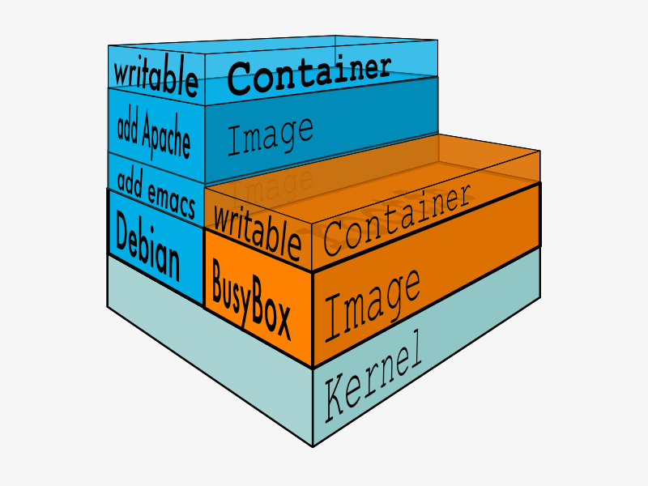
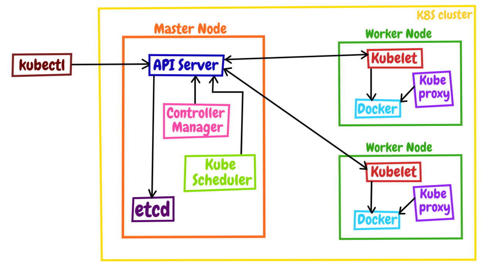

- chroot 是在 Unix 和 Linux 系统的一个操作，针对正在运作的软件行程和它的子进程，改变它外显的根目录。一个运行在这个环境下，经由 chroot 设置根目录的程序，它不能够对这个指定根目录之外的文件进行访问动作，不能读取，也不能更改它的内容。

  首先创建一个目录rootfs mkdir rootfs 然后在rootfs目录下新建三个文件 cd rootfs touch a b c 此时执行一条命令：

  ```bash
  chroot /home/centos/rootfs /bin/sh
  ```

  这条命令意思是启动一个 sh 进程，并且把 /home/centos/rootfs 作为 sh 进程的根目录

  此时执行命令：

  ```bash
  /bin/ls /
  ```

  就可以显示a b c三个文件，说明当前进程的根目录已经变成了主机上的 /home/centos/rootfs 目录。这样就实现了当前进程与主机的隔离

- Namespace 是 Linux 内核的一项功能，该功能对内核资源进行隔离，使得容器中的进程都可以在单独的命名空间中运行，并且只可以访问当前容器命名空间的资源。Namespace 可以隔离进程 ID、主机名、用户 ID、文件名、网络访问和进程间通信等相关资源。

  Docker 主要用到以下五种命名空间。

  - pid namespace：用于隔离进程 ID。

  -  net namespace：隔离网络接口，在虚拟的 net namespace 内用户可以拥有自己独立的 IP、路由、端口等。

  - mnt namespace：文件系统挂载点隔离。

  - ipc namespace：信号量,消息队列和共享内存的隔离。

  - uts namespace：主机名和域名的隔离。

- Cgroups Cgroups 是一种 Linux 内核功能，可以限制和隔离进程的资源使用情况（CPU、内存、磁盘 I/O、网络等）。在容器的实现中，Cgroups 通常用来限制容器的 CPU 和内存等资源的使用。

- 联合文件系统，又叫 UnionFS，是一种通过创建文件层进程操作的文件系统，因此，联合文件系统非常轻快。Docker 使用联合文件系统为容器提供构建层，使得容器可以实现写时复制以及镜像的分层构建和存储。常用的联合文件系统有 AUFS、Overlay 和 Devicemapper 等。





## docker

- 安装

  ```bash
  sudo apt update
  sudo apt install docker.io
  ```

- 启动

  ```bash
  sudo service docker start
  sudo usermod -aG docker ${USER}
  ```


## minikube

- 安装

  ```bash
  #Intel x86_64
  curl -Lo minikube https://storage.googleapis.com/minikube/releases/latest/minikube-linux-amd64

  # Apple arm64
  curl -Lo minikube https://storage.googleapis.com/minikube/releases/latest/minikube-linux-arm64sudo

  install minikube /usr/local/bin/
  ```

- 安装kubectl

  ```bash
  minikube kubectl
  ```

- 启动minikube

  ```bash
  minikube start --kubernetes-version=v1.23.3 --image-mirror-country='cn'
  ```


镜像拉取成功，遇到了几个坑：

1. docker版本过低，docker升级到20.10.1以上（使用`docker --version`查看版本）
2. 不能用root账号，加上`--force`
3. 镜像拉取不下来，切换到国内镜像，先执行 `minikube delete` 再执行 `minikube start --image-mirror-country='cn'`





```bash
kubectl get pod -n kube-system
```


```bash
# 查看k8s的API对象列表
kubectl api-resources
# 查看API对象，--v=9表示显示详细命令执行过程
kubectl get pod --v=9
```

## 使用YAML

```bash
# 使用YAML创建和删除API对象
kubectl apply -f ngx-pod.yml
kubectl delete -f ngx-pod.yml

# 查看API对象的详细说明
kubectl explain pod
kubectl explain pod.metadata
kubectl explain pod.spec.containers

# 生成YAML样板
# --dry-run=client表示空运行，-o yaml表示生成YAML格式，结合起来用让kubectl不会有实际的创建操作，只生成YAML文件，然后你就可以基于它进行修改了
kubectl run ngx --image=nginx:alpine --dry-run=client -o yaml
```


```yaml
apiVersion: v1
kind: Pod
metadata:
  name: busy-pod
  labels:
    owner: ycyu
    env: demo
    region: south
spec:
  containers:
  - image: busybox:latest
    name: busy
    imagePullPolicy: IfNotPresent
    env:
      - name: os
        value: "ubuntu"
      - name: debug
        value: "on"
    command:
      - /bin/echo
    args:
      - "${os}, ${debug}"
```

```bash
kubectl apply -f busy-pod.yml
kubectl delete -f busy-pod.yml
# busy-pod是yaml里定义的name字段
kubectl delete pod busy-pod
# k8s的pod运行只在后台，所以用以下方式查看日志
kubectl logs busy-pod
# 查看pod状态
kubectl get pod
# 查看指定pod的详细状态
kubectl describe pod busy-pod
# 复制文件到pod中
echo 'aaa' > a.txt
kubectl cp a.txt ngx-pod:/tmp
# 进入pod内部执行shell命令
kubectl exec -it ngx-pod -- sh
```


