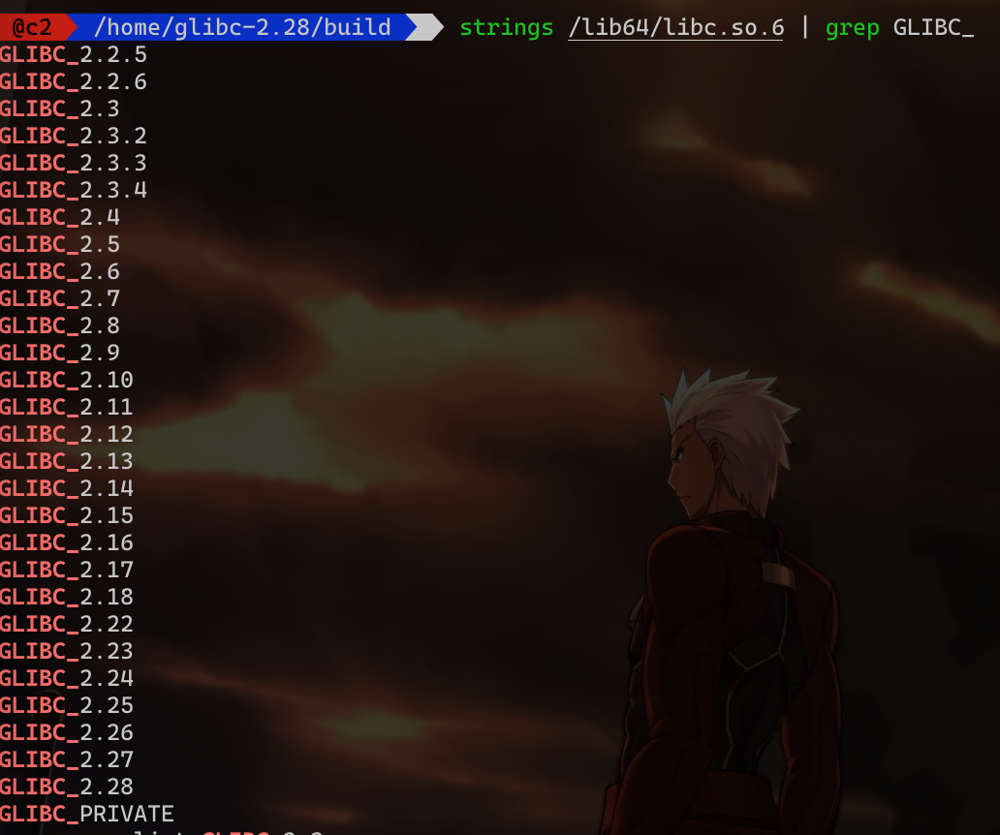
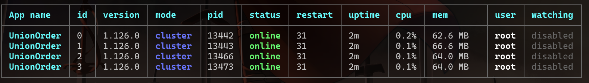
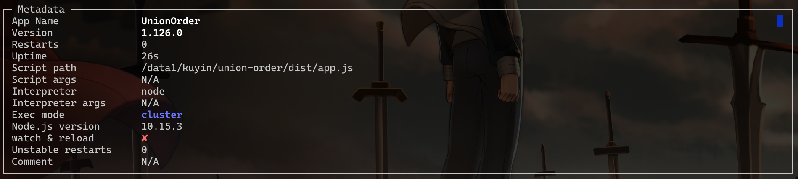
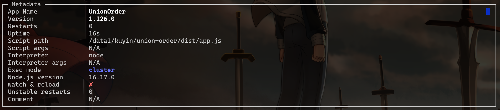

# CentOS7环境下Node.js版本升级记录

## 一、升级gcc到8.3.0

```bash
# 也可使用阿里云镜像站：https://mirrors.aliyun.com/gnu/gcc/gcc-8.3.0/gcc-8.3.0.tar.gz
wget --no-check-certificate https://ftp.gnu.org/gnu/gcc/gcc-8.3.0/gcc-8.3.0.tar.gz
tar zxvf gcc-8.3.0.tar.gz

cd gcc-8.3.0
./contrib/download_prerequisites
mkdir build
cd build
../configure --prefix=/usr/local/gcc-8.3.0 --enable-checking=release --enable-languages=c,c++ --disable-multilib

# 这里可以指定实际CPU核心数 
make -j4
make install

# 修改环境变量
echo -e '\nexport PATH=/usr/local/gcc-8.3.0/bin:$PATH\n' >> /etc/profile

# 添加动态链接库配置
echo -e '\n/usr/local/gcc-8.3.0/lib64\n' >> /etc/ld.so.conf.d/gcc.conf
ldconfig

# 验证动态链接库是否正确，打印中可以看到：libstdc++.so.6 -> libstdc++.so.6.0.25
ldconfig -v | grep c++

# 验证gcc版本
gcc --version

```


## 二、升级make 4.3

```bash
wget https://ftp.gnu.org/gnu/make/make-4.3.tar.gz
tar -zxvf make-4.3.tar.gz
cd make-4.3
./configure --prefix=/usr/local/make
make -j4
make install

cd /usr/bin
mv make make.bak
ln -sv /usr/local/make/bin/make /usr/bin/make

# 验证版本
make --version
```


## 三、升级glibc 2.28

```bash
# https://www.gnu.org/software/libc/
wget https://ftp.gnu.org/gnu/glibc/glibc-2.28.tar.gz
tar -zxvf glibc-2.28.tar.gz
cd glibc-2.28
mkdir build && cd build
../configure --prefix=/usr --disable-profile --enable-add-ons --with-headers=/usr/include --with-binutils=/usr/bin
make -j4
# 耗时比较久，如果有系统快照备份，可略过
make check
make install

# 如果升级后报错尝试如下方式，如果还不行，就要用之前的快照来恢复了
sln /usr/lib64/ld-2.17.so /usr/lib64/ld-linux-x86-64.so.2
sln /usr/lib64/libc-2.17.so /lib64/libc.so.6

# 如果使用locale命令时报错，则执行下面的操作
make localedata/install-locales
# 我自己环境中尝试时，仅执行上一步之后就不再乱码了
make install

# 验证 查看有“GLIBC_2.28”则表示成功
strings /lib64/libc.so.6 | grep GLIBC_
```




## 四、升级openssl 1.1.1k

```bash
wget https://www.openssl.org/source/openssl-1.1.1k.tar.gz
tar -zxvf openssl-1.1.1k.tar.gz
cd openssl-1.1.1k
./config --prefix=/usr/local/openssl
make -j8
make install

mv /usr/bin/openssl /usr/bin/openssl.bak
mv /usr/include/openssl /usr/include/openssl.bak
ln -s /usr/local/openssl/bin/openssl /usr/bin/openssl
ln -s /usr/local/openssl/include/openssl /usr/include/openssl

echo -e '\n/usr/local/openssl/lib\n' >> /etc/ld.so.conf.d/openssl.conf
ldconfig -v

openssl version
```


## 四、升级openssl 3.0.1

```bash
yum install -y perl-ExtUtils-CBuilder perl-ExtUtils-MakeMaker
wget https://www.openssl.org/source/openssl-3.0.1.tar.gz
tar -zxvf openssl-3.0.1.tar.gz
cd openssl-3.0.1
./config --prefix=/usr/local/openssl3/
make -j8
make install

mv /usr/bin/openssl /usr/bin/openssl.old
mv /usr/include/openssl/ /usr/include/openssl.old
ln -s /usr/local/openssl3/bin/openssl /usr/bin/openssl
ln -s /usr/local/openssl3/include/openssl /usr/include/openssl

echo -e '\n/usr/local/openssl3/lib64\n' >> /etc/ld.so.conf.d/openssl.conf
ldconfig -v

openssl version
```


## 五、安装python3

```bash
yum install epel-release
yum install -y python3
```


## 六、现网当前环境搭建（模拟）

Node.js版本v10.15.3，pm2版本3.5.0

```bash
nvm install v10.15.3
npm i -g git+https://github.com/Pana/nrm.git
npm i -g pm2@3.5.0
```


通过质效构建，然后部署到该环境中，使用pm2进行管理




## 七、Node.js版本升级

升级之前可使用如下命令查看当前pm2使用的Node.js版本

```bash
# 查询当年pm2中使用的Node.js版本
pm2 monit
```




按如下步骤安装新版本的Node.js以及全局依赖包

```bash
# 安装版本的Node.js
nvm install v18.12.1
# 设置新版本的Node.js为默认版本
nvm alias default v18.12.1
# 将旧版本Node.js全局安装的包在新版本中重新安装
nvm reinstall-packages v10.15.3
# 更新pm2的版本（非必须）
npm i -g pm2
```


修改pm2所使用的Node.js版本

```bash
# 保存pm2中的进程信息
pm2 save
# 更新pm2，使用新版本的Node.js
pm2 update
```


再次使用`pm2 monit`查看当前使用的Node.js版本




## 八、现网组件梳理

| 组件名                       | 标签                     | 备注                             |
| ---------------------------- | ------------------------ | -------------------------------- |
| Act                          | 非核心低流量             | 老的活动组件                     |
| Grocery                      | 核心高流量（可能有推送） | 组件化活动相关                   |
| Hybrid                       | 核心低流量               | 酷音APP相关内嵌页面              |
| RingService                  | 核心高流量               | 版权试听能力服务                 |
| RingTone                     | 非核心低流量             | 客户端振铃页面                   |
| TrackServer                  | 核心低流量               | 轨迹服务                         |
| UnionOrder                   | 核心高流量               | 统一订购页面                     |
| finder                       | 核心低流量               | finder内嵌H5页面                 |
| h5-chinaunicom-aimusic-proxy | 其他                     | 成都维护，之前看没有流量         |
| h5act                        | 核心低流量               | 非SSR的活动页面                  |
| h5actssr                     | 核心低流量（可能有推送） | 基于Nuxt的活动页面               |
| h5bigscreen                  | 核心低流量               | 音乐数据看板（老板看）           |
| h5iflymusic                  | 核心低流量               | 讯飞音乐官网                     |
| h5itocoo                     | 非核心低流量             | 讯飞图库官网                     |
| h5lyrics                     | 核心低流量               | 词曲家官网（作者端）             |
| h5purchase                   | 核心低流量               | 词曲家官网（采买端）             |
| h5music                      | 其它                     | 讯飞音乐旧版官网，之前看没有流量 |
| h5ring                       | 核心高流量               | 音频彩铃站点                     |
| itocoo                       | 其它                     | 讯飞图库旧版官网，之前看没有流量 |
| vring                        | 核心高流量               | 视频彩铃站点                     |
| musician                     | 其它                     | OPPO音乐人，现在应该没流量了     |
| cxmusic                      | 其它                     | 成都创响，之前看没有流量         |
| ministatic                   | 其它                     | 成都维护，之前看功能已经不全了   |
| InGrocery                    | 其它                     | AI作词页面，仅内网访问           |


### 1. Act（5078）——旧活动

​      cwd: '/data1/kuyin/act',

​      script: 'app.js',

​      env: {

​        PORT: '3001',

​        NODE_ENV: 'production',

​        NODE_CONFIG_DIR: '/data1/kuyin/act/config',

​      },

http://172.31.114.108:3001/act/redsong/index.html#/index

http://172.31.114.108:3001/act/soundproject/index.html#/index

----

https://h5.kuyin123.com/act/soundproject/index.html


### 2. Grocery（287006）

​      cwd: '/data1/kuyin/grocery',

​      script: 'src/app.js',

​      env: {

​        NODE_ENV: 'production',

​        NODE_CONFIG_DIR: '/data1/kuyin/grocery/config',

​        PORT: '3004',

​      },

http://172.31.114.108:3004/grocery/share/index.html

---

https://h5.kuyin123.com/grocery/inventory/index.html?nh=115&cid=334f5ac04b6107fe&id=632d741ee4b0234c40f3e5c3&at=1&ta=0&fc=0&immer=1&ts=0&tc=6d4edf

https://h5.kuyin123.com/grocery/songrec/index.html?nh=115&cid=f0056b410b6b73a8&pushId=6350b767e4b0fbb4a52e01c2&at=1&ta=0&fc=0&immer=1&ts=0&tc=f7e6fc

https://www.ciqujia.cn/grocery/activity/index.html?aid=1537239650809552896#/


### 3. Hybrid(23529)——客户端H5页面

​      cwd: '/data1/kuyin/hybrid',

​      script: 'src/app.js',

​      env: {

​        NODE_ENV: 'product',

​        NODE_CONFIG_DIR: '/data1/kuyin/hybrid/config',

​        PORT: '3000',

​      },

http://172.31.114.108:3000/client/rights/renew/agreement.html

---

https://h5.kuyin123.com/client/page/ios/1cc04b158f5f73ae?supportsetring=1#/home

https://h5.kuyin123.com/client/hybrid/page/index.html

https://h5.kuyin123.com/client/rights/renew/agreement.html

https://h5.kuyin123.com/client/hybrid/page/index.html
https://h5.kuyin123.com/client/hybrid/tone/index.html
https://h5.kuyin123.com/client/rights/kyservice.html
https://h5.kuyin123.com/client/rights/agreement.html?app=%E9%85%B7%E9%9F%B3
https://h5.kuyin123.com/client/rights/ky-agreement.html
https://h5.kuyin123.com/client/page/ios/1cc04b158f5f73ae?supportsetring=1   
https://h5.kuyin123.com/client/page/share/ring/KAZ001/7706/1125176025903267840


### 4. RingService(656344)——试听

​      cwd: '/data1/kuyin/ringservice',

​      script: 'src/app.js',

​      env: {

​        NODE_ENV: 'production',

​        NODE_CONFIG_DIR: '/data1/kuyin/ringservice/config',

​      },

http://172.31.114.108:3007/listen/kyh5/kyext.js

---

https://chaos.kuyin123.com/listen/kyh5/kyext.js

https://chaos.kuyin123.com/listen/api/v1/q_a_url?cn=8692&ringno=1097634933490319360&midmb=c33e9155d39c6078cb1c7e0f1297fc21&miduc=&midtc=&urlmb=&urluc=&urltc=

---

待办事项：添加cdn访问kyext.js


### 5. RingTone（2799）——客户端振铃

​      cwd: '/data1/kuyin/ringtone',

​      script: 'src/app.js',

​      env: {

​        NODE_ENV: 'production',

​        NODE_CONFIG_DIR: '/data1/kuyin/ringtone/config',

​      },

http://172.31.114.108:3008/toneh5/order.js

---

https://pring.kuyin123.com/toneh5/page/aorder/c1c250db803b364f

https://pring.kuyin123.com/toneh5/order.js


### 6. TrackServer(4184)——轨迹服务

​      cwd: '/data1/kuyin/track-server',

​      script: 'dist/app.js',

​      env: {

​        NODE_ENV: 'production',

​        NODE_CONFIG_DIR: '/data1/kuyin/track-server/dist/config',

​      },

http://172.31.114.108:3009/track/test-touch.html

http://172.31.114.108:3009/track/ges/get?distance=516.0

---

https://migu.diyring.cc/track/ges/get?distance=516.0

待办事项：migu.diyring.cc是cdn的域名，会导致url不变时在一段时间内取到的轨迹数据相同


### 7. UnionOrder（260W）——统一订购组件

​      cwd: '/data1/kuyin/unionorder',

​      script: 'dist/app.js',

​      env: {

​        NODE_ENV: 'beijing',

​        NODE_CONFIG_DIR: '/data1/kuyin/unionorder/dist/config',

​      },

http://172.31.114.108:3006/union/page/miguv2

http://172.22.143.165:3006/union/api/v1/q_cols?cn=1111&an=HGG001&pi=002&v=1.0.00&btp=0&id=242805&r=
0.6793124951479654&t=1670232865523

 https://order.diyring.cc/union/api/v1/q_ring?cn=9168&id=1420658392287936512&tc=51d73187da9c46dfa8acaedfff2271ac&t=1670313343156&op=0

https://order.diyring.cc/union/api/v2/q_mrc?cn=5036&v=1.0.00&pi=002&an=HCS001&phone=17755105631&id=1552560837921603585&tp=0&flow=1&r=0.19368180399485113&t=1670326826419


### 8. finder(515)——音乐Finder相关的H5分享页面

​      cwd: '/data1/kuyin/finder',

​      script: 'dist/app.js',

​      env: {

​        NODE_ENV: 'production',

​        PORT: '3014',

​        NODE_CONFIG_DIR: '/data1/kuyin/finder/dist/config',

​      },

http://172.31.114.108:3014/finder/demo-share/index.html

---

https://h5.kuyin123.com/finder/demo-share/index.html?shareid=6dc90abf07544b12a4809284072850b8&code=011b3lHa1IAy6E0jukFa11QT9W3b3lHK&state=123


### 9. h5-chinaunicom-aimusic-proxy（没有请求）——成都

npm start运行

http://172.31.114.108:4001/aimusic/public/index.html

---

https://miniprogram.diyring.cc/aimusic/public/index.html


### 10. h5act(3000)——未重构前的活动

​      cwd: '/data1/kuyin/h5act',

​      script: './dist/app.js',

​      env: {

​        NODE_ENV: 'production',

​        NODE_CONFIG_DIR: '/data1/kuyin/h5act/dist/config',

​      },

http://172.31.114.108:3011/actlm/0093b7a82da31e30/45275

http://172.31.114.108:3011/h5actcdn/guess-emoji/img/sound.40053d0b.png

---

https://game.diyring.cc/actlm/5490b6018b88a43e/321997?nh=128&at=1&ta=0&fc=0#/home

https://game.diyring.cc/actlm/6437b390408f50c5/321997?type=vivo#/

https://game.diyring.cc/actlm/9e7d146d6bb88249/321997?type=vivo#/

https://game.diyring.cc/actlm/9e31c7487088a710/321997?nh=96&at=1&ta=0&fc=0#/

https://game.diyring.cc/actlm/f2f8488c17b81945/321997?nh=64&at=1&ta=0&fc=0#/home

https://game.diyring.cc/actlm/5490b6018b88a43e/321997?nh=96&at=1&ta=0&fc=0#/home


### 11. h5actssr(7500)——重构后的活动（基于Nuxt的SSR）

​      cwd: '/data1/kuyin/h5actssr',

​      script: './node_modules/nuxt/bin/nuxt.js',

​      args: 'start --env=prod',

​      env: {

​        PORT: '3022',

​      },

http://172.31.114.108:3022/act/culture2/a1bc17bd2b7b10a4/45275?type=vivo

http://172.31.114.108:3022/act/h5actres/d0bd291.modern.js

---

https://game.diyring.cc/act/culture2/a1bc17bd2b7b10a4/45275?type=vivo

https://game.diyring.cc/act/find/b3e405aaae106f5c/45275/home?type=vivo

https://game.diyring.cc/act/culture3/633c6db657f8eb50/45275/?type=vivo


### 12. h5bigscreen(4434)——音乐大屏

​      cwd: '/data1/kuyin/h5bigscreen',

​      script: './dist/app.js',

​      env: {

​        NODE_ENV: 'production',

​        NODE_CONFIG_DIR: '/data1/kuyin/h5bigscreen/dist/config',

​      },

http://172.31.114.108:3021/dashboard/iflymusic/index.html

---

https://muse.kuyinyun.com/dashboard/iflymusic/index.html


### 13. h5iflymusic(220)——讯飞音乐官网

​      script: './node_modules/nuxt/bin/nuxt.js',

​      args: 'start --env=prod',

​      env: {

​        PORT: '3023',

​        NODE_ENV: 'production.purchase',

​        NODE_CONFIG_DIR: '/data1/kuyin/h5iflymusic/dist/config',

​      },

http://172.31.114.108:3023/

---

https://www.iflytekmusic.com/


### 14. h5itocoo(0)——讯飞图酷官网

​      script: './node_modules/nuxt/bin/nuxt.js',

​      args: 'start --env=prod',

​      env: {

​        NODE_ENV: 'production',

​        PORT: '3018',

​        NODE_CONFIG_DIR: '/data1/kuyin/h5itocoo/dist/config',

​      },

http://172.31.114.108:3018/

---

https://www.itocoo.com/


### 15. h5lyrics(43)——词曲家作者端

​      script: './node_modules/nuxt/bin/nuxt.js',

​      args: 'start --env=prod',

​      env: {

​        PORT: '3019',

​        NODE_ENV: 'production',

​        NODE_CONFIG_DIR: '/data1/kuyin/h5lyrics/dist/config',

​      },

http://172.31.114.108:3019/

---

https://www.ciqujia.cn/


### 16. h5music(17)——讯飞音乐旧版

​      cwd: '/data1/kuyin/h5music',

​      script: './dist/app.js',

​      env: {

​        NODE_ENV: 'production',

​        NODE_CONFIG_DIR: '/data1/kuyin/h5music/dist/config',

​      },

http://172.31.114.108:3013/h5music/pc/index.html

http://172.31.114.108:3013/h5music/app/index.html#/

---

https://h5.kuyin123.com/h5music/index


### 17. h5purchase(42)——词曲家采买端

​      script: './node_modules/nuxt/bin/nuxt.js',

​      args: 'start --env=prod',

​      env: {

​        PORT: '3020',

​        NODE_ENV: 'production.purchase',

​        NODE_CONFIG_DIR: '/data1/kuyin/h5purchase/dist/config',

​      },

http://172.31.114.108:3020/

---

https://buy.ciqujia.cn/


### 18. h5ring（50w）——音乐彩铃

​      cwd: '/data1/kuyin/h5ring',

​      script: './dist/app.js',

​      env: {

​        NODE_ENV: 'product',

​        NODE_CONFIG_DIR: '/data1/kuyin/h5ring/dist/config',

​      },

http://172.31.114.108:3010

http://172.31.114.108:3010/iringh5res/huawei/js/suggest.a550066a.js

---

https://iring.diyring.cc/friend/7343c29048673252#/

https://hw.diyring.cc/#/


### 19. itocoo(0)——讯飞图酷旧版（已废弃）

​      cwd: '/data1/kuyin/itocoo',

​      script: './dist/app.js',

​      env: {

​        NODE_ENV: 'production',

​        NODE_CONFIG_DIR: '/data1/kuyin/itocoo/dist/config',

​      },

http://172.31.114.108:3017/itocoo/pc/index.html#/


### 20. musician(3)——讯飞音乐人

​      cwd: '/data1/kuyin/musician',

​      script: './dist/app.js',

​      env: {

​        NODE_ENV: 'production',

​        NODE_CONFIG_DIR: '/data1/kuyin/musician/dist/config',

​      },

http://172.31.114.108:3016/musician/album/index.html

---

https://h5.kuyin123.com/musician/album/index.html


### 21.vring（4w）——视频彩铃

​      cwd: '/data1/kuyin/vring',

​      script: './dist/app.js',

​      env: {

​        NODE_ENV: 'production',

​        NODE_CONFIG_DIR: '/data1/kuyin/vring/dist/config',

​      },

http://172.31.114.108:3012/

http://172.31.114.108:3012/sdk/v1/order.js

---

https://vring.kuyin123.com/#/

https://vring.kuyin123.com/friend/a1c742e28add2f9c#/

http://h5.kuyin123.com/vring/sdk/v1/order.js

###  22.cxmusic——成都创响（废弃）

​      cwd: '/data1/kuyin/cxmusic',

​      script: 'dist/app.js',

​      env: {

​        NODE_ENV: 'production',

​        NODE_CONFIG_DIR: '/data1/kuyin/cxmusic/dist/config',

​      },

http://172.31.114.108:3015/cxmusic/index#/


### 23.ministatic(0)——星座彩铃（成都）

http://172.31.114.108:4002/ministatic/constellation/login.html

http://172.31.114.108:4002/ministatic/star/index.html

---

https://miniprogram.diyring.cc/ministatic/star/index.html#/select


### 24. InGrocery(1)——AI作词内网页面

​	  cwd: '/data1/kuyin/ingrocery',

​      script: 'src/app.js',

​      env: {

​        NODE_ENV: 'production',

​        NODE_CONFIG_DIR: '/data1/kuyin/ingrocery/config',

​        PORT: '3024',

​      },

https://inadmin.kuyin123.com/grocery/business-code/index.html


## 九、质效平台上构建脚本修改

**主要涉及运行环境依赖Node.js运行时的组件，比如Union-Order**，修改构建所使用的Node.js版本


