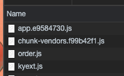
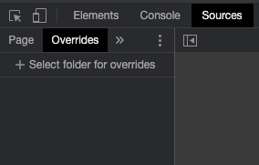
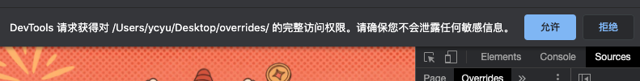
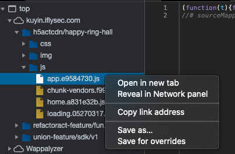
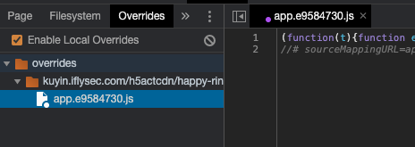
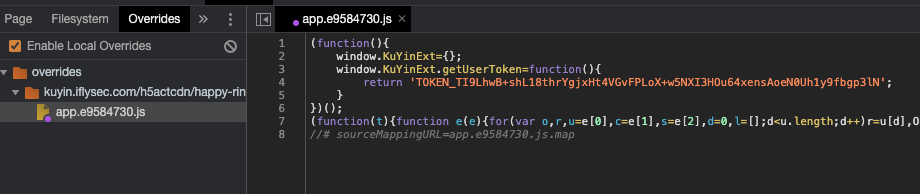
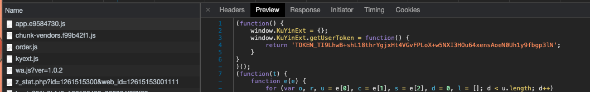
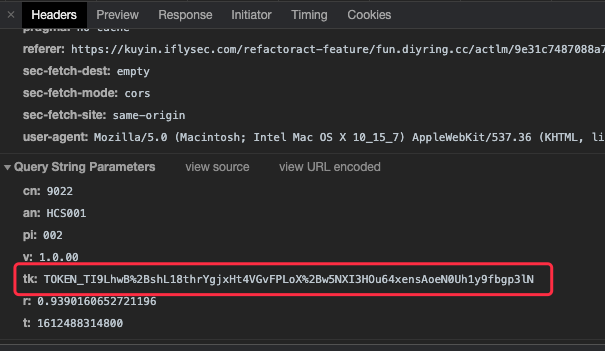

# 生产环境下H5页面宿主环境接口mock方法

## 一、背景

目前在做的OPPO春节活动，其页面是加载在OPPO主题商店（即宿主环境）中，其中一个功能是给用户发卡，具体逻辑为页面加载后调用宿主环境提供的接口获取用户的token，并使用该token去调代理层接口，代理层再去调OPPO服务端接口实现发卡。宿主环境提供的接口签名如下：

```javascript
window.KuYinExt.getUserToken(){
	reutrn 具体的token
}
```

## 二、问题

OPPO方提供的测试环境接口与正式线上环境存在差异，测试环境的token均为纯数字，而线上环境的token存在特殊字符，如token值 为“TOKEN_TI9LhwB+shL18thrYgjxHt4VGvFPLoX+w5NXI3HOu64xensAoeN0Uh1y9fbgp3lN”，其中的“+”在传递过程中会被处理成空格，导致发卡失败，所以前端需要在请求前对其进行url编码，代码修改其实很简单，麻烦的是测试同学如何验证，需要通过正式环境获取真实的token，但获取到的token不一定恰好存在特殊字符。

## 三、验证方法——利用Chrome的overrides功能

因为token其实是从宿主环境提供javascript接口中获取的，那么问题就变成我们如何在不修改代码的情况下去mock该接口，如题——使用chrome的overrides功能，具体操作方法如下：

### 1. 查看页面请求，找寻注入mock代码的时机

通过chrome的network面板查看当前页面的请求，以便在调用宿主环境接口获取token之前注入mock代码（chrome中是不存在该接口的）



如图，这些js都是在获取token之前加载的，可以使用任意一个，这里我们选择app.e9584730.js

### 2. 添加overrides

首先我们在本地创建一个文件夹，取名为overrides（名称可以随便取），然后通过chrome的Source面板，选择其中的Overides标签页，如图：



点击"Select folder for overrides"，在弹出的对话框中选择刚才创建的文件夹，注意下图中的提示要选择"允许"，给chrome添加访问本地文件夹的权限



此时我们再切回Source面板下的Page标签页，找到app.e9584730.js，右键选择"Save for overrides"



此时再切回Overrides面板时，就可以看到该js文件，并可以修改其中的代码了



### 3. 添加mock代码

添加的代码不能影响原逻辑，所以可以如下将要添加的mock代码作为IIFE来注入：

```javascript
(function(){
    window.KuYinExt={};
    window.KuYinExt.getUserToken=function(){
        return 'TOKEN_TI9LhwB+shL18thrYgjxHt4VGvFPLoX+w5NXI3HOu64xensAoeN0Uh1y9fbgp3lN';
    }
})();
```

修改后记得保存



此时再刷新页面后，在Network面板中查看该js文件，可以发现其内容已经为我们本地修改后的代码



并且此时页面发送的请求中，该token的值也为我们刚才设定的值了，可以看到token已经被url编码，从而验证通过

