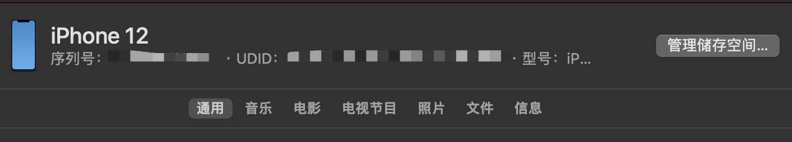
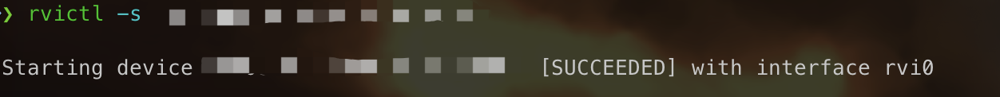
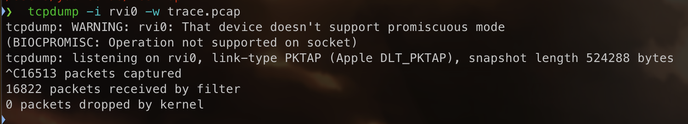
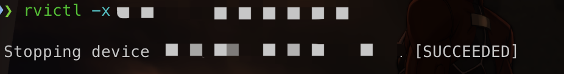

# 移动端抓包

## 一、iOS端

1. 获取手机的udid，手机连接mac，在手机上选择信任当前设备，然后就可以在Finder中看到设略，点击下图处就可以看到设备的udid
   

   右键即可复制

2. 使用命令`rvictl -s <device_udid>`创建一个远程虚拟接口，执行之后你会得到一个虚拟网络接口，比如：rvi0

   
3. 使`tcpdump -i rvi0 -w trace.pcap`，进行抓包记录，保存到trace.pcap中

   
4. 抓包结束后使用`rvictl -x <device_udid>`，删除虚拟接口

   
5. 使用wireshark等工具查看刚才生成的trace.pcap
